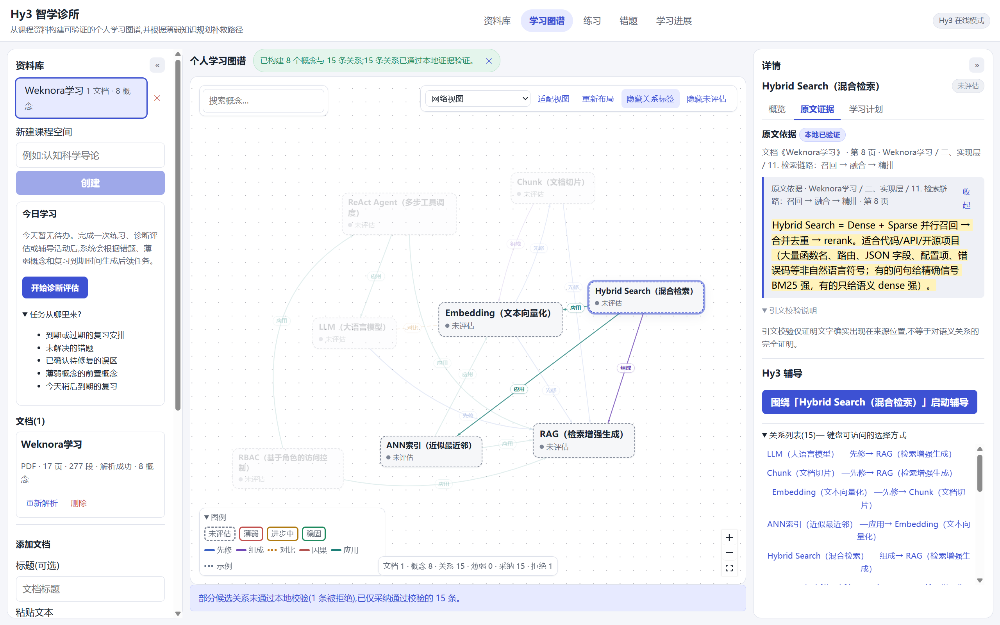
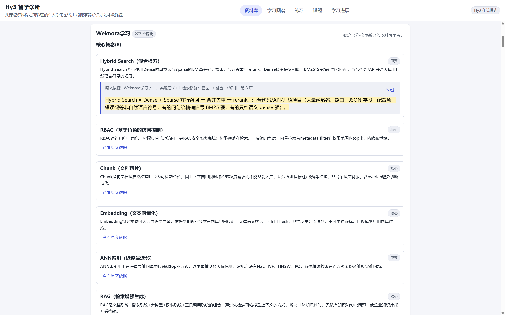
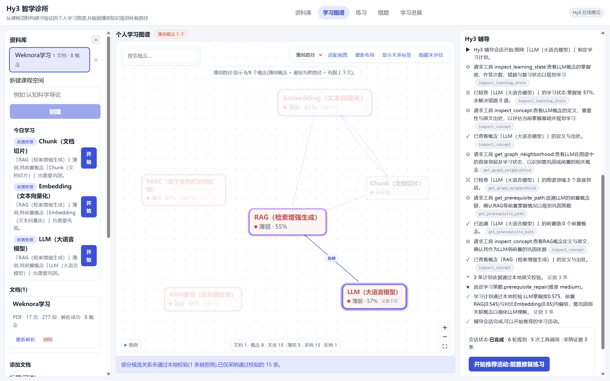
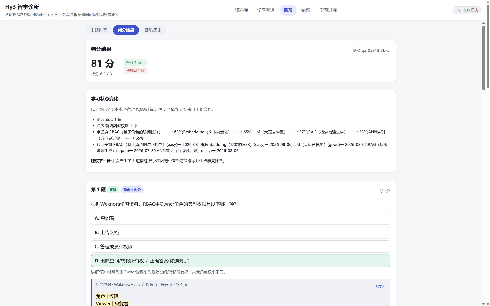
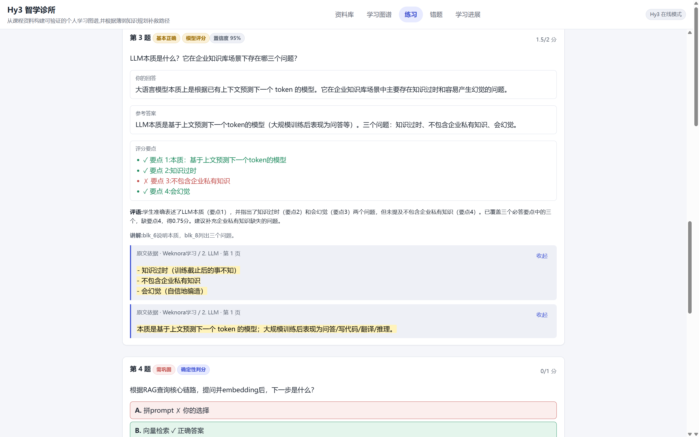
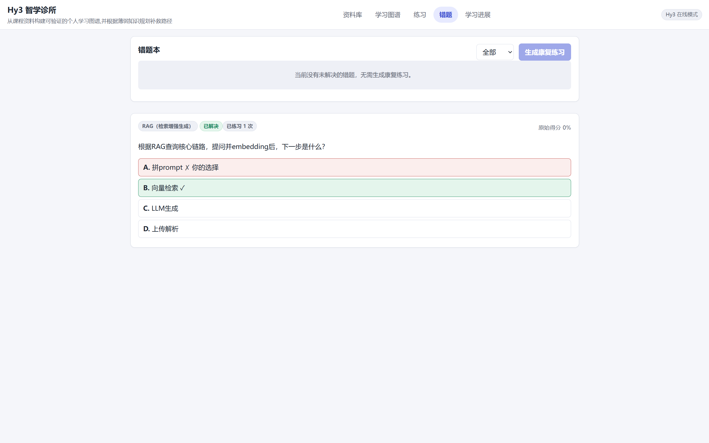
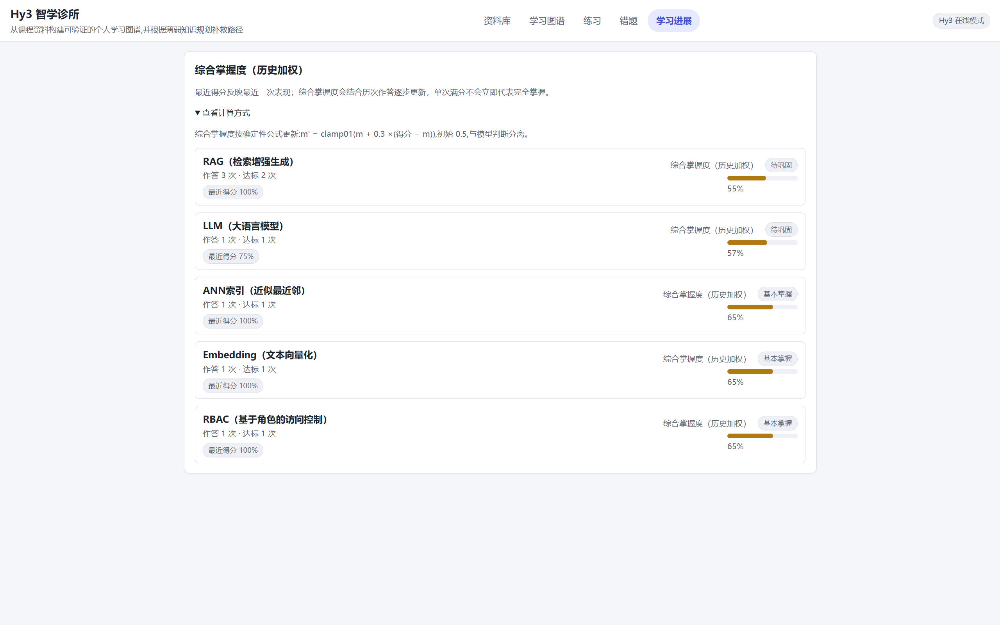

# Hy3 Study Clinic

[](https://github.com/Small-fish-QAQ/hy3-study-clinic/actions/workflows/ci.yml)
[](LICENSE)

Hy3 Study Clinic turns a learner's course documents into a **verifiable personal learning graph** and closes the loop from **diagnostic weakness to grounded remediation and persistent learning progress**. It supports pasted text, Markdown, TXT, PDF, PPTX, DOCX, HTML files, public Web Snapshots, and standalone PNG/JPEG/WebP images inside multi-document course workspaces.

The material pipeline also accepts common source-code files as learning material. Markdown, TXT, PDF, PPTX, DOCX, HTML, and source code pass through a parser registry into revision-owned normalized structural units and deterministic `structure-aware-v1` SourceBlocks. Blocks retain exact offsets, heading paths, page, slide, DOM, document-structure, or line locations where available, plus parser/chunker identity. The registry rejects extension/MIME/signature mismatches and applies bounded input, archive, XML, unit, and chunk limits.

HTML files are parsed deterministically with the Mozilla Readability and jsdom stack, without executing scripts or fetching subresources. A public URL is captured as an immutable Web Snapshot through a strict HTTP(S)-only policy with DNS/private-network validation, bounded redirects, timeout, response-size, MIME, and content checks. Snapshot revisions retain the requested URL, final URL, fetch policy, parser strategy, timestamp, exact response bytes, and SHA-256 hash. Dynamic SPA rendering, authenticated sites, crawling, and full browser fidelity are intentionally outside this product boundary.

Hy3 performs the semantic work: concept extraction, grounded question generation, semantic rubric grading, relationship and alignment proposals, misconception hypotheses, and bounded tutoring decisions. Deterministic local code validates citations and IDs, computes scores, controls every learning-state transition, and persists the accepted result in SQLite. The model never directly changes mastery, closes mistakes, accepts alignments, sets review dates, or deletes history.

## Product status

### Implemented current product

Hy3 Study Clinic presents the implemented learning workflows as one Course-centered journey. After selecting a Course, the learner moves through `主页 / 学习 / 课程结构 / 知识地图 / 进展 / 课程资料`; Settings remains secondary. Course Home explains the current goal and one next action, while technical evidence and version history remain available through intentional disclosures. Implemented behavior includes rich document workspaces, immutable material revisions, SourceBlocks, concepts, graph exploration, grounded lessons and assessments, mistakes, mastery, misconceptions, review scheduling, learner-confirmed Contracts, deterministic Course Preparation, Curricula, accepted StudyPlans, SessionAgendas, StudySessions, formal progression, bounded replanning, and lesson-aware Tutor support.

### Learner-facing product shell

- The global shell is primarily for selecting or switching the current Course. An original progression-path mark, matching favicon, and `Hy3 Study Clinic` wordmark identify the product without borrowing DeepTutor branding. The sidebar expands for Course context, collapses to an icon rail on wide screens, and becomes an accessible modal drawer below 768 px.
- The lower system zone keeps runtime status, Settings, and sidebar collapse separate from Course destinations. Fake mode is presented as the normal deterministic offline runtime, not as a fault.
- `主页` is the orientation surface. It shows the current goal, formal progress, relevant time information, a bounded agenda, actionable exceptions, and one dominant next action. `课程资料` is the dedicated source-management destination.
- `学习` is the lesson-first daily workspace. The current Teaching Brief is the primary reading order: objective, why-now context, ordered sections, examples, misconception cautions, and source references are visible before the optional Tutor panel. The learner can resume or revisit presentation sections, record a non-credit informal check, and see a truthful boundary between presentation completion and formal progression. The secondary Tutor stays visibly tied to the current lesson, supports natural-language quick questions, formats accepted responses for reading, and exposes verified source excerpts only when the accepted response metadata matches the current lesson segment.
- `课程结构` presents version/status and a learner-facing topic count before the learner expands any branch. Consecutive accepted records are shown as one topic only when all pedagogical mappings, state, source ownership, and normalized titles match; every LearningUnit/objective/source identity remains available under technical detail. Expanding a leaf-heavy section mounts its first 12 topics, with a separate control for the remainder. Grounding leads with the real material name, type, page/section, excerpts, and a safe owning-Material action; exact revision/block IDs remain subordinate.
- `进展` consolidates formal Evidence, assessment results/history, mistakes and Repair, concept mastery and Review state, plus Contract/Curriculum/Plan history. Formal checkpoints still launch contextually from Study or Agenda. A manual assessment tool remains available under an advanced Progress disclosure rather than as a peer product.
- `知识地图` is the learner-facing explanatory and navigation surface: four projection-driven modes separate course structure, learning progress, the accepted route, and current concerns. Concept extraction/deepening, graph generation, alignment review, version activation/history, and detailed provenance remain reachable through the advanced `课程结构 > 课程概念依据` disclosure. That grounding surface is Course-locked and does not fetch or display Tutor, remediation, mastery, Review, queue, or other learner overlays.
- `设置` is a focused system surface. A compact mode selector and configuration-first layout edit the server-owned provider mode, URL, model, and credential intent through validated APIs; saved Hy3 values remain available behind disclosure in Fake mode. Local Fastify health, saved provider configuration, and the timestamped result of the last deliberate external Hy3 probe are presented as separate facts. Course management creates and renames Courses through the existing validated APIs; its Danger Zone requires the exact current Course name before permanent deletion and lists the affected materials, route, Evidence, Repair, Review, mastery, and history. The surface also explains the server/browser authority boundary, reports locally restored Course continuity, and exposes the mutable browser-side sidebar preference.
- The parallel compatibility shell and peer Quiz, Mistakes, Repair, Mastery, Review, History, and Hy3-mode pages are retired. Meaningful old hash/query bookmarks are normalized into canonical Course destinations: Graph/Explore to Knowledge Map; Quiz/Assessment to advanced manual assessment; Results/History to Progress history; Mistakes/Repair/Remediation to Progress Repair; Mastery/Review to Progress mastery; Import/Materials to Course Materials; provider/Hy3 to Settings; and compatibility/advanced to Course grounding. Unknown Course paths fail safely to Course Home. Browser back/forward, Course switching, cancellation, and stale-response fencing continue through the single Course workspace.

### Agent architecture implementation status

Phases 1-5B of the Learning Execution Agent are implemented. Phase 1 provides material-revision lineage, independent source/premise authority, idempotent fenced operations, and durable model-call telemetry. Phase 2 adds learner-confirmed Contracts, validated Curriculum and StudyPlan proposals, atomic accepted-route activation, and SessionAgenda composition. Phase 3 adds durable StudySessions, bounded Tutor context, transcript events, pause/resume/stop, and learner-controlled detours. Phase 4 adds formal-evidence reconciliation, progression state, deterministic replan triggers, successor-plan proposals, and goal outcomes. Phase 5A adds the lesson-aware Tutor pedagogy contract and offline policy profile without formal-state mutation. Phase 5B presents accepted Tutor behavior as a contextual, source-aware learner experience while preserving the existing lesson, route, and formal-state authorities. Phase 6B1 adds bounded PPTX/DOCX visual source assets, Phase 6B2A adds bounded standalone-image ingestion and advisory visual projections, and Phase 6B2C adds a dedicated documented TokenHub `hy-vision-2.0-instruct` adapter. Hy3 remains the text-only language and pedagogy model. The authoritative [Learning Execution Agent Product Design](docs/STUDY_CLINIC_AGENT_PRODUCT_DESIGN.md) remains the source for future scope; other work remains separately gated and authorized.

Phase 4A adds an internal source-grounded Teaching Brief foundation for executable LearningUnits. An accepted Curriculum and StudyPlan select the route; local code builds a fixed-budget source context, while Fake or Hy3 selects compact `S*`, `O*`, and `P*` references and supplies the semantic teaching sequence. The server resolves exact current Material, MaterialRevision, SourceBlock, quote, and offset provenance, validates the proposal, records structural quality dimensions, and persists immutable Brief artifacts for auditability and reuse. Teaching Briefs are teaching content, not Course Truth, Formal Evidence, mastery, or durable mistakes.

Phase 4B1 connects those immutable Briefs to the existing StudySession route. A learner explicitly prepares the current `teach_unit`, sees a bounded learner-safe lesson projection, starts and resumes segment presentation, revisits or completes the presentation, and may answer informal checks that are session-only observations with `credit: none`. Preparation is idempotent and lease/fencing protected; route, Agenda, and session versions fence stale commands. Tutor turns receive only the current bounded Brief slice (with exact source excerpts and no internal IDs), while formal evidence, mastery, mistakes, Plan progress, and Agenda completion remain unchanged until a later formal workflow.

Phase 4B2 makes that route lesson-first in `学习`. A missing Teaching Brief is prepared automatically through the existing bounded server coordinator, then displayed as a readable sequence with provenance chips that distinguish verified course excerpts from Hy3 teaching organization. Presentation controls are resumable and version-fenced; informal checks remain explicitly non-credit. Completing the presentation is only a presentation milestone: it does not update mastery, close mistakes, or advance an Agenda item. When the existing formal checkpoint is launchable, the learner can hand off through the existing local grading/evidence path; otherwise the UI says that no direct formal entry is available. Tutor remains an optional secondary support surface, and no Assessment V2, repair, spaced-repetition, multimodal, or real-Hy3 work is included in this phase.

Phase 5A makes that Tutor lesson-aware without creating another lesson or assessment engine. Each conversational turn receives the current bounded Teaching Brief slice (or the bounded non-lesson unit context), route state, recent pedagogical moves, and operation-local source offers. Hy3 selects one move from the controlled vocabulary (for example `SIMPLIFY`, `GIVE_EXAMPLE`, `CONTRAST`, `ANSWER_QUESTION`, `REPAIR_MISCONCEPTION`, `DETOUR`, or `RETURN_TO_ROUTE`); local code enforces direct learner intent, avoids repetitive `SELF_EXPLANATION`, rejects unknown source references, and keeps formal-check readiness advisory. Tutor replies may cite only offered source references; analogies and other synthesis are labeled by the response context and are not exact source quotations. The selected move is persisted as audit metadata on the StudySession turn, while the conversation remains non-credit: it cannot create Evidence, change Mastery, close or create Mistakes, schedule Reviews, complete Agenda items, or change Plan progress. The deterministic offline `lesson-aware-tutor-v1` profile covers 23 policy scenarios; helpfulness and pedagogical quality remain human/model-judged rather than a universal score.

Phase 5B turns that accepted metadata into a learner-facing Tutor experience without moving pedagogy policy into React. The lesson remains primary and Tutor stays secondary below it, with a current-objective cue, six ordinary-text quick questions, readable paragraph/list responses, friendly move and route cues, and keyboard-accessible source disclosures. Source keys and policy enum values remain hidden; an accepted reply with no source refs is labeled as a Hy3 supplemental explanation, while source-backed replies resolve only against the current lesson segment's learner-safe projections. `Enter` sends, `Shift+Enter` inserts a newline, and existing stream cancellation, retry, reconciliation, and stale-response fencing remain in force. A Tutor formal-readiness cue can offer the existing formal-checkpoint handoff only when the accepted metadata and current launchability agree; the conversation itself remains non-credit and cannot alter formal state.

## Reviewer quick links

- **[Watch the final demo](docs/assets/hy3-study-clinic-demo.mp4)**: 1:53, silent H.264 MP4, 1920x1200.
- **[Review the real Hy3 online-verification record](docs/evidence/hy3-online-verification.md)**: sanitized, commit-pinned aggregates from the complete six-operation `eval:hy3` suite.
- **[Read the architecture and trust boundaries](docs/ARCHITECTURE.md)**.
- **[Reproduce the verification results](docs/VERIFICATION.md)**.
- **[Review the authoritative next-product design](docs/STUDY_CLINIC_AGENT_PRODUCT_DESIGN.md)** and **[project evolution](docs/PROJECT_EVOLUTION.md)**; both clearly distinguish design from implemented behavior.
- **[Inspect the final tagged release](https://github.com/Small-fish-QAQ/hy3-study-clinic/releases/tag/issue-4-final)** and **[upstream submission PR #77](https://github.com/Tencent-Hunyuan/Hy3/pull/77)**.

The immutable `issue-4-final` tag points to `c67ac6d`. The real-provider evaluation ran from its direct parent, clean commit `46d34f2`; the tagged child publishes only the sanitized record, its regression guard, and documentation. Later main commits contain the separately identified post-award improvements and next-product design; they do not move or reinterpret that historical checkpoint.

## Demo

[](docs/assets/hy3-study-clinic-demo.mp4)

**[Watch the full demo video (1:53, silent MP4)](docs/assets/hy3-study-clinic-demo.mp4)**

The video follows one continuous learning journey:

course material -> document import with provenance -> Hy3 concept extraction -> locally validated personal learning graph -> evidence inspection -> diagnostic assessment -> deterministic objective grading plus Hy3 semantic grading -> mistake notebook -> targeted remediation -> score improvement from 81 to 100 -> mistake resolution -> persistent mastery update -> graph-grounded Hy3 tutoring.

The same workflows run offline with the fake provider through `npm run demo:graph` and `npm run demo:adaptive`.

### Knowledge Map projection contract (Phase 10A)

The course-scoped `GET /api/workspaces/:workspaceId/knowledge-map` endpoint exposes one versioned, read-only projection consumed by the learner-facing Knowledge Map. Its four modes (`knowledge_structure`, `learning_progress`, `learning_route`, and `weakness_map`) are views over the same heterogeneous concept, LearningUnit, and synthesis nodes; they do not create a graph-owned progress or mastery store.

The projection keeps authority explicit. Validated source graph relations and accepted Curriculum prerequisite, concept-association, and synthesis-membership edges are structural only. Legacy mastery is the only source for a `mastered` concept state. Formal Evidence and deterministic progression provide `evidence_backed`; lesson presentation can only produce `taught` or `awaiting_formal_validation`. Active Repair takes display precedence while preserving formal facts, and Review due/retrievability concerns remain scheduling signals rather than mastery failure. Mastery Red Team `possible_gap` is advisory and cannot change any formal state.

Every accepted graph edge and current Curriculum association retains exact source-block provenance. Exact quotation validation proves source occurrence, not complete semantic entailment. Accepted Contract/Curriculum/StudyPlan/Agenda identity, source-manifest fingerprints, active MaterialRevisions, and current Evidence bindings are checked on read; stale or incomplete route/source state fails closed as `unknown`/`partial`. The GET is deterministic, provider-free, and mutation-free. Historical Curriculum, Plan, Formal Evidence, and assessment records remain addressable in the projection history without being treated as current truth.

### Learner-facing Knowledge Map (Phase 10B)

The Course `知识地图` destination consumes the Phase 10A projection directly. `知识结构` explains concepts, LearningUnits, prerequisites, membership, and synthesis. `学习进展` distinguishes planned, currently learning, taught, awaiting formal validation, evidence-backed, mastered, and Repair states. `学习路线` emphasizes completed, current, next, and prerequisite-locked work without rewriting the accepted StudyPlan. `关注地图` keeps formal failure, active Repair, due Review, retrievability concern, and Mastery Red Team advisory visually and textually distinct.

Selecting a node opens a learner-facing inspector with current projected state, route position, formal-validation status, concern reasons, neighboring course relationships, source provenance, and only server-projected actions. A Study action exists only for the unlocked, launchable current Agenda item; evidence, Repair, and Review actions lead to focused Progress views. Home opens the map, Study locates the current LearningUnit, and Progress opens the concern view. Stale/unusable routes never receive a fabricated Study action.

The deterministic topology layout is stable across modes. Learner-dragged positions and the camera are stored locally by Course/Curriculum identity; search, zoom, fit, reset, and one-hop focus support larger maps. Maps above 48 edges use restrained straight-edge rendering to keep interaction bounded. At narrow widths the inspector becomes a focus-trapped bottom sheet with Escape/close focus restoration. Loading, unconfigured, partial/unknown, failure/retry, cancellation, Course switching, and late-response fencing are explicit. Opening or navigating the map performs no background Hy3 operation and does not mutate persistent learning state.

### Legacy surface consolidation (Phase 10C)

The application has one canonical hash route model under `#/course/:workspaceId/...`. The ordinary destinations are Home, Study, Curriculum, Knowledge Map, Progress, Materials, and secondary Settings. Progress owns separate canonical subsections for Evidence, Repair, mastery/Review, and history, so old bookmarks retain the actual user job instead of landing on a generic page. Direct bookmarks to advanced grounding and manual assessment remain supported. Alias normalization uses `replaceState`; learner navigation uses `pushState`; browser history creates a fresh controlled navigation intent without an echo or redirect loop.

Only redundant product shells were retired. Assessment generation/grading, immutable attempts, Formal Evidence, mistake and Repair lifecycle, concept mastery, successor Review/FSRS records, misconception history, graph validation/versioning/alignment, source provenance, workspace/material administration, provider configuration, and audit data keep their existing APIs, services, repositories, and migrations. No database or backend authority changed. In particular, deterministic legacy quiz grading remains the sole writer of historical concept mastery; Evidence, Review/FSRS, Repair, Tutor, and Mastery Red Team output do not become mastery writers.

### Formal assessment and evidence boundary

Practice and formal assessment are separate paths. Formal assessments use immutable accepted versions with explicit learning-unit/objective targets, exact MaterialRevision/SourceBlock bindings, and an authoritative rubric. Short-answer items are the supported formal path; choice items remain practice/advisory unless complete option-premise authority is available. Attempts are durable and immutable after submission, and grades are append-only records that support regrading without erasing history. A grade is not Formal Evidence: local gating derives evidence only from an eligible item, current grade, submitted attempt, and valid source/rubric authority. Evidence is then handed to a separate idempotent progression-reconciliation boundary. Tutor conversation, lesson completion, exact quote occurrence alone, and derived visual descriptions never grant formal credit.

### Diagnostic Repair orchestration

A failed or partial formal grade can open a durable Repair episode. Repair interprets the response, not the learner: wrong does not automatically mean the underlying knowledge is absent. The bounded taxonomy distinguishes a surface slip, incomplete expression, local misconception, reversed relation, procedural gap, prerequisite gap, irrelevant/guessing response, and uncertainty. A semantically correct response with a harmless spelling slip does not open Repair merely because of that slip.

Local code derives the episode from the persisted grade and criterion judgments, selects the minimum sufficient intervention policy, validates source and target identity, and owns every status transition. Fake mode can generate an immutable, source-linked Repair packet for deterministic offline development. Repair practice is non-credit and creates no Evidence, mastery, mistake closure, or progression mutation. Reading an explanation, clicking continue, or saying "I understand" cannot resolve Repair. Resolution requires supported Evidence from a linked, fresh formal assessment version for the same target; that Evidence then enters an explicit, idempotent reconciliation call into the existing deterministic completion projection. A projection failure preserves Grade and Evidence for retry without another provider grading call.

## Product workflow

### Course materials to a verifiable learning graph

1. Create a course workspace and add one or more documents. PDF parsing preserves page identity, positioned-text reconstruction, headings, lists, conservative tables, and page ranges. PPTX preserves presentation relationship order, stable drawing-layer order, paragraphs/lists, tables, speaker notes, and slide ownership. DOCX preserves body order, heading hierarchy, paragraphs, lists, tables, and honest document-structural locations without invented page numbers.
2. Hy3 extracts concepts section by section along a deterministic document outline (with a synthetic-window fallback for weak headings), under size-aware budgets — a thin section may honestly yield nothing, and long documents are no longer compressed into one 3-8-concept pass. Every concept carries `(blockId, exact quote)` evidence, and 资料映射 shows which sections are mapped, with per-section additive deepening that never regenerates existing concept ids.
3. Deterministic candidate generation and bounded Hy3 proposals align equivalent concepts across documents. Only exact normalized aliases are auto-accepted; semantic merges require learner review.
4. Hy3 proposes typed graph relations from a controlled vocabulary: `prerequisite`, `part_of`, `contrasts_with`, `causes`, `applies_to`, and `example_of`.
5. Local validation rejects unknown concepts, cross-workspace references, invalid relations, fabricated evidence, duplicates, and prerequisite/part-of cycles before a versioned graph is persisted.
6. The learner uses the Course Knowledge Map to inspect structure, progress, route position, or concerns from the same server-owned projection. Search, selected-neighborhood focus, and a provenance-aware inspector lead back to legitimate Study, Progress, Curriculum, or Material actions. The legacy network/dependency graph remains available only for concept-grounding preparation. Every accepted concept and edge remains traceable to source evidence.
7. Each concept can open a 讲解 lesson card: typed teaching sections (explanation, intuition, worked example, misconception warnings, contrasts, applications) whose provenance is decided per segment by the server — verified course quotes are labeled 课程资料/本地已验证, everything else is honestly labeled AI 辅助讲解(非资料原文) and never becomes grading evidence. Where the course text differs from the common presentation, the conflict is shown with a verified quote and the source wins.

Failed graph, plan, or lesson generation never overwrites the last valid version.

### Rich document extraction and original assets

- PDF remains a deterministic text-layer parser. It reconstructs visual lines from positioned text, filters conservative repeated headers/footers, keeps page spans, and emits explicit warnings for pages without extractable text. It does not enumerate PDF figures or interpret diagrams.
- PPTX slide order comes from `ppt/presentation.xml` relationships. Within a slide, text uses stable OOXML drawing-layer order; this is deterministic but is not claimed to be perfect spatial or semantic reading order. Speaker notes stay distinct from visible slide content, and tables retain row and column order in normalized table units.
- Revision-aware DOCX ingestion reads bounded OOXML directly to preserve headings, paragraphs, contiguous lists, tables, headers/footers, and embedded media relationships. DOCX pagination depends on rendering software, so no page number is fabricated.
- Embedded PPTX/DOCX media is persisted as immutable `extracted_original` source material with revision ownership, a stable revision-local identity, SHA-256 byte identity, media type, byte length, dimensions when deterministically available, and parent slide/document structure where known. Hash-addressed blob storage avoids duplicating identical original bytes. Embedded assets do not become independent logical Materials.
- Unsupported or incomplete structures produce visible partial-extraction warnings. Missing relationships, unsupported objects, image-only slides/pages, and PPTX charts or SmartArt are not silently treated as complete semantic text.

### Visual source preparation and derived semantics (Phase 6B2A)

- Standalone `PNG`, `JPEG`, and `WebP` uploads are real Image Materials. The server checks actual bytes, declared-type agreement, dimensions, channels, decoded-pixel bounds, animation/multipage policy, and complete bounded decodability. The exact original bytes and SHA-256 remain immutable `extracted_original` authority; an image-only revision may legitimately have no authoritative text SourceBlocks.
- Embedded PPTX/DOCX images reuse the Phase 6B1 asset and occurrence model. Visual preparation enumerates retained `PNG`, `JPEG`, and `WebP` image occurrences only when dimensions are known. Identical bytes may share a stored blob, but every eligible slide/document occurrence retains its own parent location and visual reference; other retained media remain provenance-only assets.
- Visual preparation is explicit through `GET /api/workspaces/:workspaceId/documents/:documentId/visuals` and `POST /api/workspaces/:workspaceId/documents/:documentId/visuals/:visualRef/prepare`. Preparation is bounded and idempotent, reports `missing`, `preparing`, `ready`, `failed`, or `stale`, and persists immutable `visual_derivations` bound to the exact MaterialRevision, asset occurrence, and original byte hash.
- `sharp` 0.35.3 is used for actual-byte inspection and forced decode. Source limits are 25 million pixels and 16,384 pixels per dimension; provider transport is deterministically resized/oriented/transcoded when needed and capped at 2,048 pixels per dimension and 4 MiB. Normalized transport is derived preparation, never replacement source.
- FakeProvider implements deterministic visual-description fixtures with a strict schema for description, visual type, visible text, important concepts, pedagogical notes, and uncertainty. The derived result is labelled advisory and nonblocking. It can support retrieval discovery, Teaching Brief context, and Tutor context without becoming quoted course text, Course Truth, Formal Evidence, mastery, mistake closure, or progression.
- Local OCR is intentionally not shipped in this phase. Hy3 remains the text-only language/pedagogy provider; the dedicated `TokenHubVisionProvider` targets only the officially documented `hy-vision-2.0-instruct` one-image transport. Its bounded descriptions remain advisory and provider-variable. Advisory lexical retrieval of accepted visual descriptions is implemented; vector visual search, semantic entailment, and formal visual evidence are not implemented.

### Final Materials capability boundary

The Materials Core has eight format families, all converging on `Material` -> immutable `MaterialRevision` -> parser adapter -> normalized structural units -> `structure-aware-v1` SourceBlocks and revision-local original assets. The labels below describe shipped behavior, not a promise of perfect extraction.

| Family              | Shipped capability                                                                                             | Formal evidence boundary                                         | Important limitation                                                                                       |
| ------------------- | -------------------------------------------------------------------------------------------------------------- | ---------------------------------------------------------------- | ---------------------------------------------------------------------------------------------------------- |
| PDF                 | `BOUNDED`: text-layer extraction, page spans, headings/lists/conservative tables, original bytes               | Exact authoritative text only; no OCR or visual-derived evidence | Multi-column/rotated/figure/image-only pages can be partial                                                |
| PPTX                | `BOUNDED`: slide ownership, text/list/table/notes structure, embedded original images                          | Exact extracted text only                                        | OOXML drawing order is not guaranteed semantic reading order; charts/SmartArt/equations are warned partial |
| DOCX                | `BOUNDED`: heading hierarchy, paragraphs/lists/tables, headers/footers where related, embedded original images | Exact authoritative text only                                    | No fabricated pages; advanced drawings/equations/footnotes may be incomplete                               |
| Markdown            | `FULL` within the supported syntax: headings, lists, quotes, fenced code, tables, exact offsets                | Exact text                                                       | Unsupported extensions remain ordinary text                                                                |
| TXT                 | `TEXT_LAYER_ONLY`: deterministic paragraph blocks and line offsets                                             | Exact text                                                       | Intentionally low structure                                                                                |
| Standalone Image    | `BOUNDED`: actual-byte validation, immutable original asset and dimensions, bounded visual preparation         | `NOT_AVAILABLE` for image descriptions                           | Provider descriptions are advisory and nonblocking; local OCR is not shipped                               |
| HTML / Web Snapshot | `BOUNDED`: static Readability/jsdom extraction, DOM/heading paths, tables/code/links and snapshot bytes/hash   | Captured extracted text only                                     | No JavaScript, browser rendering, authentication, crawl, or remote-subresource archive                     |
| Source Code         | `BOUNDED`: exact source text, imports/comments/functions/classes and line provenance                           | Exact source text only                                           | Not repository intelligence: no execution, call graph, LSP, or dependency authority                        |

Original extracted text and original visual bytes are distinct from `DERIVED_OCR`, `DERIVED_VISUAL_DESCRIPTION`, `DERIVED_LAYOUT_LABEL`, and `DERIVED_SUMMARY`. TokenHub visual output can help retrieval, Teaching Briefs, Lessons, and Tutor context only as `ADVISORY_DERIVED`; it cannot become Course Truth or formal Evidence by selection alone. Exact quote occurrence proves location, not semantic entailment.

### Diagnostic weakness to verified remediation

1. A workspace diagnostic assessment uses validated question blueprints. A question marked cross-document must have verified evidence from at least two documents.
2. Objective answers are graded locally. Hy3 classifies short-answer rubric coverage, while local code recomputes the awarded score from required-point coverage.
3. Low scores create open mistakes. A substantive wrong answer may create a tentative misconception hypothesis, but only later discriminating answers can confirm, reject, or resolve it.
4. Remediation re-tests at most three concepts with open mistakes. A correct remediation answer resolves exactly the linked source mistakes. A round missing a required grounded question piece gets ONE targeted regeneration of only the missing pieces before failing honestly.
5. Local rules update historical mastery and a separate FSRS-style review schedule. Grading applies its complete learner-state write set in one transaction; duplicate or concurrent submissions of the same quiz apply state at most once (409), and a stale pending quiz whose required concepts are no longer available is rejected with zero state change.
6. A bounded Tutor session can inspect only whitelisted, read-only workspace state. The Tutor is offered only activity modes that are executable in the current state; its recommendation is validated at completion (deterministically downgraded with a visible timeline note when preconditions fail) and launched server-side with launch-time revalidation — every 开始 button the product shows corresponds to an activity that actually starts. The daily queue works the same way, and after remediation it advances into unassessed concepts so newly extracted content is reachable.

Completed quizzes are retained as immutable, read-only history. Opening a historical result never regenerates, regrades, or reapplies learning-state changes.

Removing a material from the active course normally retires its stable logical identity rather than deleting its revisions, source provenance, assessments, or longitudinal learner history. Retired material is hidden from active material lists and can force route revalidation. Explicit workspace deletion is the separate destructive operation and may cascade the workspace's course data.

### Course Preparation and the accepted Course journey

1. The learner confirms a versioned Learning Contract over stable logical materials and role assignments. That same meaningful action starts Course Preparation; Material revisions and source blocks are execution identities, not Contract scope.
2. Hy3 may propose a Curriculum and StudyPlan, but local code validates known IDs, source evidence, manifest freshness, route coverage, feasibility, authority eligibility, and launchability. For Curriculum evidence, the server builds a complete exact catalog and a deterministic Course Source Map tied to the current logical Materials, active MaterialRevisions, ordered SourceBlocks, current Concepts, and valid predecessor intersection. The production selector preserves the established predecessor, Concept, locality, lexical, section-balance, and fallback rankings, reserves one candidate opportunity per derived budgeting section, then deterministically redistributes unused capacity through the same ranked and source order. Baseline predecessor, Concept, and priority-grounding candidates are retained if a saturated reserve would otherwise displace them. Hy3 sees compact operation-local IDs and excerpts of at most 320 characters; local code maps each offered selection back to its full hash-bound identity and resolves the exact text. Candidate ranking and section metadata are navigation context, not truth authority, and model-written quote text is not an authority in this path. The provider budget remains at most 160 blocks, 240 offers, and two offers per block; reserve offers are also whole-object truncated to the exact baseline internal-offer byte ceiling. The complete catalog remains local as the deterministic selection source, while validation accepts only the exact operation-local offers Hy3 actually received. Parser-derived SourceBlocks remain evidence records. The production default is `legacy_direct_v1`, the established single-request direct-Curriculum policy. The retained internal/testable `course_map_materialization_v1` policy instead makes one operation-local Course Map proposal followed by one or two fixed LearningUnit-detail batches (`MAX_DETAIL_BATCHES=2`). For the Course Map proposal, each allocated source region receives a compact `R*` ref and adjacent `R*:A*` Concept/canonical anchor options. Hy3 chooses module placement, array order, titles, learning intent, scope, anchor options, prerequisite relations, and synthesis grouping using only those refs. It does not return allocation fingerprints, generated keys, numeric indexes, raw Concept/canonical IDs, or other server-owned structure. Local code resolves the exact bindings and derives every internal key, index, fingerprint association, and operation-local ID before running the unchanged full Course Map validator. Each logical request has the existing one shared schema-or-semantic repair allowance, so one staged Curriculum operation makes at most three logical provider calls and six physical requests including repairs. Local code validates every Course Map and detail identity, assembles the batches deterministically into the existing Curriculum contract, reruns materialization and the unchanged StudyPlan preflight, and persists only the complete valid Curriculum. No Course Map or partial batch is persisted. Model-correctable offered-identity, hierarchy, prerequisite, synthesis, region, and detail-evidence failures may consume the repair for their logical request. Contract, manifest, predecessor, active-pointer, lease, or fencing changes fail locally without asking the model to repair authority. Regenerating an old Curriculum creates a proposed successor version with its exact source references and mappings; it never rewrites the accepted version. A second invalid response for any logical request fails closed, and any failure preserves the accepted predecessor. A deterministic preflight reports unit capabilities and prompt scale from the exact accepted planning input. `due_review` is unit-local here: an unrelated due Concept cannot make a source-only unit executable. A Curriculum with no executable LearningUnit stops before persistence instead of inventing a capability. A learner-created Curriculum proposal still requires learner review. Course Preparation may locally accept only its own policy-tagged candidate after the unchanged deterministic StudyPlan preflight passes; the final proposed StudyPlan remains the single learner-owned course-plan decision. Switching between the two internal policies requires no migration and never reinterprets historical Curricula.
3. Acceptance atomically installs one compatible Contract, current authoritative accepted Curriculum, StudyPlan, and SessionAgenda route. A stale Plan bound to a superseded Curriculum cannot be newly accepted. Historical intervening proposals remain auditable, while a current Plan may activate only when its immutable predecessor lineage descends from the active route. Direct Agenda launch also requires the active route, expected version, a queued or active item, matching Plan/item kind and LearningUnit, current capability, and any still-valid targeted-repair prerequisite. A failed or rejected successor leaves the prior accepted route intact.
4. The learner opens `学习`; its durable StudySession persists Tutor turns, exchanges, summaries, route-stack frames, and agenda edits. A definitive Tutor provider failure remains visible and refreshes the authoritative Session version before another send, so the next distinct command does not require navigation or reload. Pause, resume, and stop change execution state without rewriting the accepted StudyPlan snapshot or pointer.
5. Conversation is not formal evidence. Formal assessments and deterministic reconciliation alone can advance objective and unit progression; replan candidates remain proposals until learner acceptance.

### Teaching Brief preparation boundary

For one accepted, executable `teach_unit` item, the internal preparation service checks route ownership and source-manifest freshness, selects bounded mapped evidence plus Concept grounding and local neighbors, and either reuses an identical immutable Brief or performs one provider generation. A normal structured generation is one physical request; schema or semantic repair is limited to one additional request. Timeout, transport failure, and cancellation are not retried. Source references remain learner-visible-ready provenance records, while AI synthesis, examples, contrasts, and misconception candidates retain advisory labels. Informal checks and formal opportunity markers do not create Evidence or learner-state writes. A route or source change leaves the old Brief in history and prevents it from being reused as current.

### Adaptive pace and learner-governed feasibility

The accepted Curriculum remains complete when a target date is tight. New
Contracts treat daily/weekly minutes as an `estimate` by default and preferred
session length as a shaping preference. A learner can explicitly set
`availabilityPolicy: hard_cap` and/or mark a deadline hard; only those choices
can block acceptance of an over-cap route. Soft deficits persist as an
`at_risk` warning with deterministic projected effort, capacity, slack,
confidence, assumptions, and bounded recommendations. Recommendations remain
proposals until the learner accepts, rejects, keeps the current route, or asks
for another strategy.

PaceBaseline starts with unknown confidence. Append-only observations use
explicit active StudySession, formal-attempt, Repair, or Review time and never
browser idle time. A bounded effort multiplier updates remaining-work estimates
only after enough evidence; ordinary Agenda adaptation does not create a
StudyPlan version. Historical Contracts without the policy field retain their
legacy hard-cap interpretation, while newly saved Contracts are explicit soft
estimates.

### Curriculum-to-StudyPlan execution contract

Hy3 may select exact evidence and existing semantic relationships for a LearningUnit, but it does not create persistent Concept authority by returning an ID. During Curriculum materialization, the server can attach a current source Concept only when the LearningUnit selected the exact offered `(MaterialRevision, SourceBlock, quote span)` identity already used by that Concept, or when Hy3 selected an offered canonical Concept whose accepted membership contains that current source Concept. Canonical bindings are then derived from accepted memberships of the materialized source Concepts. Unknown IDs, stale groundings, memberships outside the operation snapshot, and merely similar titles or quotations fail closed; exact quotation validation proves location, not semantic entailment.

When the nearest accepted Curriculum in a successor lineage has no StudyPlan-generatable frontier, the successor is treated as an execution-remediation proposal even if rejected or stale versions intervene. The materialized candidate must pass the existing deterministic StudyPlan preflight, including the Contract's explicit-deferral policy, inside the original-plus-one-repair provider boundary. The final materialization is checked before persistence, and current launchability is checked again before any acceptance. Course capabilities use the same current-state rule, so a stale candidate is not advertised as acceptable. Failure preserves the accepted predecessor. Fake and real providers use this same schema, evidence materialization, execution gate, and physical-attempt ceiling; Fake fixtures do not receive private launch metadata.

Course Preparation is a read-only deterministic projection plus one bounded server coordinator. `GET /api/workspaces/:id/preparation` reports learner-safe checkpoints and never starts provider work. The learner-authorized `POST /api/workspaces/:id/preparation/run` reuses durable SQLite operations, leases, fencing, idempotency keys, provider telemetry, request cancellation, and stale revision checks while advancing missing or stale Concept grounding, Curriculum proposal/remediation, local executability validation, and StudyPlan proposal. It stops for a changed learning scope, a learner-created Curriculum proposal, a non-executable generated structure, or the final proposed course plan. Reads and navigation never duplicate work; failed or interrupted runs preserve accepted predecessors and expose a bounded retry.

The older advanced recovery views remain available for deliberate inspection. Their reads are still side-effect free, but the normal post-Contract path no longer sends the learner to `探索` merely to advance machine-owned grounding. Exact quotation checks prove source location, not semantic completeness, and a partially successful section extraction can make a Material usable without proving that every idea was captured.

Learning Contract freshness is evaluated separately from that downstream recovery. The accepted Contract retains immutable provenance to the learner-confirmed role assignment, while current readiness compares the same logical Material and the latest learner-confirmed semantic role. Reprocessing, parser changes, new MaterialRevisions/SourceBlocks, and Concept, graph, Curriculum, or StudyPlan changes do not require Contract reconfirmation. Retiring/removing a scoped logical Material, moving it outside the Course, losing valid role confirmation, or confirming a different role does. Course Home exposes those genuine changes with a Chinese explanation and a reconfirmation action; otherwise missing/stale Concept grounding continues directly to Concept extraction. Contract draft saves refetch authoritative Contract history before writing so an old browser snapshot cannot submit a stale predecessor pointer.

Curriculum coverage warnings are projected into structured warning codes and counts for learner-safe rendering. Existing accepted versions and their historical diagnostic strings remain immutable; the primary UI renders the structured explanation, while the original bounded diagnostic is available only inside an explicit technical disclosure. Exact quotation validation continues to prove source location, not complete semantic entailment.

### Curriculum quality and retrieval evaluation

The server includes reusable offline evaluation helpers that produce a schema-versioned Curriculum quality profile rather than a composite score. Deterministic dimensions cover source/material/section mapping, hierarchy and LearningUnit distributions, prerequisite structure, declared synthesis, validated Concept/canonical/evidence bindings, evidence diversity, and optionally supplied execution capability/frontier eligibility. Learner-goal lexical matching and near-duplicate objective detection are labelled as heuristics. Pedagogical meaningfulness, correctness/depth, synthesis usefulness, and human preference remain explicitly model-judged or human dimensions; the evaluator does not fabricate values for them. Inputs must exactly match one Course, Learning Contract revision, execution-source manifest, MaterialRevisions, SourceBlocks and their revision fingerprints, and the supplied current binding authority.

The bounded Curriculum selector can also return an opt-in trace of corpus/catalog/candidate/offer counts, material and section diversity, exact serialized UTF-8 bytes for the ranked internal offer array, an explicitly estimated token count, configured budgets, offer-priority effects, and contribution by predecessor, Concept, locality, lexical, section-balance, and fallback signals. The named `b3_baseline_v1` control and `derived_section_reserve_v1` production evidence-selection policy are independently reproducible; changing that selector needs no data migration. A separate exact SourceBlock-ID helper measures recall at block, internal-offer byte, and estimated-token budgets when a caller supplies required IDs. These byte/token fields are selection diagnostics, not the smaller provider-facing DTO or complete prompt size; exact provider request sizing remains separate. Mapped identity proves structural provenance, not semantic coverage or entailment; lexical matching does not prove adequate teaching; valid prerequisite structure does not prove pedagogical meaning. Evidence-selection policy changes only bounded candidate visibility; the separate Curriculum-generation policy selects the production legacy direct path or the retained internal Course Map path.

A pure Course Source Map projects the current execution manifest into exact logical-Material, active-revision, parser-heading-path, derived budgeting-section, and SourceBlock order. The real Curriculum operation now builds this map from its already validated persisted execution facts before evidence selection. It retains revision fingerprints plus current Concept and selected predecessor usage associations, while rejecting foreign, stale, duplicate, incomplete, or misordered inputs. Predecessor references contribute only when their exact block/revision fingerprint is still in the current corpus. The map is computed on demand and is not persisted or sent as hierarchy context. Its headings, sections, hierarchy, and associations organize navigation only; SourceBlocks remain the evidence authority.

The retained internal/testable Course Map Curriculum path partitions that complete Course Source Map into at most 120 contiguous planning regions and shows Hy3 only bounded region summaries, exact excerpts, compact region refs, and adjacent anchor options. Hy3 returns semantic module/region ordering, prerequisite relations, and synthesis selections; it cannot return raw authority IDs or restate server-owned keys, indexes, or fingerprints. Local code resolves the refs, derives all deterministic structure, and validates the complete allocation, prerequisite DAG, synthesis boundaries, source distribution, and current Concept/canonical anchors. Unknown, stale, duplicate, omitted, cyclic, out-of-order, or over-budget structure fails closed. The resulting Course Map remains operation-local: it is not persisted, learner-visible, accepted as Course Truth, or an additional learner decision. Deterministic planning then assigns every region exactly once, in stable order, to at most two detail batches. Hy3 selects only region-owned evidence and anchors; local code rejects omissions, overlaps, foreign evidence, stale fingerprints, and unsupported Concepts before assembling the existing persisted Curriculum. The fixed bound fails closed rather than dropping a region or writing a partial result.

An offline retrieval-policy evaluator accepts that map, an exact local evidence catalog, named production signal rankings, caller-supplied required block IDs, and fixed block, global-offer, per-block-offer, and serialized-byte budgets. It reports separate profiles for the supplied baseline, whole-offer byte truncation, deterministic section reserves/caps, transparent weighted reciprocal-rank fusion, and hierarchy-only packaging. The production reserve reuses the evaluator's pure one-block uncapped reserve and deterministic redistribution function; RRF, section caps, and hierarchy packaging remain evaluation-only. Profiles retain exact IDs and per-signal attribution and report recall, material/section balance, baseline overlap, exact UTF-8 JSON bytes, and `ceil(bytes / 4)` only as a token estimate. There is deliberately no aggregate "best" score or model call; sensitive historical labels and results remain outside the repository.

## Evidence

The seven screenshots use the Chinese-language interface shown in the final demo. Their captions state only what is visible and what the local validation pipeline establishes.

### Materials and provenance



_A PDF imported through the material library. The expanded source-evidence panel identifies the document, section, and page and displays the exact verified quotation._


_The personal learning graph with a selected concept, typed relationships, and a source quotation marked locally verified. The active graph contains only proposals that passed local ID, relation, evidence, deduplication, and cycle checks._

### Graph-grounded tutoring



_A completed bounded Tutor session. Its safe timeline shows read-only inspection of learning state, concept context, graph neighborhood, and prerequisite path before a `prerequisite_repair` plan is accepted and made launchable._

### Assessment and Hy3 grading



_An 81-point diagnostic result with the locally composed learning-state-change summary: mistake creation, mastery movement, and review scheduling._



_Hy3 semantic grading reports per-rubric-point coverage, confidence, and feedback. The displayed 1.5/2 award is computed locally from validated rubric coverage, and the supporting source quotations remain visible._

### Remediation and persistent learner state



_The previously open RAG mistake is marked resolved after a linked remediation answer is graded correct. The model cannot close mistakes._



_The learning-progress view keeps the latest score separate from historical weighted mastery and displays the transparent local update formula._

### Real Hy3 online verification

The repository also publishes [human-readable](docs/evidence/hy3-online-verification.md) and [machine-readable sanitized aggregates](docs/evidence/hy3-online-verification.json) generated from a gitignored real-provider report. The record binds the run to clean commit `46d34f2` and records:

- provider `hy3`, configured model, endpoint hostname, runtime, and timestamps;
- 6/6 successful evaluation operations across nine requests, including one bounded schema-repair request;
- 4/4 and 3/3 proposed concepts passed exact-quote grounding across two fixture documents;
- alignment and grading agreement against small hand-authored labels;
- 2/2 assessment items with verified evidence spanning multiple documents; and
- a Tutor first step inside the controlled action vocabulary.

This is integration evidence, not a benchmark. Exact quotation validation proves the cited text exists at the claimed source position; it does not independently prove complete semantic entailment.

## Responsibility boundary

| Hy3 proposes                                       | Deterministic local code owns                                                                                         |
| -------------------------------------------------- | --------------------------------------------------------------------------------------------------------------------- |
| Grounded concepts                                  | Ingestion, source blocks, offsets, page/section provenance                                                            |
| Standard and remediation questions                 | Request/domain schemas and answer stripping                                                                           |
| Short-answer rubric coverage and feedback          | Objective answers, required-point score arithmetic, totals                                                            |
| Typed graph relations                              | Known IDs, relation vocabulary, evidence, cycles, version acceptance                                                  |
| Cross-document alignments                          | Candidate bounds, exact-alias rule, review decisions, canonical persistence                                           |
| Assessment blueprints and misconception hypotheses | Evidence-derived scope, lifecycle transitions, persistence                                                            |
| Lesson-card teaching content and conflict claims   | Segment-level provenance (verified anchors vs labeled AI teaching), conflict-quote verification, assessment isolation |
| Remediation and Tutor plans                        | Tool execution, budgets, plan validation, activity launchability + launch                                             |
| Semantic rationales                                | Mistakes, mastery, review scheduling, permissions, all final mutations                                                |
| Curriculum and StudyPlan proposals                 | Contract scope, source-manifest freshness, hierarchy, coverage, feasibility, launchability, route activation          |
| Tutor turns and StudySession summaries             | Persistent transcript/event lifecycle, route version checks, pause/resume/stop, formal-evidence separation            |
| Replan suggestions                                 | Trigger qualification, successor lineage, learner decision, atomic route replacement                                  |

All important real-provider output uses runtime-validated structured contracts. Important output is never extracted with ad hoc regular expressions. A schema/JSON failure or model-correctable Curriculum candidate failure may receive the same single bounded repair request; a second failure and every authoritative state conflict fail closed.

## Getting started

### Requirements

- Node.js 20.9 or newer (`.nvmrc` selects the current Node 20 release; CI also verifies Node 24).
- npm.
- No Docker, network connection, or API key for the default fake-provider mode.

Windows PowerShell:

```powershell
npm install
Copy-Item .env.example .env
npm run dev
```

Unix-like shells:

```bash
npm install
cp .env.example .env
npm run dev
```

Open <http://localhost:5173>. Vite proxies `/api` to Fastify at `http://127.0.0.1:8787`.

### Provider modes

`LLM_PROVIDER=fake` is the default. It is offline and shares the real provider's validated contracts. The complete workflow can be repeated offline, but regenerated IDs and state mean generated content and order may vary between runs; byte-identical output is not promised.

Saved Settings intentionally take precedence over `LLM_PROVIDER`. Automated browser or offline processes that must never reach an external provider set `AUTOMATION_EXPECT_PROVIDER=fake` in addition to an isolated `PROVIDER_CONFIG_PATH` and a non-external visual mode. The server checks the final resolved runtime after precedence is applied and refuses startup before provider construction when it is not Fake; guarded processes also reject a later switch to Hy3. The shipped fake evaluation and smoke scripts independently verify `/api/config` before their first provider-capable operation.

Rich-document extraction is local and deterministic in both provider modes. It does not call Hy3, so Fake and real-Hy3 setup is unchanged.

For the real API, set the server-side variables in `.env`:

```dotenv
LLM_PROVIDER=hy3
HY3_BASE_URL=https://your-hy3-endpoint.example.com/v1
HY3_API_KEY=your-own-key
HY3_MODEL=your-model-name
```

Complete `HY3_BASE_URL`, `HY3_API_KEY`, and `HY3_MODEL` values are required to activate `hy3` mode. An incomplete startup selection is accepted for Settings recovery and falls back to Fake mode until a complete saved configuration is activated. The repository provides no default endpoint, model, or credential. `HY3_TIMEOUT_MS` defaults to 30000 ms for ordinary provider calls. Operation owners may choose a stricter or longer bounded override: the minimal connection probe is capped at 15000 ms, while Curriculum and StudyPlan generation each default to 240000 ms. Curriculum output is capped at 16000 tokens. No provider request uses an infinite timeout. See [`.env.example`](.env.example) for the complete contract, including server and database settings.

Visual derivation is configured separately from the language model. Deterministic offline development uses `VISUAL_PROVIDER=fake`; production starts fail-closed with `VISUAL_PROVIDER=disabled`. To enable the single supported real visual path, configure:

```dotenv
VISUAL_PROVIDER=tokenhub
TOKENHUB_VISUAL_BASE_URL=https://tokenhub.tencentmaas.com/v1
TOKENHUB_VISUAL_API_KEY=your-own-key
TOKENHUB_VISUAL_MODEL=hy-vision-2.0-instruct
TOKENHUB_VISUAL_TIMEOUT_MS=120000
```

The adapter sends one locally bounded PNG, JPEG, or WebP Data URL plus one instruction in a single TokenHub Chat Completions user message. It does not route images to `hy3`, accept multiple models, send system messages, or request provider-specific structured-output extensions. Each physical request has a bounded timeout; one schema or semantic repair is permitted, and the operation lease is `2 * request timeout + 30 seconds`. Secrets and raw provider payloads are not derivation identity or telemetry fields.

The running application routes every physical Fake/Hy3 inference through one telemetry decorator. Each original request, bounded repair, service retry, timeout, cancellation, and stale-lease outcome receives one attempt record with provider/model/runtime generation. A real-provider usage row is written only when the provider reports usage; a timeout with no response does not invent zero tokens or cost. Fake usage is known zero and is recorded as such. Prompts, raw responses, headers, credentials, and raw unknown errors are not telemetry fields. Hy3 structured responses accept only a complete JSON value or one whole-response JSON markdown fence before Zod and local semantic validation; arbitrary prose extraction, wrapper unwrapping, null stripping, and field invention are rejected. A private evaluation/debug observer may receive bounded scalar-redacted structure, byte counts, finish reason, validation paths/codes, and repair outcome, but never the prompt, source text, raw response, or credential. Internal attempt codes distinguish parse, schema, semantic, truncation, format, and repair-exhaustion failures while the learner-facing error remains generic. Workspace cost policies are checked at this boundary before an applicable request is sent, and the staged Curriculum coordinator rechecks them before each logical Course Map or detail stage. When a real provider leaves monetary cost unknown, a refuse policy fails closed after that attempt; confirmation policies require the operation's explicit confirmation. With the 240-second per-request timeout, production `legacy_direct_v1` Curriculum commands and StudyPlan commands use a 10-minute ownership lease around their original-plus-one-repair bound. Internal `course_map_materialization_v1` operations use a 26-minute lease around their worst-case six physical requests plus a two-minute margin. Fencing still rejects a worker that loses ownership. Failed Curriculum commands retain only bounded safe error code/message and deterministic validation details. A Curriculum timeout states that generation took longer than expected and the accepted version was not changed; provider, timeout, and operation ID remain bounded technical details. While generation is active, the UI shows truthful coarse phases, disables duplicate actions, and offers Stop through the existing request-cancellation path. No progress percentage is fabricated.

For the 277-block dogfood Course, deterministic offline reconstruction measured the pre-optimization B2 Curriculum request at 288059 characters / 345831 UTF-8 bytes with 551 provider-visible evidence offers. The bounded request is 41218 characters / 55681 bytes with 204 offers across 148 blocks, an 83.9% byte reduction, while the complete 551-offer authoritative catalog remains local. This is a structural payload measurement, not a claim that a live provider will meet a particular latency target.

Provider configuration is server-authoritative and can be edited from Settings. A usable saved configuration takes precedence over startup environment values; malformed or incomplete saved data falls back to a valid environment configuration or Fake mode. Values are stored in ignored, user-local `./data/provider-config.json` (override with `PROVIDER_CONFIG_PATH`). The file is plaintext-at-rest, outside Course SQLite, and written atomically; it is never returned by normal APIs. POSIX writes request mode `0600`; Windows `chmod` does not guarantee ACL hardening, so confidentiality still depends on the user's account and directory ACLs. Settings exposes Fake/local deterministic mode and the real Hy3 mode. Fake mode never calls external Hy3 and keeps saved credentials for switching back. The safe config API reports only whether a secret is configured, never its value. Leaving the secret unchanged preserves it; replacement and removal are explicit actions. Reset discards unsaved edits, while confirmed credential removal persists the removal and activates Fake mode because Hy3 requires a complete credential set.

Settings separates Study Clinic service health, saved provider completeness/source, and the last external Hy3 connectivity result. **Test Hy3 connection** is user-triggered only and sends the smallest supported chat-completion probe; it may consume provider usage. A result records when it was tested and becomes stale after any configuration generation change. Success proves only that the endpoint, credential, model, and minimal compatible response worked for that probe; it does not guarantee that a later large generation will finish. Conversely, an operation timeout does not mark the saved credential invalid. Campaign tests and offline QA never call the real provider. Provider mutation/testing endpoints enforce a loopback client address and, when browsers send `Origin`, a loopback origin; the product does not expose them as remote administration APIs.

The saved Base URL is trusted local-user configuration. Private and loopback HTTP(S) destinations remain allowed so locally hosted Hy3-compatible services work; there is no destination-address denylist.

### Main commands

| Command                 | Purpose                                                                             |
| ----------------------- | ----------------------------------------------------------------------------------- |
| `npm run dev`           | Build shared code and run the API and web development servers.                      |
| `npm run build`         | Type-check and build every workspace.                                               |
| `npm run lint`          | Run ESLint and the Prettier check.                                                  |
| `npm test`              | Build shared code and run all workspace tests.                                      |
| `npm run demo:offline`  | Run the original flows in process with the fake provider.                           |
| `npm run demo:http`     | Exercise the original HTTP flows against a running server.                          |
| `npm run demo:graph`    | Exercise the document -> graph -> overlay -> plan -> remediation workflow.          |
| `npm run demo:adaptive` | Exercise alignment -> assessment -> Tutor -> learner-state -> daily-queue workflow. |
| `npm run eval:fake`     | Run the deterministic offline structural evaluation and write ignored reports.      |
| `npm run eval:hy3`      | Run the optional real-provider evaluation; explicit credentials are mandatory.      |
| `npm run eval:evidence` | Publish sanitized evidence from a successful real-provider report.                  |

The full command matrix, restart checks, evidence-publication rules, and test inventory are in [Verification](docs/VERIFICATION.md). Real-provider evaluation details are in [eval/README.md](eval/README.md).

## Architecture

### Lesson checks and targeted Repair

The learner-facing Study loop keeps formal assessment inside lesson execution:

`Lesson -> 正式检查 -> learner-safe criterion feedback -> targeted Repair practice -> fresh changed-context verification`.

Lesson checks, Tutor conversation, and Repair practice are non-credit. A formal short-answer attempt is immutable after submission. Local code validates the accepted AssessmentVersion, source bindings, IDs, grading shape, Evidence gate, and Repair transitions; Hy3 proposes semantic grading or Repair content through the existing bounded structured provider contract. A successful Repair verification resolves only that Repair episode after supported Evidence is linked. It does not claim global Course Mastery. The current three-failure verification bound defers to deeper support, and Repair can be deferred, cancelled, resumed, and recovered after reload. Progression reconciliation remains a separate explicit operation.

```text
apps/web (React + Vite)
        | /api JSON and NDJSON Tutor events
        v
apps/server (Fastify)
        |-- ingestion, grounding, deterministic domain services
        |-- SQLite repositories and numbered migrations
        `-- provider boundary --> Hy3-compatible API or Fake Provider

packages/shared -- Zod schemas, domain types, payloads, and deterministic utilities
```

The browser never calls Hy3 directly. SQLite holds course workspaces, logical materials and immutable revisions, normalized structural units, hash-addressed original asset blobs and revision-local asset provenance, source blocks, source authority, Contracts, Curricula, StudyPlans, SessionAgendas, StudySessions, formal progression records, graph versions, assessments, completed attempts, mistakes, mastery, misconception hypotheses, review events, operations, and model-call telemetry. The browser retains only lightweight selection and graph-position preferences.

Formal progression is deliberately layered: an immutable Attempt produces an append-only GradeRecord; the criterion-gated local policy derives supported Formal Evidence; and a separate reconciliation adapter projects that Evidence through the existing completion policy and Course route. Duplicate reconciliation is idempotent, stale accepted routes are fenced, and a projection failure leaves the Grade/Evidence durable for retry.

The responsive Course shell and Settings route are presentation boundaries over server-owned runtime state, not parallel configuration or persistence systems. The original SVG mark is reused by the sidebar and favicon; provider secrets never enter browser storage. Curriculum expansion state is ephemeral presentation state: expanding branches, revealing the units after the first 12, or opening source/version details never modifies the accepted Curriculum.

See [Architecture & Design Notes](docs/ARCHITECTURE.md) for request lifecycles, grounding rules, all 30 migrations, document deletion/reprocessing behavior, rich-document archive safety, original-asset provenance, accepted-route lifecycle, formal progression, graph routing, provider contracts, learner-state machines, cancellation, and dependency rationale. It documents implemented current behavior; the authoritative design separately identifies later gated work.

## Verification summary

### Coverage and risk semantics

Course Home presents a deterministic current-risk projection over the active
Contract, Curriculum, source manifest, and accepted/proposed StudyPlan. It
groups low-level source observations by stable revision/material identity and
keeps structural unmapped counts separate from meaningful Curriculum gaps.
Soft feasibility deficits are planning warnings, and Plan recommendations are
learner choices rather than accepted omissions. An intentional deferral is
recorded only after the learner accepts a consequential route decision.
Historical and superseded records remain available in the raw coverage-risk
audit view with exact source provenance, but do not inflate current Course
counts. Exact source mapping still proves occurrence and location, not
semantic completeness or entailment.

The immutable `issue-4-final` tag has a historical verification record. Current test files and test totals are intentionally not duplicated here because they change as the implementation evolves. Run the commands in [Verification](docs/VERIFICATION.md) against the checked-out revision for current results.

CI runs build, lint, and tests on Ubuntu Node 20, Ubuntu Node 24, and Windows Node 24. `eval:fake` exercises deterministic structural boundaries, including activity executability, grading state safety, semantic-recall fixtures, and lesson provenance. See [Verification](docs/VERIFICATION.md) for exact commands, migration/integration coverage, the evidence-to-requirement matrix, and the limits of each smoke script. The human product/dogfood protocol is maintained separately in [docs/DOGFOOD.md](docs/DOGFOOD.md).

Tests never call the real Hy3 API.

Focused visual-provider and full-repository verification commands are:

```bash
npm run test -w @hy3-clinic/shared -- src/domain/richDocumentSchemas.test.ts
npm run test -w @hy3-clinic/server -- src/llm/tokenHubVisionProvider.test.ts src/config.test.ts src/db/visualDerivationsMigration.test.ts src/services/visualPreparation.test.ts src/services/visualLearningFlow.test.ts src/services/teachingBriefPreparation.test.ts
npm run test -w @hy3-clinic/web -- src/upload.test.ts src/views/GraphWorkspaceView.test.tsx src/App.test.tsx
npm run build
npm run lint
npm test
npm run eval:fake
npx prettier --check README.md docs/ARCHITECTURE.md
git diff --check
```

## CodeBuddy collaboration

CodeBuddy Code, connected to Hy3 through Tencent Cloud TokenHub, performed a focused accessibility and regression review of the source-evidence disclosure. Its accepted contribution was limited to [`SourceEvidencePanel.test.tsx`](apps/web/src/components/SourceEvidencePanel.test.tsx):

- correcting a test that retained a detached DOM reference after conditional rendering;
- adding Enter and Space keyboard-interaction coverage; and
- covering the fallback for unavailable cited source blocks.

CodeBuddy confirmed, but did not author, the component's existing native button semantics, `aria-expanded`, `aria-controls`, and stable panel ID. It did not stage, commit, or push files.

## Limitations

- Settings local-service tests cover only local reachability. The separate external Hy3 test is explicit, minimal, timestamped, and may consume provider usage; a passing probe is not a guarantee for later large requests. Campaign verification mocks it and makes no real call. Provider configuration edits are validated and activated by the server, while the browser receives only safe non-secret state.
- Curriculum has progressive disclosure rather than search/filter. Its conservative topic presentation retains every accepted LearningUnit identity and never fabricates mappings, a current unit, or progress state; malformed hierarchy recovery is display-only and does not repair stored Curriculum data.
- Historical Curricula created before parser-fragment grouping may contain many source-only LearningUnits and remain accepted history. Their smaller learner-facing topic presentation has no planning authority. When those units lack a launchable capability, the supported repair is a separately proposed and learner-accepted successor Curriculum, not a capability backfill or Plan-only display projection. If no current Concept has the exact selected evidence identity, the server will not synthesize one from a LearningUnit title or citation; the learner must first generate revision-grounded Concepts from the Course material, then request the successor.
- PDF import requires an embedded text layer; there is no OCR. Complex multi-column layouts, rotated text, diagrams, PDF figures, and image text are not reconstructed. DOCX provenance has structural order and headings but no page numbers.
- PPTX text follows stable OOXML drawing-layer order, not a guaranteed semantic reading order. Charts, SmartArt, equations, unknown shapes, and unsupported embedded objects are not semantically interpreted; supported original media can be retained with an explicit partial-extraction warning.
- Embedded original images remain immutable source assets. Accepted provider-derived descriptions are available only through explicit advisory projections; they are not visual source truth. HTML/Web Snapshot ingestion is a static, no-JavaScript snapshot path: it captures one public HTTP(S) response, retains exact response bytes and URL/hash provenance, and keeps remote images as reference/alt/caption metadata rather than pretending they were archived.
- The dedicated TokenHub visual path is bounded advisory generation, not perfect OCR, exact chart extraction, formal visual Evidence, multimodal mastery, or proof of pedagogical effectiveness. Provider-visible text and structural interpretation can vary by fixture; unknown image-token accounting and monetary cost are never inferred.
- Exact-quote verification establishes location, not semantic entailment. Strict grounding may reject otherwise schema-valid output.
- 资料映射 reports structural mapping and anchor coverage, never semantic course coverage: a mapped section may still contain uncaptured ideas. Section budgets and the 40-concepts-per-document ceiling bound extraction depth.
- Lesson cards may teach beyond the uploaded text; such segments are explicitly labeled AI 辅助讲解(非资料原文), are never grading evidence, and their factual quality depends on the configured model.
- Mastery and review scheduling are transparent local heuristics, not calibrated cognitive diagnoses. Misconception records remain hypotheses until graded evidence changes their state.
- Semantic alignment can be wrong and has no unmerge operation; source concepts and history remain intact underneath.
- Tutor context, graph generation, assessments, remediation, history, and retrieval are deliberately bounded. Dense graph layouts can retain crossings, and lexical retrieval can miss synonyms.
- Course Source Map hierarchy comes only from current parser heading paths and deterministic budgeting sections; it does not create parent summaries or semantic authority. The production reserve guarantees section opportunity under fixed global ceilings, not semantic relevance or complete coverage. The offline policy benchmark uses exact local catalog identities but does not contain raw SourceBlock text, so exact quotation verification remains at catalog construction/materialization. Its token figures are estimates, and the validation cases do not prove teaching quality or make rank-fusion weights universal.
- The production Course Map and detail stages bound provider work and validate structure, evidence ownership, and assembly; they do not prove teaching quality or semantic entailment. The Course Map is operation-local and is never a second accepted course artifact. A Course Map whose details cannot fit within two fixed batches fails without dropping regions or replacing a valid predecessor. Sparse source regions with no executable current Concept can still fail the unchanged StudyPlan preflight; local code does not invent Concept authority to make them launchable.
- Hy3 structured-output capabilities depend on the configured OpenAI-compatible serving backend. The adapter does not assume native `response_format` or JSON Schema support; constrained decoding would require an explicit verified endpoint capability and would remain an additional layer before local Zod and semantic validation.
- Material/document retirement is non-destructive to immutable revisions, source provenance, assessments, and longitudinal learning history, but there is no automatic unretire operation. Reprocessing stages and activates an immutable extraction revision while retaining earlier source artifacts and history; failed parsing leaves the prior active revision unchanged. Explicit workspace deletion is irreversible and has no recycle bin.
- The fake evaluation checks structure and safety boundaries, not teaching quality. The real evaluation uses small fixtures and depends on the configured model/API.

Detailed format, graph, history, scheduling, and parser limitations are documented beside their implementation in [Architecture & Design Notes](docs/ARCHITECTURE.md).

## Phase 8B review scheduling

Current objective-level review scheduling uses a local deterministic FSRS-6 adapter backed by the exact `ts-fsrs@5.4.1` dependency. It accepts only `Again` and `Good`, disables fuzz and short-term learning, and enforces a 365-day local due-date ceiling. Scheduler state is separate from mastery, Evidence, and Course Truth.

Formal Assessment remains authoritative: Attempt -> Grade -> criterion-gated Evidence -> successful progression reconciliation -> Review activation or execution outcome. Review failure records `Again`; only a supported fresh verification belonging to the same ReviewExecution can record `Good`. Migration 31 adds versioned targets/bindings, immutable successor events, CAS schedule state, scheduler configuration metadata, and one-active-execution fencing. Migration 32 adds ordered event sequences, an explicit `pending_initial_review` projection with null FSRS memory, and durable per-Evidence backfill audits.

The explicit startup backfill considers only supported pre-cutover Formal Evidence whose progression reconciliation and exact Contract/Curriculum/LearningUnit/objective/source binding can be revalidated. Eligible evidence becomes immediately due `pending_initial_review` state at the persisted scheduler policy epoch; it creates no Review event, rating, stability, difficulty, repetitions, or lapses. Ambiguous bindings are audited and skipped, and retries reuse the same durable audit and target identities.

The old `review_items` and `review_events` tables remain audit history only. Their grading writer is disabled, and current queue, assessment, Tutor, and API projections read successor state without a legacy fallback. Pre-cutover legacy rows and score buckets are never replayed into fabricated FSRS history. FSRS-7, optimization, Hard/Easy automation, broad Review UX, and learner self-rating are outside this phase.

## Phase 8C due Review workflow

Due Reviews now run through the existing Course, SessionAgenda, StudySession, Formal Assessment, Evidence, Repair, and Progress surfaces. A deterministic agenda reconciliation projects each due objective into one exact `due_review` action without displacing an active StudySession. Launch validates the accepted Contract/Curriculum/StudyPlan route, current objective binding, source-manifest fingerprint, and agenda version before creating or resuming one durable `ReviewExecution`.

The learner receives a fresh current-source formal short-answer AssessmentVersion. Local code owns the target/source fence, attempt lifecycle, criterion-gated Grade and Evidence, progression reconciliation, and the binary successor scheduler outcome. A supported direct retrieval records one `Good`; a failed retrieval records one `Again`, opens the existing targeted Repair episode, keeps Repair practice non-credit, and requires changed-context fresh verification before one `Good`. Historical Evidence and events remain visible after a later failure. Duplicate launch, submission, retry, stale route, and stale source operations fail closed or replay idempotently.

Course Progress labels the learner-safe phase (`正式回忆进行中`, `需要针对性修复`, `修复练习中`, `等待换情境确认`, or `正式结果已保存，安排待同步`) and shows the next due time only from the local projection. Stability, difficulty, retrievability, policy versions, and other FSRS internals are not presented as mastery. A scheduling write failure leaves the valid Formal Grade/Evidence/progression state intact and exposes a retryable scheduling state.

Hy3 still performs semantic assessment grading and Repair proposal work through the existing structured provider boundary. Deterministic local code validates all IDs, citations, evidence conclusions, route versions, scheduler events, and persistence. FakeProvider is the only provider used by automated tests; real-Hy3 setup is unchanged and remains an explicit, credentialed option.

## Mastery Red Team shadow architecture

Mastery Red Team is a developer/audit-only shadow workflow for searching for a fair, source-grounded counterexample to apparent mastery. It is not a learner-facing assessment route and it is not another mastery authority. A target is eligible only when its objective has current supported Formal Evidence, applied progression reconciliation, a completed LearningUnit, a current accepted Course route, a future non-initial Review state, and no open mistake, confirmed misconception, active Repair, or due Review already owning the gap.

Each run freezes an immutable `MasterySnapshot`: accepted Contract/Curriculum/StudyPlan/Agenda identities, route and source-manifest versions, objective and LearningUnit context, supported Evidence/Grade/Attempt/criterion records, legacy mastery observations, mistake/misconception/Repair summaries, Review state, prior questions, and exact active original-source excerpts. Route, Review binding, source revision, or exact-quote drift makes the snapshot stale and fails closed.

Local policy derives named fragility hypotheses such as transfer, boundary conditions, near-neighbor confusion, changed premises, counterexamples, error diagnosis, alternative refutation, cross-LearningUnit synthesis, historical misconceptions, adversarial distractors, representation shift, and one explicit discriminative follow-up. It selects the least-used locally supported family with deterministic tie-breaking. This is not IRT, BKT, a calibrated mastery probability, or a semantic-similarity model.

Hy3 receives bounded aliases, verified excerpts, the selected family, concise historical summaries, and fixed candidate limits. It proposes exactly three structured short-answer candidates. Local code rejects unknown IDs/sources, hidden or external premises, unresolved ambiguity, unbound rubric/answer claims, stale or non-authoritative sources, triviality, answer leakage, duplicates, and excessive lexical overlap before selecting one candidate. Exact quotation proves source occurrence, not complete semantic entailment or universal fairness.

The selected candidate reuses the existing Formal Assessment, Attempt, semantic Grade, and criterion machinery under the explicit `mastery_red_team_shadow` authority mode. Ordinary learner Formal APIs cannot execute that version, and its Grade cannot create Evidence, progression reconciliation, mastery changes, Review events, Repair episodes, mistake changes, or Course Truth changes. Outcomes are append-only advisory records: `robust_signal`, `possible_gap`, or `inconclusive`. A possible gap may only propose a fresh inspection through the ordinary Formal Evidence path; historical valid Evidence remains intact.

Developer/audit endpoints are:

- `POST /api/workspaces/:workspaceId/mastery-red-team/runs`;
- `GET /api/workspaces/:workspaceId/mastery-red-team/runs/:runId`;
- `POST /api/workspaces/:workspaceId/mastery-red-team/runs/:runId/submit`.

FakeProvider is deterministic and covers valid candidates, duplicates, unsupported sources, unfair/unanswerable prompts, trivial prompts, schema failure, one bounded candidate repair, and repair exhaustion. Real-Hy3 configuration uses the existing `LLM_PROVIDER=hy3` setup; no live Red Team call or learner-facing workflow is required or claimed by this shadow gate. No production dependency was added.

## License

[Apache-2.0](LICENSE). The built-in Chinese sample course and evaluation fixtures are original repository content released under the same license.
