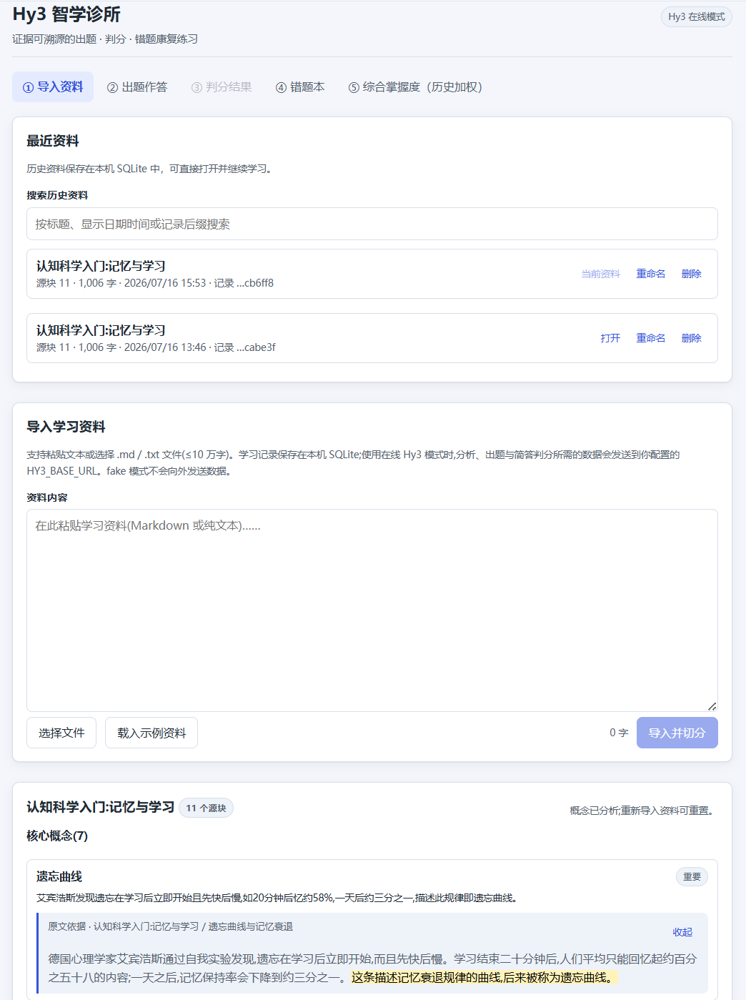
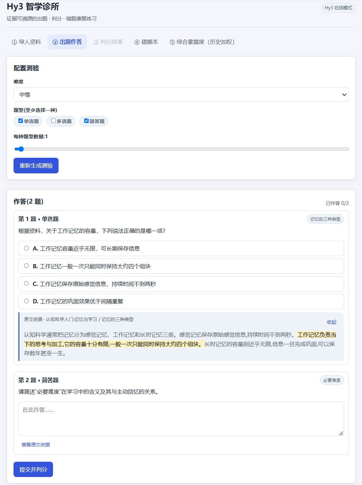
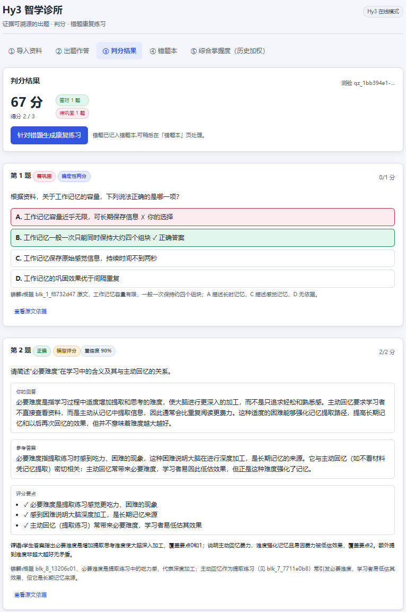
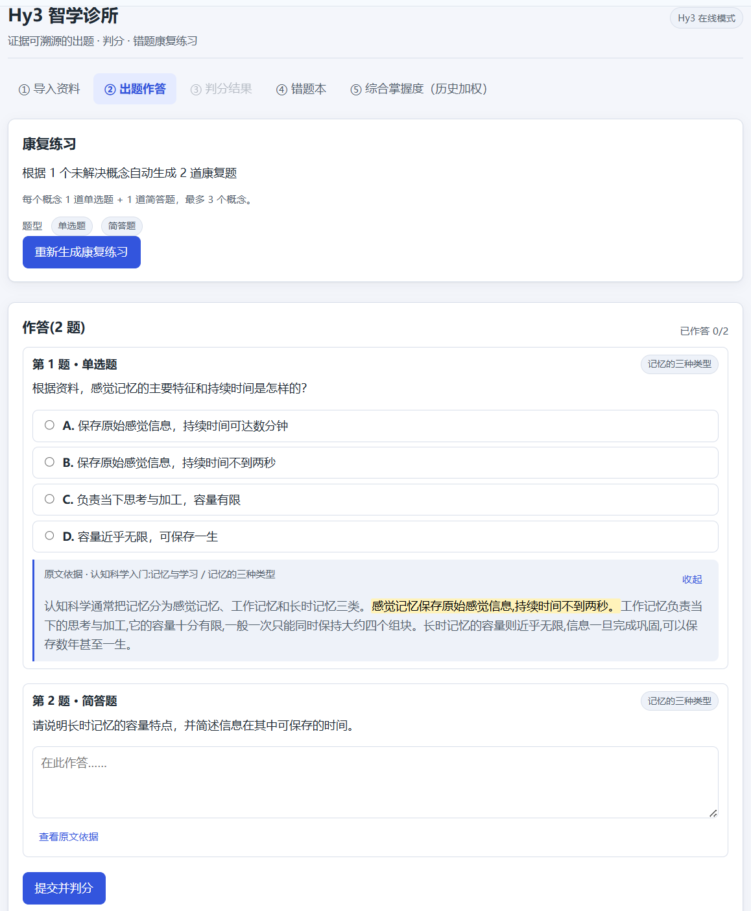
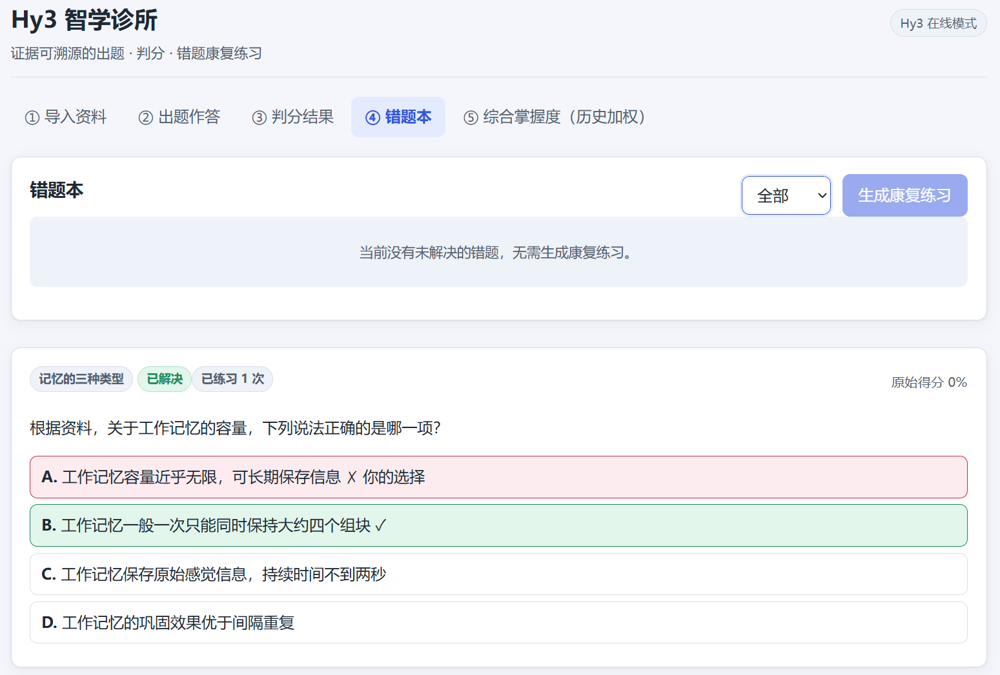
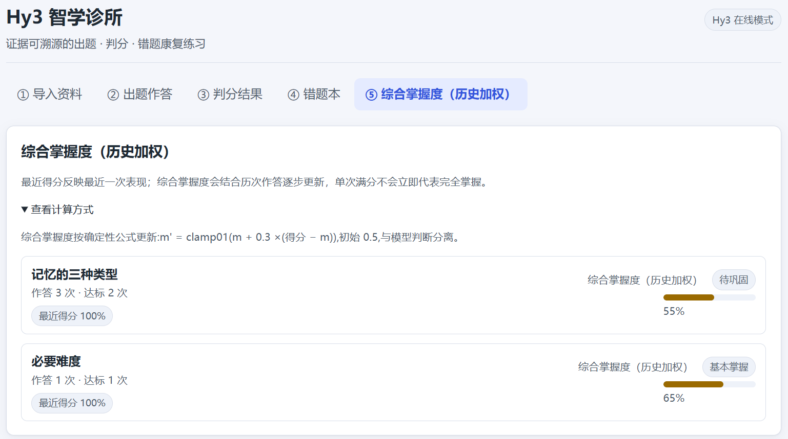

# Hy3 Study Clinic

[](https://github.com/Small-fish-QAQ/hy3-study-clinic/actions/workflows/ci.yml)
[](LICENSE)

Hy3 Study Clinic builds a **verifiable personal learning graph** from course materials, **aligns concepts across documents** (including bilingual and malformed duplicates), **diagnoses learning gaps**, and uses a **bounded Hy3 tutor** to plan evidence-grounded adaptive learning. A learner organizes one or more course documents (pasted text, Markdown, TXT, PDF, DOCX) inside a course workspace, extracts grounded concepts, aligns them into canonical workspace concepts, and lets Hy3 propose a **typed, evidence-cited concept graph**. Deterministic local code validates every proposal against the source text before anything is persisted. Mastery, mistakes, tentative misconception hypotheses, and review status are overlaid on the graph; a bounded Tutor session inspects local state through a read-only tool whitelist and produces a validated learning plan; cross-document activities update mistakes, misconceptions, mastery, and review scheduling through deterministic local rules; and a daily learning queue brings the learner back at the right time.

Everything the model proposes — concepts, alignments, questions, graph edges, plan reasons, misconception hypotheses — carries `(blockId, exact quote)` citations that the server re-verifies with exact string matching before acceptance. Grading arithmetic, mistake lifecycle, misconception transitions, mastery math, review scheduling, graph and alignment acceptance, tool execution, budgets, and persistence remain local and deterministic. The complete workflow runs offline with the deterministic fake provider; the same runtime-validated contracts drive the real Hy3 provider when configured.

## The evidence-grounded learning workspace

The primary journey (fully covered by the fake-provider smoke script, `npm run demo:graph`):

1. Create or open a **course workspace** (学习图谱 module; the app shell offers 资料库 · 学习图谱 · 练习 · 错题 · 学习进展).
2. Add one or more learning documents — pasted text, `.md`, `.txt`, `.pdf`, or `.docx` — with per-document parsing status, page counts, and visible extraction warnings.
3. Parsing preserves **source provenance**: stable block IDs, character offsets, heading paths, and (for PDF) page numbers.
4. Extract grounded concepts per document (existing pipeline).
5. Ask Hy3 to propose typed relationships between the existing concepts (`prerequisite`, `part_of`, `contrasts_with`, `causes`, `applies_to`, `example_of`), each with verbatim source evidence.
6. Local validation accepts only edges whose concepts exist in the workspace, whose relations are in the controlled vocabulary, whose evidence quotes verify exactly, and whose `prerequisite`/`part_of` structure stays acyclic — the result is persisted as a **versioned graph**; a failed generation never touches the previously active version.
7. The interactive graph fills the workspace between two collapsible panels and offers three layout modes — 网络视图 (default deterministic d3-force network), 依赖视图 (layered prerequisite hierarchy), and 薄弱路径 (a **minimal remediation subgraph**: every weak concept, deterministic shortest prerequisite repair paths, the direct part_of whole for context, and a small bounded number of direct prerequisite dependents — contrast/example/application/causal relations are excluded, and the UI states the scope, including when the minimal path happens to cover the whole graph). Edges are **floating, obstacle-aware, and crossing-minimized**: endpoints are dynamic node-boundary intersections that follow drags in real time, straight lines bend into gentle deterministic curves when a card blocks the way, parallel and reciprocal relations get separate lanes, and high-degree nodes spread their attachment points over side slots ordered by the geometric direction of each opposite endpoint — so edges sharing a node approach as an ordered fan instead of crossing in the last mile. A bounded deterministic whole-graph pass additionally scores candidate routes against the other edges' routes (card intersections ≫ edge crossings ≫ congestion ≫ bend ≫ length) and revisits crossing pairs until no improvement remains; freshly generated network layouts get a bounded crossing-aware local refinement before display, the dependency view orders each layer with deterministic barycenter sweeps, and every edge is painted over a canvas-colored casing under-stroke so the crossings that remain stay legible. Small relation-colored arrowheads terminate exactly at the target boundary (contrasts_with stays dashed and directionless). Nodes show learner state (`unassessed` / `weak` / `developing` / `stable`), mastery percentage, and open-mistake badges; hovering highlights a node's neighborhood with a tooltip (emphasis only — hover can never move nodes, re-run layout, re-route edges, or re-fit the view); the viewport fits automatically once per graph state after nodes measure. In-canvas overlays provide concept search, 适配视图 / 重新布局 actions, edge-label and unassessed-concept toggles, a legend, and a live graph summary. Node dragging is fully controlled and real-time (connected edges re-route locally per frame; one bounded global cleanup runs on drag release); final positions persist per graph version in `localStorage` on drag release, and 重新布局 clears them. An empty workspace shows a staged onboarding path driven by real persisted state.
8. Selecting a node opens the inspector (概览 · 原文证据 · 学习计划 tabs) with verified quotes (document, page, and section locations), mastery, attempts, mistakes, and relationships; selecting an edge (on canvas or via the keyboard-accessible relationship list) shows its relation, explanation, and verified evidence. Double-clicking a node enters 聚焦邻域 (one- or two-hop) with a 返回全图 control.
9. A weak concept can request a **remediation plan** — bounded input, controlled strategy/difficulty vocabularies, engine-supported question types only, and evidence-cited target reasons — validated locally before acceptance; invalid plans never replace an accepted plan, and accepting a plan writes **no** learning state.
10. Launching an accepted plan reuses the existing remediation engine when targets still have open mistakes, or preconfigures a focused practice quiz otherwise. Scoring, mistake resolution, and mastery updates flow through the unchanged deterministic pipeline.

Pre-upgrade single-material data remains fully readable: the migration gives every legacy material its own compatibility workspace and deletes nothing.

### The adaptive learning loop

On top of the workspace journey above, the adaptive upgrade (fully covered by `npm run demo:adaptive`) closes the loop:

11. **Align concepts across documents** — deterministic local candidates (normalized keys, malformed concatenations, shared blocks/headings, bilingual summary overlap) feed a bounded Hy3 proposal round; exact-normalization aliases are auto-accepted by a documented local rule, everything else waits for review in the 概念对齐 panel (accept with name repair / keep separate / reject). The graph then renders **one canonical node** per aligned group, with aliases and all source documents in the inspector; original concepts, evidence, and learning history stay untouched underneath.
12. **Run a diagnostic assessment** — a workspace-scoped quiz generated from validated question blueprints; cross-document questions (including the fully wired `concept_comparison` type) must carry verified evidence from at least two documents, and the client payload never contains answers, rubrics, or expected reasoning steps.
13. **See misconception hypotheses** — a substantive wrong answer may create a *proposed* hypothesis (可能的误区 · 待确认). Only a discriminating question can locally *confirm* or *reject* it, and only later correct performance *resolves* a confirmed one. The model can never set these states.
14. **Start a bounded Tutor session** from a weak node: a safe timeline streams live (state inspected → neighborhood inspected → tools requested and locally validated → evidence accepted → gap identified → strategy selected → plan accepted), the run is persisted and cancellable, and the final plan is validated by the same code path as the remediation planner before the recommended activity can be launched.
15. **Review on schedule** — every graded activity advances a local FSRS-style scheduler (stability/difficulty/due date, kept strictly separate from mastery), and the 今日学习 daily queue orders overdue reviews, confirmed misconception repair, open mistakes, weak prerequisites, and due-today items by explicit deterministic priorities.

## Demo

https://github.com/user-attachments/assets/13acc199-9212-433b-bee3-802a8e90a854

**[Watch the full demo video (under 2 minutes)](docs/assets/hy3-study-clinic-demo.mp4)**

Verified locally: **1:38.834**. The walkthrough covers both original end-to-end learning workflows, evidence panels, hybrid grading, remediation, resolved mistakes, and historical weighted mastery. Material history management is documented in the accompanying screenshots. (The video predates the learning-workspace upgrade; the workspace/graph/planner workflow is demonstrated by `npm run demo:graph`.)

## Core workflows

### Flow A — Grounded quiz and grading

1. Load the built-in sample, paste text, or import a `.md`, `.txt`, `.pdf`, or `.docx` learning material — the 资料库 import page and course workspaces accept the same formats through the same parsing pipeline. PDF text extraction requires embedded/selectable text (no OCR); malformed or text-free files are rejected with structured errors instead of being stored.
2. Local ingestion validates and splits the material into stable source blocks.
3. Hy3 analyzes core concepts and returns a quotation plus source-block reference for each one.
4. Hy3 generates questions, explanations, and exact-quote citations from the material.
5. Single- and multiple-choice questions are graded deterministically; nonblank short answers use Hy3 semantic rubric grading over **required/optional rubric points** — only points the question wording explicitly requests can reduce the score, while optional enrichment appears as 可补充 feedback.
6. The result view shows scores, coverage-derived status badges (正确 / 基本正确 / 部分正确 / 需巩固), answer explanations, grading provenance, 1-based rubric feedback, and traceable source evidence.

### Flow B — Mistake remediation

1. An answer scoring below `0.6` enters the mistake book as an open mistake.
2. Only concepts with **currently open** mistakes are eligible. They are ordered deterministically by open-mistake count, with at most three concepts selected per round.
3. Hy3 generates exactly one single-choice question and one short-answer question for every selected concept, so a remediation quiz always contains **2–6 questions**.
4. Resolved concepts are excluded, even if their historical mastery remains low.
5. A correctly answered remediation question resolves exactly its linked source mistakes; a low-scoring remediation answer can create a new open mistake.
6. Local code updates historical weighted mastery from the graded concept score. The model does not choose the update formula.

When there are no open mistakes, the server refuses remediation generation and the UI disables the action with an explicit empty state.

## Evidence

The screenshots are grouped by what they verify. They show the Chinese-language UI used in the final demo.

### Grounded quiz and grading



_Grounded concept analysis with source evidence — each visible concept includes an exact quotation and a source-block reference._



_Generated quiz with traceable evidence — questions expose their cited source passage without exposing answer keys before submission._



_Deterministic objective grading plus Hy3 semantic grading — the result view labels grading provenance and shows explanations and evidence._

### Mistake remediation and mastery



_Remediation generated from an unresolved concept — the quiz is explicitly scoped to the learner's open mistake concepts._


_Hy3 semantic grading — visible rubric points, feedback, confidence, and source evidence make the short-answer judgment reviewable._



_Resolved mistake and no-open-mistakes state — the mistake is marked resolved and remediation generation is disabled._



_Recent score versus historical weighted mastery — the UI keeps the latest result separate from the deterministic historical estimate._

### Material history


_Searchable material history — persisted records provide open, rename, and permanent-delete actions._

Additional evidence: [successful 100-point remediation result](docs/assets/05-hy3-remediation-result.png).

## What Hy3 does

The real `hy3` provider implements ten model-backed tasks through an OpenAI-compatible `chat/completions` API:

- extract concepts with proposed `{ blockId, quote }` evidence;
- generate grounded standard quiz questions and explanations;
- generate grounded remediation questions for selected open-mistake concepts;
- semantically grade nonblank short answers against classified rubric points, reporting full/partial coverage per point plus confidence and feedback (the numeric score is recomputed locally from required-point coverage);
- propose typed concept-graph edges between **existing** concepts, each with 1–3 verbatim evidence quotes;
- propose a bounded remediation plan (summary, weakness hypothesis, controlled strategy and difficulty, engine-supported question types, ordered steps, evidence-cited targets) from a locally bounded input;
- propose **concept alignments** (equivalent / alias / broader / narrower / related_but_distinct) between locally-pruned candidate pairs only, with a repaired canonical name and evidence;
- propose **workspace assessment items** — a validated question blueprint (target concepts, difficulty, learning objective, evidence-mapped reasoning steps) plus its concrete question, including cross-document `concept_comparison` items with evidence from several documents;
- propose (or explicitly decline) a **misconception hypothesis** for one wrong answer, with a controlled category and tentative wording;
- drive one bounded **Tutor step** at a time: select a whitelisted read-only tool with validated arguments, or finalize a plan plus a recommended activity.

Source blocks are wrapped in fresh per-request delimiters, labelled with stable block IDs, and explicitly marked as untrusted data rather than instructions. Short-answer grading inputs are fenced in the same way. Model output is JSON-extracted and checked against runtime schemas. If the model content cannot be extracted as valid JSON or fails its schema, the provider makes **one** structured repair request; a second failure returns a structured error. Transport, timeout, and later grounding failures are not retried by that repair loop.

After schema validation, the server checks every proposed citation using exact string matching. It computes offsets itself, records repeated occurrences, narrowly re-anchors a quote only when there is one unambiguous alternative block, and rejects unsafe or missing evidence. This verifies that the cited text exists at the recorded location; it does not independently prove the semantic truth of every generated explanation.

Hy3 does **not** perform objective scoring, total-score arithmetic, remediation target selection, mistake lifecycle management, misconception state transitions, mastery math, review scheduling, graph or alignment validation or acceptance, tool execution, plan acceptance, document parsing, or SQLite persistence. The model can never directly modify mastery, resolve or close mistakes, confirm/reject/resolve misconceptions, set review dates, accept concept merges, delete history, or mutate persistent learning state — everything it proposes is data that local code validates, persists, and acts on.

## What remains deterministic and local

The application keeps control-flow and record-keeping decisions outside the model:

| Local responsibility | Behavior |
| --- | --- |
| Ingestion and segmentation | Normalizes text, rejects unsupported/binary/oversized inputs, and creates source blocks with stable offsets. Binary sniffing applies to raw pasted/`.md`/`.txt` bytes only; PDF/DOCX extraction output is instead conservatively sanitized (see Document parsing). |
| Document parsing | Extracts PDF text per page (unpdf) and DOCX text with headings (mammoth); validates extension, magic bytes, and decoded size (≤10 MB); records page/heading provenance and visible extraction warnings; rejects malformed or text-free files instead of storing empty documents. Extraction artifacts emitted by real-world generators — e.g. Chrome/Skia PDFs map unmapped list-bullet glyphs to U+0000 — are removed before page spans are computed (NUL, stray control characters, soft hyphens, noncharacters, unpaired surrogates; form feed and similar separators become newlines), so valid documents are not misdetected as binary and artifacts never reach stored text. CJK, emoji, punctuation, tabs and newlines are preserved unchanged. |
| Runtime and grounding validation | Enforces request/domain schemas, question-type-specific fields, known concepts, requested question types, and exact-quote grounding. |
| Graph validation | Accepts only edges between existing workspace concepts with controlled relations and exactly-verified evidence; rejects self-links, cross-workspace references, duplicates, and `prerequisite`/`part_of` cycles; one invalid candidate never rejects valid siblings. |
| Graph versioning | Persists each generation as a new version; persist + activate + retention run in one transaction; a failed generation is recorded but never replaces the active graph; historical `ready` versions can be re-activated. |
| Learner-state overlay | Derives `unassessed`/`weak`/`developing`/`stable` per concept from existing mastery and mistake rows only (no second source of truth, no invented confidence values). |
| Plan validation | Verifies every plan target exists in the workspace, keeps the selected concept (or a direct prerequisite) central, re-verifies target evidence quotes, restricts question types to the assessment engine, and keeps the previous accepted plan on any failure. Accepting a plan writes no learning state. |
| Objective grading | Single choice uses exact equality; multiple choice uses exact set equality with no partial credit. Blank short answers receive a deterministic zero. |
| Rubric alignment | Classifies every short-answer rubric point as required (explicitly requested by the question) or optional enrichment; providers propose the classification, but local validation demotes unrequested evaluative points (advantages/drawbacks/comparisons), promotes stem-requested ones, requires evidence grounding for required points, repairs all-optional rubrics, deduplicates normalized points, and rejects rubrics with no groundable required point. Legacy string rubrics load as required points. |
| Short-answer scoring | Computes the score deterministically from REQUIRED-point coverage only — `(full + 0.5 × partial) / required` — so missing optional enrichment can never reduce the score, and neither the model's holistic score nor its confidence sets the awarded points. Status badges derive from the same coverage: full → 正确, ≥ 0.6 → 基本正确, > 0 → 部分正确, 0 → 需巩固. |
| Score calculation | Maps normalized question scores to points and totals all awarded/possible points locally. |
| Mistake lifecycle | Creates open mistakes below the `0.6` threshold and resolves the exact source mistakes linked to a correct remediation answer. |
| Remediation scope | Selects up to three open-mistake concepts and enforces exactly one single-choice plus one short-answer question per concept; a plan launch restricts selection to plan targets. |
| Persistence and recovery | Stores records in SQLite; restores the last selected material and workspace, their blocks/concepts/graph, while keeping mistake and mastery records available through scoped APIs. |
| Material management | Searches history, renames records, and transactionally deletes a document with its dependent learning data, graph edges, and workspace plans. |
| Request safety | Propagates cancellation and ignores superseded or late UI responses, including responses for a workspace, document, graph version, selection, or plan that was switched or deleted. |
| Alignment acceptance | Generates candidates deterministically (never all-pairs), auto-accepts only exact-normalization aliases under a documented tested rule, verifies proposal evidence, restricts proposals to locally-offered pairs, executes merges as transactional set unions (cycles impossible), and keeps every decision auditable. |
| Blueprint validation | Confirms blueprint concepts/documents belong to the workspace, verifies every evidence quote, computes `cross_document` scope from **verified** evidence only (a false multi-document claim is rejected), checks reasoning-step/evidence consistency, and strips answers, rubrics, and reasoning steps from client payloads. |
| Tutor execution | Validates every tool request against a typed whitelist with strict argument schemas, enforces workspace isolation and explicit budgets (6 iterations / 12 tool calls / 3 plan targets / 8 blocks per search / 20 evidence records), composes every timeline event locally, and validates the final plan through the shared planner validator. Failed, cancelled, or interrupted runs change no learning state. |
| Misconception lifecycle | Owns the `proposed → confirmed/rejected → resolved` state machine; only graded discriminating questions trigger transitions, illegal transitions are rejected, and terminal records stay auditable. |
| Review scheduling | Advances a local FSRS-style scheduler (stability, difficulty, due date, lapse count) only from completed graded events, keeps it strictly separate from mastery, and versions the scheduler state. |
| Daily queue | Orders overdue reviews (most overdue first), confirmed misconception repair, open mistakes, weak prerequisites, and due-today reviews by explicit deterministic priorities — facts only, no invented time estimates. The empty state explains these sources and offers the real workspace diagnostic assessment once concepts exist. |
| Source retrieval | A bounded local BM25-style lexical search (CJK bigrams + Latin words) plus graph-neighborhood expansion; bounded query/result/excerpt sizes, exact source locations, workspace isolation, no SQL/filesystem/network access. |

Historical weighted mastery uses the transparent local formula:

```text
m' = clamp01(m + 0.3 × (score − m))
```

Each concept starts at `0.5`. For a submission, the local service averages that concept's question scores and applies one update. A first perfect concept score therefore moves mastery to `0.65`, not `1.0`. This is a deterministic historical estimate—not a scientific cognitive diagnosis—and short-answer scores supplied to the formula can originate from Hy3's semantic grading.

## Workspaces, documents, and provenance

- A **workspace** groups documents, concepts, the versioned concept graph, and accepted remediation plans. Learner state (attempts, mistakes, mastery) stays keyed to documents/concepts; the workspace aggregates it.
- **Supported formats**: pasted text, `.md`, `.txt` (existing behavior preserved), plus `.pdf` and `.docx` uploads (base64 over JSON, ≤10 MB decoded, magic-byte checked). Both import surfaces — the top-level 资料库 page (`POST /api/materials`) and workspace documents (`POST /api/workspaces/:id/documents`) — share one ingestion path, one parser, and the same limits and error messages; a 资料库 file import lands in its own auto-created compatibility workspace like any legacy material. No OCR: a scanned image-only PDF is rejected with a structured `PARSE_FAILED` error, and image-only pages produce visible warnings.
- **Provenance per block**: stable content-addressed block ID, character offsets into the normalized document text (`content.slice(startOffset, endOffset) === block.content` is an invariant), heading path (Markdown/DOCX), and 1-based page number (PDF). Document metadata records media type, original filename, parsing status, page count, extraction warnings, and parser version.
- **Reprocessing** re-extracts a PDF/DOCX from its stored original bytes with the current parser. It is deliberately destructive for that document's dependent data (blocks, concepts, quizzes, mistakes, mastery) and for workspace plans/graph edges that referenced it — all replaced or pruned in one transaction after an explicit UI confirmation.
- **Deleting a document** removes its dependent data through verified FK cascades in one transaction; graph edges that lose their concepts or all their evidence are pruned, affected graph versions get a visible `pruned` marker, and all workspace plans are invalidated (plans may cite any document, and they carry no learning history).

## The concept graph

- **Nodes** are the existing extracted concepts (no duplicate concept model). **Edges** use the controlled relation vocabulary `prerequisite | part_of | contrasts_with | causes | applies_to | example_of` and carry 1–3 server-verified evidence quotes plus a concise model explanation.
- **Versioning**: every generation attempt creates a new version row (`generating → ready | failed`) with provider metadata and a validation summary (candidates, accepted, rejected with reasons, duplicates removed, dropped evidence). Success persists edges, marks the version `ready`, and activates it atomically; at most 10 versions are retained per workspace. Failure — provider error or zero surviving edges — marks the version `failed` and leaves the previously active graph untouched.
- **Caveat preserved**: exact quotation validation proves the quoted text exists at the claimed source position; it does not independently prove the semantic relationship. The UI labels edge explanations and plan reasons as model-proposed, and verified quotes as locally verified.

## Learner-state overlay

For every workspace concept the server derives, deterministically and only from existing mastery/mistake rows:

- `unassessed` — no graded attempts;
- `weak` — open mistakes exist, or mastery `< 0.7`;
- `stable` — no open mistakes, mastery `≥ 0.85`, and at least 3 graded attempts;
- `developing` — everything in between;

plus mastery value, attempt/correct counts, last score and activity time, open/resolved mistake counts, an "enough supporting activity" flag (≥3 attempts), and direct prerequisite concepts from the active graph. There are no probabilistic confidence values and no spaced-repetition scheduling (no FSRS).

## Remediation planning

- **Bounded planner input**: the selected concept, its direct prerequisites (≤5) and direct graph neighbors (≤8), the source blocks of the involved documents, current mastery rows, open mistakes (≤10, stems only), and previously seen question types.
- **Structured plan**: summary, weakness/misconception hypothesis, strategy from `review | contrast | worked_example | retrieval_practice | prerequisite_repair | application_practice`, difficulty from `easy | medium | hard`, question types restricted to the existing engine (`single_choice | multiple_choice | short_answer`), 1–6 ordered steps, and 1–4 targets each with an evidence-cited reason.
- **Local acceptance rules**: every target must be a workspace concept; the selected concept or one of its direct prerequisites must remain central; target evidence is re-verified against the source; an invalid proposal fails with a structured error and the previously accepted plan is kept. One accepted plan is stored per (workspace, concept).
- **Launch**: if plan targets still have open mistakes, the existing remediation engine runs on the document with the most open targeted mistakes, restricted to plan targets (questions stay linked to the mistakes they re-test). Otherwise a focused practice quiz is preconfigured from the plan's difficulty and question types. Either way the existing deterministic grading/mistake/mastery pipeline is unchanged, and the plan itself never writes learning state.

## Canonical cross-document concept alignment

- **Layered model** — source concept mentions (the original per-document rows) are never destroyed or rewritten. A separate alignment layer maps every source concept into exactly one **canonical workspace concept**; merging is a transactional union of two canonical groups, so cycles are impossible by construction. Aliases are the distinct member names; every proposal (accepted, rejected, or kept separate) stays auditable.
- **Deterministic candidates first** — normalized-key equality (NFKC + casefold + whitespace/punctuation strip + safe plural folding), malformed-concatenation containment (`Workingmemoryhas` ⊃ `workingmemory`), shared evidence blocks, identical headings across documents, Latin token overlap, bilingual summary-bigram overlap, and previously accepted alias knowledge. The bounded candidate list (≤30 pairs) is all Hy3 ever sees — never all pairs.
- **One tested auto-accept rule** — only exact normalized-key equality is auto-accepted (as `alias`, origin `local_rule`), with the display name chosen deterministically (Chinese over Latin, spaced over concatenated, then shorter). Every semantic merge requires review.
- **Local validation of proposals** — concepts must exist in the workspace, the pair must have been locally offered, self-alignment is rejected, evidence quotes must verify exactly, duplicates are dropped. Rejected model output is reported with reasons, never persisted as accepted.
- **Deletion policy** — memberships cascade away with their source concepts; a canonical concept survives while at least one backing document remains and is removed with its last member.
- **Display** — the graph renders one node per canonical group (anchored on a stable representative source concept, so saved positions and selection keep working); edges are re-anchored and deduplicated; learner overlays aggregate member states with the same thresholds as the server. All of this is a pure client-side projection — no second source of truth.

## Cross-document assessment

- **Question blueprints** — every workspace assessment question is generated together with a blueprint recording target canonical concepts, source concepts, source documents, type, difficulty, learning objective, evidence-mapped expected reasoning steps, scope, and grading method. Blueprints are persisted for audit; reasoning steps stay server-side.
- **Honest cross-document scope** — `cross_document` is computed locally from the documents of the **verified** evidence; a question claiming to span documents without verified multi-document evidence is rejected (`concept_comparison` requires it).
- **`concept_comparison`** is a fully wired new question type: generated with evidence from at least two documents, answered as free text, graded through the existing semantic-rubric path, persisted, displayed with per-document evidence badges, and covered by tests. Existing `single_choice`/`multiple_choice`/`short_answer` behavior is unchanged.
- **Exact attribution** — grading keys every question to **its own concept's document** (never an arbitrary quiz-level document): mistakes, mastery, misconceptions, and review items all land on the right concept and document, while blueprints retain the canonical- and document-level trace. Assessment modes: `diagnostic`, `concept_practice`, `prerequisite_repair`, `cross_document`, `review`, `misconception_check`.
- **Closing the loop** — practice-oriented assessment questions link to the open mistakes of their concept, so a correct answer resolves exactly those mistakes (the same rule remediation quizzes always had). Every graded submission returns a deterministic `stateChanges` summary (concepts and documents assessed, mistakes created/resolved, misconception transitions, mastery movements, review scheduling, recommended next step) that the results view renders.

## Bounded Hy3 Tutor

- **Tool whitelist** (read-only, workspace-scoped, strict Zod argument schemas): `inspect_learning_state`, `inspect_concept`, `inspect_canonical_aliases`, `get_graph_neighborhood`, `get_prerequisite_path`, `search_source_blocks`, `read_source_block`, `inspect_open_mistakes`, `inspect_misconceptions`, `inspect_review_queue`. Tools cannot touch the filesystem, run SQL or shell commands, make HTTP requests, or mutate any state; out-of-workspace references fail closed before execution.
- **Explicit budgets** — at most 6 planning iterations, 12 executed tool calls, 3 final plan targets, 8 blocks per search, 20 retained evidence records, and a bounded observation size; no recursion, no sub-agents, no unbounded retries. A model that never finalizes fails the run with zero state changes.
- **Safe timeline** — the run streams NDJSON events (`session_started`, `state_inspected`, `neighborhood_inspected`, `tool_requested/validated/rejected`, `evidence_accepted/rejected`, `gap_identified`, `strategy_selected`, `plan_accepted`, `session_completed/cancelled/failed`) whose summaries are composed by local code. Chain-of-thought, raw prompts, and raw model output are never exposed or persisted.
- **Final plan** — validated by the same shared validator as the remediation planner (workspace concepts only, centrality, exact-quote evidence) and persisted through the existing plan store, together with a recommended activity (`mode` + concept ids) the UI can launch in one click.
- **Run persistence** — every run (status, iterations, tool calls, accepted evidence, plan, activity, error) and its timeline events are persisted and inspectable; client disconnects mark the run `cancelled`; runs left `running` by a dead process are marked `interrupted` on startup. No non-completed run ever alters mastery, mistakes, misconceptions, or review state.

## Misconception hypotheses

- One wrong answer is **never** a diagnosis. A substantive wrong answer on a workspace assessment may create a *proposed* hypothesis (bounded to 2 per submission, provider output schema-validated, evidence verified, tentative wording enforced in the UI: 可能的误区 · 待确认).
- The deterministic state machine is `proposed → confirmed | rejected` (decided **only** by a graded discriminating question: wrong confirms, correct rejects) and `confirmed → resolved` (a later correct discriminating answer). `rejected`/`resolved` are terminal and stay auditable; illegal transitions are refused; the model cannot set any state.
- The Tutor ranks confirmed misconceptions above one-off proposals; rejected hypotheses never drive the daily queue.

## Review scheduling and the daily queue

- **Separate concerns** — mastery answers "how well has understanding been demonstrated"; review scheduling answers "when should this concept be reviewed". Neither overwrites the other.
- **Local FSRS-style scheduler** (documented deliberately as a compact local implementation instead of a new dependency): per-concept stability and difficulty, deterministic score→rating mapping (`again < 0.6 ≤ hard < 0.75 ≤ good < 0.9 ≤ easy`), growth on success, collapse + lapse count on `again`, versioned state, immutable review events, fixed-clock tests. Only completed graded events advance it.
- **今日学习 daily queue** — overdue reviews (most overdue first), confirmed misconception repair, open mistakes, weak prerequisites of weak concepts, then due-today reviews; one concept appears once; reasons state facts (counts, overdue days) with no invented time estimates.

## Bounded local source retrieval

Retrieval is a small deterministic module, not a vector database: NFKC-normalized CJK character bigrams plus Latin word tokens scored BM25-style over the workspace's blocks, with graph-neighborhood expansion appended and everything bounded (query ≤200 chars, ≤8 results, ≤240-char excerpts with exact offsets). SQLite FTS5 was deliberately not used because its default tokenizers do not segment CJK text; at dozens of blocks per workspace, scoring on the fly is simpler and consistent. Retrieved text is data only — documents containing instruction-like text ("Ignore all previous instructions…") flow through search results verbatim with zero effect on state, and every prompt fences source material as untrusted data.

## Evaluation

`eval/` contains small original bilingual fixtures (including malformed names, conflicting claims, and prompt-injection text), hand-authored labels (explicitly not model-generated), and two runners: `npm run eval:fake` (offline; 31 structural checks over provenance, alignment, blueprints, budgets, misconception/review transitions, retrieval bounds, injection defenses, and state invariants) and `npm run eval:hy3` (optional; requires explicit real credentials, refuses to run without them, and measures schema first-pass success, grounding acceptance, label agreement, cross-document answerability, Tutor-step validity, and latency). See [eval/README.md](eval/README.md).

## Database migrations

The SQLite schema is migrated in place (numbered, run-once, idempotent to re-run):

1. `initial_schema` — original tables.
2. `course_workspaces_and_documents` — adds `workspaces`, document metadata columns on `materials` (media type, filename, parse status, page count, warnings, parser version, original bytes, `updated_at`), and `page_number` on `source_blocks`. Every existing material receives its own compatibility workspace named after its title. No learning data is deleted or rewritten; migration from a populated pre-upgrade database is covered by tests.
3. `concept_graph_and_remediation_plans` — adds `graph_versions`, `graph_edges` (FK-cascaded to concepts), `graph_edge_evidence` (FK-cascaded to source blocks), and `remediation_plans` (unique per workspace + concept).
4. `canonical_concept_alignment` — adds `canonical_concepts`, `canonical_members` (one per source concept, FK-cascaded), and auditable `alignment_proposals`.
5. `workspace_assessments_and_blueprints` — rebuilds `quizzes` per the documented SQLite table-rebuild procedure (all rows copied; `material_id` becomes nullable, `workspace_id`/`assessment_mode` added; foreign keys disabled around the transaction with a `foreign_key_check` before commit so a bad rebuild rolls back completely) and adds `question_blueprints`.
6. `misconception_hypotheses` — adds `misconceptions` with full audit payloads.
7. `review_scheduling` — adds `review_items` (per workspace + concept) and immutable `review_events`.
8. `tutor_runs_and_events` — adds `tutor_runs` and their safe timeline `tutor_events`.

Migration from populated v1 and v3 databases (including rollback on a mid-batch failure and FK re-enablement) is covered by tests; deleting one document preserves canonical concepts still backed by other documents, and deleting the last backing document removes them under the documented policy.

## New production dependencies

| Dependency | Where | Why it was selected |
| --- | --- | --- |
| [`unpdf`](https://github.com/unjs/unpdf) | server | Actively maintained serverless build of Mozilla PDF.js for text extraction. Per-page text (needed for page provenance), no native dependencies, no worker configuration, no execution of embedded scripts, no OCR. |
| [`mammoth`](https://github.com/mwilliamson/mammoth.js) | server | The standard maintained DOCX text extractor. Reads only `word/document.xml` (macros/scripts/media ignored), emits a constrained HTML that we convert deterministically to Markdown-style text so headings survive as section provenance, and reports conversion warnings we surface to the learner. |
| [`@xyflow/react`](https://github.com/xyflow/xyflow) (React Flow 12) | web | Small, actively maintained, React-18-compatible interactive graph renderer with built-in pan/zoom, node dragging, and node/edge selection. |
| [`d3-force`](https://github.com/d3/d3-force) | web | Standard, tiny force-simulation library used per the official React Flow force-layout guidance. The 网络视图 layout runs a bounded number of synchronous ticks with positions seeded from concept-ID hashes and d3-force's deterministic LCG, so layouts are reproducible, never animate indefinitely, and never consume background CPU. |

The committed binary test fixtures (`apps/server/src/testing/files/`) are tiny self-authored files regenerated by `node scripts/generate-test-fixtures.mjs`. `artifacts.pdf` replicates the Chrome/Skia font structure (Type0/Identity-H with ToUnicode mappings to `<0000>`) that makes PDF.js emit NUL characters inside valid text — the regression class behind a real-world import failure.

## Architecture

```text
apps/web (React + Vite)
        │  /api JSON
        ▼
apps/server (Fastify)
        ├── ingestion + grounding + deterministic services
        ├── SQLite (better-sqlite3)
        └── provider boundary ──► Hy3-compatible API or offline Fake Provider

packages/shared ── runtime Zod schemas, domain types, provider payloads,
                   sample material, and mastery formula used by both apps
```

- [`apps/web`](apps/web) contains the interactive learning-workspace (workspace/documents · interactive graph · evidence/tutor detail), import, quiz, results, mistake, mastery, evidence, and history-management UI.
- [`apps/server`](apps/server) contains Fastify routes, ingestion and document parsing, grounding verification, graph validation, grading/remediation/planner services, provider adapters, repositories, and migrations.
- [`packages/shared`](packages/shared) contains the cross-workspace runtime schemas and deterministic domain utilities.
- SQLite stores workspaces, materials (documents), blocks, concepts, canonical concepts/members/alignment proposals, graph versions/edges/evidence, remediation plans, question blueprints, quizzes, submissions, grading results, mistakes, mastery, misconceptions, review items/events, and Tutor runs/events. The browser talks only to the server; it never calls Hy3 directly.

For a deeper request-lifecycle description, see [Architecture & Design Notes](docs/ARCHITECTURE.md).

## Getting started

### Requirements and installation

- Node.js **20 or newer** (`package.json` specifies `>=20.0.0`; `.nvmrc` selects 20).
- npm. Docker and an API key are not required for the default offline mode.

Install dependencies and copy the tracked environment template.

Windows PowerShell:

```powershell
npm install
Copy-Item .env.example .env
npm run dev
```

Unix-like shells:

```bash
npm install
cp .env.example .env
npm run dev
```

Open <http://localhost:5173>. The Vite development server proxies `/api` to the Fastify server at `http://127.0.0.1:8787`.

### Provider modes

- `LLM_PROVIDER=fake` is the default: offline and suitable for local development and automated tests, with no network or API key. The complete workflow can be repeated offline; the provider function itself is deterministic for identical input (unit-tested), and local scoring rules (objective grading, the EMA mastery formula) are deterministic — but end-to-end run output such as concept order, selected weak concepts, and generated questions may vary between runs, and no bit-for-bit identical output is claimed.
- `LLM_PROVIDER=hy3` runs the real online flow. `HY3_BASE_URL`, `HY3_API_KEY`, and `HY3_MODEL` are then required and remain server-side. The repository intentionally provides no default endpoint, model, or credential.

The tracked [`.env.example`](.env.example) defines the complete configuration contract:

| Variable | Default in the tracked example | Purpose |
| --- | --- | --- |
| `LLM_PROVIDER` | `fake` | Select `fake` or `hy3`. |
| `HY3_BASE_URL` | empty | Hy3-compatible API base URL; the adapter appends `/chat/completions`. Required for `hy3`. |
| `HY3_API_KEY` | empty | Server-side API key. Required for `hy3`; never place a real key in tracked files. |
| `HY3_MODEL` | empty | Provider model name. Required for `hy3`. |
| `HY3_TIMEOUT_MS` | `30000` | Per-call timeout in milliseconds. |
| `PORT` | `8787` | Fastify port. |
| `HOST` | `127.0.0.1` | Fastify bind host. |
| `DATABASE_PATH` | `./data/clinic.sqlite` | SQLite file, or `:memory:` for an ephemeral database. |

`DATABASE_PATH` is resolved from the server process working directory. With the normal npm workspace commands, the default file is `apps/server/data/clinic.sqlite`; if the compiled server is launched from another directory, use an absolute path when location must be independent of the working directory. The root `.env` is loaded explicitly even though the server runs from its workspace.

### Commands

| Command | Purpose |
| --- | --- |
| `npm run dev` | Build shared code, then run server and web development processes. |
| `npm run build` | Production build/type-check for all workspaces. |
| `npm run start -w @hy3-clinic/server` | Start the built API server after `npm run build`. |
| `npm test` | Build shared code and run every workspace test suite. |
| `npm run lint` | Run ESLint and Prettier checks. |
| `npm run format` | Apply repository formatting. |
| `npm run demo:offline` | Run both flows in-process with the offline fake provider after a build (repeatable offline; generated content/order may vary between runs). |
| `npm run demo:http` | Drive both original flows over HTTP while `npm run dev:server` is running. |
| `npm run demo:graph` | Drive the complete workspace → documents (MD/PDF/DOCX) → concepts → graph → overlay → plan → remediation workflow over HTTP while the server is running; `node scripts/smoke-graph.mjs verify <workspaceId> <conceptId>` re-checks persistence after a restart. |
| `npm run demo:adaptive` | Drive the complete adaptive workflow over HTTP (multi-document import with bilingual duplicates → alignment → canonical graph → diagnostic assessment → misconception proposal + discriminating confirmation → bounded Tutor timeline → recommended practice → deterministic mistake/mastery/misconception/review updates → daily queue); `node scripts/smoke-adaptive.mjs verify <workspaceId> <conceptId> <runId>` re-checks persistence after a restart. |
| `npm run eval:fake` | Offline structural evaluation (31 checks) after a build; writes `eval/reports/eval-fake.{json,md}`. |
| `npm run eval:hy3` | Optional real-provider evaluation; requires explicit `HY3_*` credentials and refuses to run without them. |

The web production bundle is emitted under `apps/web/dist` and can be served by a static host alongside the API.

## Persistence and material management

Learning records are stored locally in SQLite and remain available after a browser refresh. The browser stores only the last selected material ID in `localStorage`; on startup it verifies that ID against SQLite-backed history, then restores the material, source blocks, and persisted concepts. Mistakes and mastery remain available through their material-scoped APIs.

Recent-material history provides search by title, displayed creation time, or record suffix, plus explicit open, inline rename, and permanent-delete actions. Renaming changes only the trimmed title and preserves the material ID and learning records.

Permanent deletion requires a confirmation that identifies the record and states that the action is irreversible. The root deletion is transactional, and SQLite foreign-key cascades remove the material's blocks, concepts, quizzes, questions, submissions, grading results, mistakes, and mastery records. There is no recycle bin or undo.

## Reliability, privacy, and safety

- Zod runtime schemas validate API inputs, persisted domain objects, and structured provider output; question schemas enforce choice/short-answer-specific required and incompatible fields.
- Exact-quote grounding is verified after model-output validation. Invalid standard questions are discarded, while an incomplete remediation pair fails the whole remediation generation.
- Invalid model JSON/schema output receives at most one repair request, avoiding unbounded retry loops.
- Hy3 calls have configured timeouts and external cancellation that remains active while the response body is read. UI request identities prevent late or superseded responses from replacing current state.
- Transactions protect multi-row operations such as material/block insertion, concept replacement, quiz/question insertion, migrations, remediation counters, and permanent deletion. Foreign keys and cascade behavior are enabled and regression-tested.
- In `fake` mode, provider work stays offline. In `hy3` mode, the source/question context needed for analysis, generation, remediation, and short-answer grading is sent to the configured endpoint; short-answer grading also sends the student's answer and rubric context.
- Credentials are read only by the server, sensitive request headers are redacted from logs, and `.env`, `data/`, SQLite, WAL, and SHM files are ignored by Git.
- Randomized untrusted-data boundaries and plain-text React rendering reduce injection risk, but the project does not claim to be prompt-injection proof.

## Testing

`npm test` was run against the current working tree on **2026-07-21**:

| Workspace | Test files | Tests | Result |
| --- | ---: | ---: | --- |
| `packages/shared` | 5 | 74 | Passed |
| `apps/server` | 34 | 318 | Passed |
| `apps/web` | 14 | 229 | Passed |
| **Overall** | **53** | **621** | **Passed** |

Regression coverage includes exact grounding and source fencing; structured Hy3 output and bounded repair (including graph-edge and plan proposals); semantic-grading equivalence rules; deterministic objective grading; resolved-concept exclusion and exact remediation pairs; no-open-mistake behavior; persistence recovery; rename/delete confirmation and failure handling; transactional rollback and cascade deletion; provider timeout/cancellation; and stale-response suppression after navigation, material switching, or deletion.

Upgrade coverage adds: workspace/document/graph/plan schema bounds; PDF/DOCX/malformed-file ingestion with page and heading provenance; the unified material-library file import (PDF/DOCX at `POST /api/materials`: provenance, history reopen, direct concept analysis, title override, transactional rejection of malformed/scanned/oversized/unsupported files with no partial writes, and the frontend picker's staging, importing/cancel states, local validation, and stale-response handling); migration from representative populated pre-upgrade databases (v1 and v3, including rollback and FK re-enablement); the graph validation matrix; the graph generation lifecycle; deterministic learner-overlay states; planner acceptance/rejection semantics and both launch modes; document deletion pruning graph edges without dangling references; and the graph frontend's states, selection, evidence display, planner lifecycle, cancellation, and stale-response suppression.

Adaptive coverage adds: alignment candidate signals and the exhaustive misconception transition matrix (shared package); alignment auto-accept/review/decide/rename/deletion-policy flows plus hostile-provider rejection (unoffered pairs, unknown concepts, self-alignment, fabricated evidence); cross-document blueprint validation (false multi-document claims, unsupported types, fabricated evidence, answer-leak prevention), per-concept document attribution, review scheduling only after graded completion, and adaptive mistake resolution; the review scheduler (fixed clock: initial scheduling, lapse, monotone growth, clamps, invalid ratings, day boundaries); retrieval bounds and injection neutrality; Tutor tool whitelist/argument/workspace-isolation/read-only guarantees, budget exhaustion, hostile tool calls, plan-validation fail-closed, target caps, cancellation, interrupted-run marking, NDJSON streaming, and end-to-end injection resistance; and the adaptive frontend (canonical node collapsing and overlay aggregation, alignment review with name repair, daily-queue launches, Tutor timeline streaming/cancellation/stale suppression, misconception and review display, and the state-change results card).

Grading-correctness coverage adds: rubric back-compat parsing (legacy strings load as required points; all-optional rubrics promote) and graded-status classification thresholds (shared package); stem-aspect alignment, evidence grounding, zero-required repair/rejection, and deduplication of proposed rubric points; deterministic required-coverage scoring (full/partial credit, out-of-range index tolerance, optional points carrying zero score-reducing weight); end-to-end submissions where missing optional enrichment keeps full credit and creates no mistake, and partial required coverage earns deterministic partial credit; the results UI (1-based 要点 numbering, 可补充 rendering without error markers, 正确/基本正确/部分正确/需巩固 badges); and assessment-launch states (immediate disabled aria-busy feedback on the daily queue, Tutor recommendation and empty-state diagnostic, single-activity guarantee under rapid clicks, failure recovery, stale-completion suppression after workspace or concept switches, and queue refetch after graded completion).

## CodeBuddy collaboration

CodeBuddy Code was connected to Hy3 through Tencent Cloud TokenHub and used for a focused accessibility and regression audit of the source-evidence disclosure.

- It inspected `SourceEvidencePanel`, its call sites, tests, and shared evidence types, and confirmed that the production disclosure already used native button semantics, `aria-expanded`, `aria-controls`, and a stable panel ID.
- Its accepted contribution in [`SourceEvidencePanel.test.tsx`](apps/web/src/components/SourceEvidencePanel.test.tsx) fixed a regression test that retained a detached DOM-node reference after conditional rendering replaced the toggle button; added keyboard coverage for opening and closing with Enter and Space; and added fallback coverage for unavailable cited source blocks so optional offsets neither corrupt nor duplicate displayed text.
- CodeBuddy did not author the existing production accessibility attributes and did not stage, commit, or push files.

## Evidence-to-requirement matrix

| Submission claim | Implementation | Evidence | Relevant tests |
| --- | --- | --- | --- |
| Hy3 used throughout final workflows | [`hy3Provider.ts`](apps/server/src/llm/hy3Provider.ts), [`provider.ts`](apps/server/src/llm/provider.ts) | [Full demo](docs/assets/hy3-study-clinic-demo.mp4), screenshots [01](docs/assets/01-hy3-grounded-analysis.png), [02](docs/assets/02-hy3-generated-quiz.png), [06](docs/assets/06-hy3-semantic-grading.png) | [`hy3Provider.test.ts`](apps/server/src/llm/hy3Provider.test.ts), [`flows.test.ts`](apps/server/src/routes/flows.test.ts) |
| Interactive frontend | [`App.tsx`](apps/web/src/App.tsx), [`views`](apps/web/src/views) | [Full demo](docs/assets/hy3-study-clinic-demo.mp4), screenshots 01–09 above | [`App.test.tsx`](apps/web/src/App.test.tsx) |
| Grounded concept analysis | [`analysis.ts`](apps/server/src/services/analysis.ts), [`verify.ts`](apps/server/src/grounding/verify.ts) | [Screenshot 01](docs/assets/01-hy3-grounded-analysis.png) | [`verify.test.ts`](apps/server/src/grounding/verify.test.ts), [`flows.test.ts`](apps/server/src/routes/flows.test.ts) |
| Generated grounded quiz | [`quizzes.ts`](apps/server/src/services/quizzes.ts), [`prompts.ts`](apps/server/src/llm/prompts.ts) | [Screenshot 02](docs/assets/02-hy3-generated-quiz.png) | [`flows.test.ts`](apps/server/src/routes/flows.test.ts), [`quizzes.test.ts`](apps/server/src/services/quizzes.test.ts) |
| Hybrid grading | [`grading.ts`](apps/server/src/services/grading.ts), [`score.ts`](apps/server/src/grading/score.ts) | Screenshots [03](docs/assets/03-hy3-grading-result.png) and [06](docs/assets/06-hy3-semantic-grading.png) | [`score.test.ts`](apps/server/src/grading/score.test.ts), [`flows.test.ts`](apps/server/src/routes/flows.test.ts) |
| Mistake remediation | [`remediation.ts`](apps/server/src/services/remediation.ts), [`grading.ts`](apps/server/src/services/grading.ts) | Screenshots [04](docs/assets/04-hy3-remediation-quiz.png) and [07](docs/assets/07-hy3-mistakes-resolved.png) | [`flows.test.ts`](apps/server/src/routes/flows.test.ts) |
| Second end-to-end flow | [`study.ts`](apps/server/src/routes/study.ts), [`MistakesView.tsx`](apps/web/src/views/MistakesView.tsx) | [Full demo](docs/assets/hy3-study-clinic-demo.mp4), screenshots [04](docs/assets/04-hy3-remediation-quiz.png), [07](docs/assets/07-hy3-mistakes-resolved.png), [08](docs/assets/08-hy3-mastery.png) | [`flows.test.ts`](apps/server/src/routes/flows.test.ts), [`App.test.tsx`](apps/web/src/App.test.tsx) |
| Local persistence and history | [`database.ts`](apps/server/src/db/database.ts), [`materials.ts`](apps/server/src/repositories/materials.ts), [`App.tsx`](apps/web/src/App.tsx) | [Screenshot 09](docs/assets/09-material-history-management.png) | [`repos.test.ts`](apps/server/src/repositories/repos.test.ts), [`apps/server/src/routes/materials.test.ts`](apps/server/src/routes/materials.test.ts), [`apps/server/src/services/materials.test.ts`](apps/server/src/services/materials.test.ts), [`App.test.tsx`](apps/web/src/App.test.tsx) |
| Under-two-minute demo | [`docs/assets`](docs/assets) | [1:38.834 demo](docs/assets/hy3-study-clinic-demo.mp4) | Local container-duration inspection |
| Open-source reproducibility | [`package.json`](package.json), [`.env.example`](.env.example), [`ci.yml`](.github/workflows/ci.yml), [`fakeProvider.ts`](apps/server/src/llm/fakeProvider.ts) | [Full demo](docs/assets/hy3-study-clinic-demo.mp4) | 226 passing tests across all workspaces |

## Limitations

- Reopening a material restores its source and concepts, but not historical quiz, submission, or result screens; there is no material-scoped read API for those histories.
- Per-document remediation processes at most three currently open concepts per round; workspace assessments are bounded to 8 questions and 6 target concepts.
- Unsubmitted answers live only in React state and are not persisted.
- Permanent deletion has no recycle bin or undo; document reprocessing intentionally resets that document's extraction-dependent learning data after confirmation.
- Mastery is a simple exponential moving-average heuristic, not a cognitive diagnosis; the learner-state thresholds (0.7 weak / 0.85 stable / 3 attempts) are deterministic product choices, not calibrated psychometrics.
- **Semantic concept alignment can be wrong** — normalized-key auto-accept is safe by construction, but model-proposed merges are hypotheses the learner must review; a wrong accepted merge can be mitigated by renaming but there is currently no unmerge operation (the underlying source concepts and history remain intact).
- **Misconception hypotheses require confirmation** — a proposed hypothesis is tentative by definition, one discriminating question is a pragmatic (not psychometrically validated) decision rule, and hypothesis quality depends on the provider.
- **Review scheduling is not proof of learning** — the local FSRS-style model estimates forgetting risk with fixed constants; it is not calibrated to the individual learner, and there is no per-item manual rescheduling.
- **Bounded Tutor plans may be incomplete** — the Tutor sees at most its budgeted tool observations; it can miss context, and a run that exhausts its budgets fails without a plan (by design).
- No OCR: image-only PDFs (or pages) yield structured errors or per-page warnings. DOCX has no page numbers (section headings are the provenance); PDFs have no reliable heading structure (pages are the provenance).
- PDF extraction fidelity is bounded by the file's own ToUnicode maps: glyphs a generator mapped to U+0000 (typically list bullets/arrows in Chrome/Skia PDFs) are removed rather than reconstructed, and compatibility code points the generator chose (e.g. Kangxi-radical forms for some CJK characters) are stored as extracted, which can affect exact-text search for those characters.
- No vector database and no generic RAG: retrieval is bounded lexical scoring plus graph expansion; recall is limited by exact-ish term overlap (CJK bigrams mitigate segmentation but not synonymy).
- Strict citation verification can reject otherwise schema-valid model output and require regeneration; the structured-output repair attempt does not repair downstream grounding failures. Generated graphs, quizzes, and assessments can contain fewer items than requested when invalid candidates are rejected.
- Exact-quote verification proves citation location, not semantic entailment — for quiz explanations, graph relationships, alignment rationales, misconception hypotheses, and plan reasons alike.
- Edge routing and crossing minimization are deterministic and bounded (small candidate sets, a bounded pair-improvement phase, and a bounded layout refinement — not an exhaustive global solver): dense or pathological arrangements can retain edge-edge crossings (the casing under-stroke keeps them legible), and a node dragged directly on top of the only corridor between two others can still force a route across a card. Manual node positions saved in one layout mode are reused by the other modes (by design, per graph version).
- Legacy PDF/DOCX documents imported before the upgrade cannot be reprocessed (no stored original bytes); re-import them instead.
- Evaluation fixtures and labels are deliberately small; `eval:hy3` results depend on the configured model/API and are indicative, not benchmarks. Generated content and ordering may vary between runs even in fake mode — only local scoring and state rules are deterministic.

## License

[Apache-2.0](LICENSE). The built-in Chinese sample course is original repository content released under the same license.
