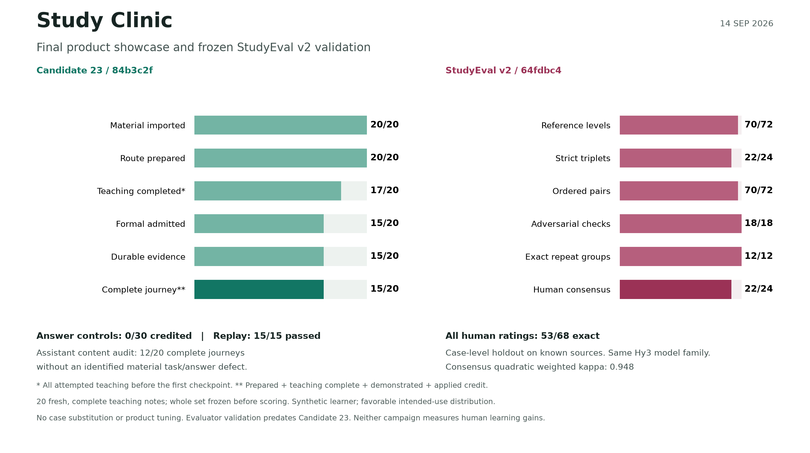

# Hy3 Study Clinic

**把自己的资料，变成一门有讲解、有练习、有补救、能追溯学习证据的课程。**

A Hy3-powered learning system that turns your materials into a course, with guided study, targeted repair, formal assessment, and traceable learning evidence.

[](https://github.com/Small-fish-QAQ/hy3-study-clinic/actions/workflows/ci.yml)
[](LICENSE)

[截图导览](docs/DEMO.md) · [系统架构](#系统架构) · [快速运行](#快速运行) · [最终评估结果](docs/FINAL_EVALUATION.md) · [20课showcase](eval/final-showcase/README.md) · [StudyEval验证](eval/studyeval-validation/README.md) · [Task 1 验收入口](#task-1-验收入口)

### ▶ 1 分 50 秒演示

https://github.com/user-attachments/assets/ba1004fd-fec8-44cb-9fbf-0961fa6962f2

[下载 MP4](docs/media/demo/Hy3-Study-Clinic-demo-2560x1440.mp4) · [字幕](docs/media/demo/Hy3-Study-Clinic-demo.zh-CN.srt)

[](docs/media/screenshots/07-contextual-tutor.webp)

_读到疑问处，就这段问 Tutor。真实 Hy3 课程画面；点击图片可放大。_

## 为谁解决什么问题

面向用课件、教材和技术文档自学的学生与开发者。读完一段解释之后，学习者还需要知道：接下来学什么、换个情境是否还会、答错后补哪一步，以及系统凭什么认为自己已经学会。

Study Clinic 将这些动作放进同一门持续保存的课程。**Hy3 负责理解资料、组织教学、命题、语义评分和诊断；本地规则负责校验出处、记录正式证据和推进学习状态。** 学习者可以暂停、继续、追问和调整允许的课程设置。

## 从资料到下一次学习

| 步骤              | 学习者看到的过程                                                                                                                   |
| ----------------- | ---------------------------------------------------------------------------------------------------------------------------------- |
| **1. 建课**       | 导入 PDF、DOCX、PPTX、Markdown、HTML、网页快照或源码文本；选择基础理解、熟练运用、高水平表现或深入迁移，可补充重点主题。           |
| **2. 确认路线**   | 审阅 Hy3 提出的课程结构，调整名称、先修关系允许的顺序和重点；确认后生成学习计划。                                                  |
| **3. 学习与追问** | 连续讲解串起概念和案例；在关键步骤作判断，需要时展开提示，或选中原文向旁边的 Tutor 提问。                                          |
| **4. 练习与补救** | 独立作答。答错后查看针对这次错误的诊断、解释与例子，再做新问题检验理解。                                                           |
| **5. 正式验证**   | 具备来源与评分依据的目标进入正式测评；本地规则根据评分要点、证据和版本条件决定是否记入进度。深入迁移课程还安排目标对应的迁移任务。 |
| **6. 回到课程**   | 从课程主页继续下一项任务，在进度页回看正式证据、待补救内容和到期复习。知识地图辅助定位概念与关系。                                 |

讲解、Tutor 对话、提示和非正式练习都不授予正式学分。缺少正式评分依据的目标会保留为教学内容；选择更深的课程不会自动赋予它正式测评资格。一次通过也不等于长期掌握。

| 对准这次错误，补上理解                                                                                                                                            | 学过的内容与正式证据分开记录                                                                                                                                                                |
| ----------------------------------------------------------------------------------------------------------------------------------------------------------------- | ------------------------------------------------------------------------------------------------------------------------------------------------------------------------------------------- |
| [](docs/media/screenshots/11-repair-explanation.webp) | [](docs/media/screenshots/15-progress-without-false-mastery.webp) |

从课程资料、结构到新情境复测的更多画面，见[完整截图导览](docs/DEMO.md#截图导览)。

## 系统架构

[](docs/media/architecture/study-clinic-architecture.svg)

_H 表示 Hy3 语义工作，L 表示本地权威；双标记表示两者协作。点击图片查看矢量原图，职责与源码依据见[架构说明](docs/ARCHITECTURE.md)。_

## 为什么需要 Hy3

同一份资料可以有多种合理的课程划分、解释方式和补救路径；学生也不会总按参考答案的措辞作答。这些工作需要开放式语义理解。

| Hy3 的实际工作                        | 本地系统如何约束结果                                                     |
| ------------------------------------- | ------------------------------------------------------------------------ |
| 提取概念，提出课程单元和学习目标      | 校验资料版本、引用、目标范围、先修结构与可执行性，由学习者确认课程结构。 |
| 编写讲解、推演案例、练习和 Tutor 回复 | 区分资料原文与补充教学；检查结构、来源、明显答案泄露与当前学习上下文。   |
| 判断候选证据关系、简答评分要点        | 模型提供结构化判断，本地代码计算绑定关系、分数和正式证据资格。           |
| 根据错误提出诊断与补救                | 绑定实际答错的题目和已展示内容，准备补救与复测；诊断仍是假设。           |

参赛配置的模型调用使用 **Hy3**。默认 Fake 模式便于无密钥体验流程；它的预设内容不能代表 Hy3 教学质量。可选视觉描述适配器不属于参赛调用链，按[运行指南](docs/SETUP.md)保持关闭。

## 产品的不同之处

- **课程有持续状态。** 资料、已确认的结构、当前学习任务与学习记录相互关联，重开页面可以继续。
- **出处可以核对。** 资料原文定位到具体版本与文本位置；模型补充解释单独标识。引用存在并不等于语义一定正确。
- **错误触发后续教学。** 非正式练习中的错误进入解释、补救与复测，正式测评有独立的证据与补救流程。
- **学习记录有依据。** 看完讲解、点过提示或表示“懂了”不会写入正式证据。评分与进度记录可以回看，模型不能自行宣布掌握。

## 快速运行

推荐 **Node.js 24 + npm**。安装依赖需要网络；安装完成后，默认 Fake 模式的本地流程不需要 API 密钥。

```bash
git clone https://github.com/Small-fish-QAQ/hy3-study-clinic.git
cd hy3-study-clinic
npm ci
npm run build
npm run dev
```

打开 [http://localhost:5173](http://localhost:5173)，创建课程、添加课程资料，再跟随页面操作。当前学习界面与教学生成使用简体中文。

离线模式可重复体验流程，但生成内容、标识和排序可能变化（outputs may vary between runs）。

要体验真实 Hy3，将 [`.env.example`](.env.example) 复制为 `.env`，配置 `LLM_PROVIDER=hy3`、`HY3_BASE_URL`、`HY3_API_KEY` 和 `HY3_MODEL`，并设置 `VISUAL_PROVIDER=disabled`。重启服务，在设置页核对实际生效的模型；已保存的设置优先于环境配置。

完整的 Windows / macOS / Linux 步骤、端口、数据位置、配置优先级与常见问题见 **[运行指南](docs/SETUP.md)**。

## Task 1 验收入口

按官方实战任务 1 的交付项定位现有材料。判别力与一致性为必需验证；一致性可用人工标注或重复评估验证，对抗性为鼓励项。

| 官方交付项                 | 仓库入口                                                                                                                                                                                                                                                                                         |
| -------------------------- | ------------------------------------------------------------------------------------------------------------------------------------------------------------------------------------------------------------------------------------------------------------------------------------------------ |
| 应用侧与开源项目           | [目标用户与场景](#为谁解决什么问题) · [Hy3 的必要性与职责](#为什么需要-hy3) · [应用源码](apps/) · [运行环境与 Hy3 配置](docs/SETUP.md) · [配置样例](.env.example)                                                                                                                                |
| 评估方法设计               | [六维操作标准](docs/EVALUATION.md#六个操作维度) · [v2判断流程](eval/studyeval/METHOD.md) · [冻结实现](eval/studyeval/evaluator.mjs) |
| 评测样本                   | [20课来源与设计](eval/final-showcase/DESIGN.md) · [showcase完整清单](eval/final-showcase/dataset/schedule.json) · [评估器对照、难例与反例](eval/studyeval-validation/dataset/registry.json) |
| 有效性验证：判别力、一致性 | [三档、成对与重复验证](eval/studyeval-validation/README.md) · [保留人类对齐](eval/studyeval-validation/analysis/HUMAN-AUDIT.md) |
| 对抗性验证（鼓励项）       | [18个独立对抗案例](eval/studyeval-validation/dataset/cases/) · [完整检测结果](eval/studyeval-validation/analysis/fresh-metrics.json) |
| 完整评测与复现             | [showcase冻结协议](eval/final-showcase/PROTOCOL.md) · [产品全部结果与复核](eval/final-showcase/README.md) · [StudyEval全部观察与复现](eval/studyeval-validation/README.md) |
| 分析报告                   | [场景选择与解决方案](docs/PROJECT_PROPOSAL.md) · [最终分析](docs/FINAL_EVALUATION.md) · [失败模式与能力边界](docs/LIMITATIONS.md) |
| 2 分钟以内 demo            | [1 分 50 秒视频与观看路线](docs/DEMO.md)                                                                                                                                                                                                                                                         |

## 评估与已验证的范围

**最终提交：冻结的 Candidate 23 产品showcase + StudyEval v2.0新样本验证 + 保留人类对齐。**

20课showcase完成 **15/20条首个正式检查点旅程（75%）**：20课完成准备，17课完成教学，15课通过Formal并写入受支持、已应用的证据。全部20课、指标和策略在评分前冻结，之后没有调产品、替换案例或选择性重跑。完整来源、逐课结果和实际作答见[最终评估](docs/FINAL_EVALUATION.md)。

[](docs/media/showcase/evaluation-overview.svg)

构造前研究稳定的历史材料和成功学习过程，以产品在正常适用条件下的展示质量为明确目标，选择完整、自包含、有解释、例题和应用深度的新讲义。助手逐项复核后，**12/20条完整旅程未发现实质题目或作答缺陷**；另3条获证记录中的题目或附加断言问题仍公开保留，不用持久化成功掩盖语义问题。

| 检验 | 结果 | 范围 |
| --- | --- | --- |
| 产品首个检查点旅程 | **15/20** | 20课全分母；教学17/20，Formal及应用证据15/20 |
| 证据与重放 | **0/30反例获证；15/15重放一致** | 另10个反例机会未到达；50/50数据库与45/45绑定检查通过 |
| StudyEval构造参考等级 | **70/72** | 24个新语义家族，每个好/中/差三档；参考是构造假设 |
| 严格三档 / 成对顺序 | **22/24组 / 70/72对** | 每组三档须2>1>0；两对并列，无反向排序 |
| 对抗 / 重复一致 | **18/18例 / 12/12组** | 重复组预先选定，各评三次 |
| 保留人类共识 | **22/24** | 共识二次加权kappa 0.948；全部68条原评分匹配53条 |

[StudyEval验证包](eval/studyeval-validation/README.md)保留102个唯一新输入和207次新样本/人类观察，支持无密钥离线重算。它在评估器冻结后、Candidate 23之前完成；不当作20课产品成绩。人类对齐是已知来源上的案例级保留，非来源互斥验证，原有分歧和流程元数据缺失均保留。

产品showcase使用合成学习者与有意选择的完整正常材料，不能外推任意上传资料。首个Formal检查点不是完整课程毕业，持久化证据也不是长期掌握；实际获证作答另有助手内容复核，不能由数据库校验替代语义判断。

[三个可核查的学习过程](eval/final-showcase/EXAMPLES.md)展示四分位数、赊销收入和关系连接的实际题目、作答与评分依据。它们是全20课运行中的说明性摘录，失败课程继续保留在同一分母中。

Candidate 23冻结前通过 **2,878项产品测试、22项StudyEval测试及三平台CI**。开发回归的代表性旅程由16/24升至20/24，旧套件教学保持20/20，但Formal准入和独立响应获证有所下降；这些混合开发结果没有拼入新showcase。2026-09-12的全部原始结果、独立模型审阅和人类答卷仍可从[历史报告](docs/EVALUATION_RESULTS.md)核查。

```bash
node eval/studyeval-validation/scripts/verify.mjs
node eval/final-showcase/publication/verify.mjs
```

运行范围与证据链见[验证说明](docs/VERIFICATION.md)。本项目尚无学习效果实验，不声称提升成绩、记忆保持或长期掌握率。

## 当前限制

- PDF 需要文本层，没有 OCR；图表、公式和复杂版式的语义提取有限。
- 模型可能解释错误、误判证据关系或评分要点；本地校验提高可追溯性，不能证明全部语义正确。
- 正式测评受来源和构念支持范围约束，不能为所有计算、设计或评价目标提供可靠的正式判定。
- 练习新颖性、提示质量和迁移深度仍需人工核验；长期掌握与复习调度不是经过校准的认知诊断。
- 这是本地学习应用，未提供面向公共部署的多用户认证与租户隔离方案。

更多边界见 [LIMITATIONS.md](docs/LIMITATIONS.md)。

## 文档与许可

[参赛说明](docs/PROJECT_PROPOSAL.md) · [演示与图集](docs/DEMO.md) · [运行指南](docs/SETUP.md) · [评估协议](docs/EVALUATION.md) · [验证说明](docs/VERIFICATION.md) · [架构](docs/ARCHITECTURE.md) · [文档索引](docs/README.md)

[Apache-2.0](LICENSE)。内置中文示例课程与评估 fixtures 为项目原创内容；字体与图标许可见[文档索引](docs/README.md)。

> **个人活动作品声明：** 本项目为参与「腾讯犀牛鸟开源人才培养计划 · 混元大语言模型项目」实战任务 1 开发的个人作品，不代表腾讯或 Hy3 官方发布。
