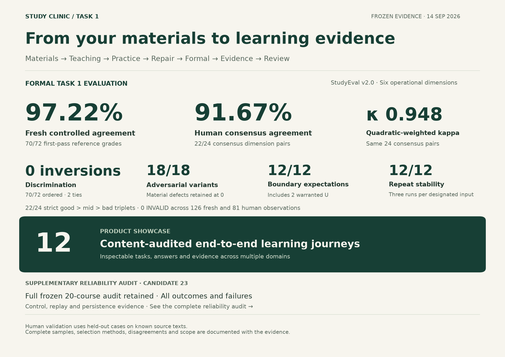

# Hy3 Study Clinic

**把自己的资料，变成一门有讲解、有练习、有补救、能追溯学习证据的课程。**

A Hy3-powered learning system that turns your materials into a course, with guided study, targeted repair, formal assessment, and traceable learning evidence.

[](https://github.com/Small-fish-QAQ/hy3-study-clinic/actions/workflows/ci.yml)
[](LICENSE)

[演示](docs/DEMO.md) · [Product Showcase](docs/PRODUCT_SHOWCASE.md) · [StudyEval 正式评估](eval/studyeval-validation/README.md) · [系统架构](#系统架构) · [快速运行](#快速运行) · [Task 1 验收入口](#task-1-验收入口)

### ▶ 1 分 50 秒演示

https://github.com/user-attachments/assets/ba1004fd-fec8-44cb-9fbf-0961fa6962f2

[下载 MP4](docs/media/demo/Hy3-Study-Clinic-demo-2560x1440.mp4) · [字幕](docs/media/demo/Hy3-Study-Clinic-demo.zh-CN.srt)

[](docs/media/screenshots/07-contextual-tutor.webp)

_读到疑问处，就这段问 Tutor。真实 Hy3 课程画面；点击图片可放大。_

## 为谁解决什么问题

面向用课件、教材和技术文档自学的学生与开发者。读完一段解释之后，学习者还需要知道：接下来学什么、换个情境是否还会、答错后补哪一步，以及系统凭什么认为自己已经学会。

Study Clinic 将这些动作放进同一门持续保存的课程。**Hy3 负责理解资料、组织教学、命题、语义评分和诊断；本地规则负责校验出处、记录正式证据和推进学习状态。** 学习者可以暂停、继续、追问和调整允许的课程设置。

## 从资料到下一次学习

| 步骤              | 学习者看到的过程                                                                                                                   |
| ----------------- | ---------------------------------------------------------------------------------------------------------------------------------- |
| **1. 建课**       | 导入 PDF、DOCX、PPTX、Markdown、HTML、网页快照或源码文本；选择基础理解、熟练运用、高水平表现或深入迁移，可补充重点主题。           |
| **2. 确认路线**   | 审阅 Hy3 提出的课程结构，调整名称、先修关系允许的顺序和重点；确认后生成学习计划。                                                  |
| **3. 学习与追问** | 连续讲解串起概念和案例；在关键步骤作判断，需要时展开提示，或选中原文向旁边的 Tutor 提问。                                          |
| **4. 练习与补救** | 独立作答。答错后查看针对这次错误的诊断、解释与例子，再做新问题检验理解。                                                           |
| **5. 正式验证**   | 具备来源与评分依据的目标进入正式测评；本地规则根据评分要点、证据和版本条件决定是否记入进度。深入迁移课程还安排目标对应的迁移任务。 |
| **6. 回到课程**   | 从课程主页继续下一项任务，在进度页回看正式证据、待补救内容和到期复习。知识地图辅助定位概念与关系。                                 |

讲解、Tutor 对话、提示和非正式练习都不授予正式学分。缺少正式评分依据的目标会保留为教学内容；选择更深的课程不会自动赋予它正式测评资格。一次通过也不等于长期掌握。

| 对准这次错误，补上理解                                                                                                                                            | 学过的内容与正式证据分开记录                                                                                                                                                                |
| ----------------------------------------------------------------------------------------------------------------------------------------------------------------- | ------------------------------------------------------------------------------------------------------------------------------------------------------------------------------------------- |
| [](docs/media/screenshots/11-repair-explanation.webp) | [](docs/media/screenshots/15-progress-without-false-mastery.webp) |

从课程资料、结构到新情境复测的更多画面，见[完整截图导览](docs/DEMO.md#截图导览)。

## 为什么需要 Hy3

同一份资料可以有多种合理的课程划分、解释方式和补救路径；学生也不会总按参考答案的措辞作答。这些工作需要开放式语义理解。

| Hy3 的实际工作                        | 本地系统如何约束结果                                                     |
| ------------------------------------- | ------------------------------------------------------------------------ |
| 提取概念，提出课程单元和学习目标      | 校验资料版本、引用、目标范围、先修结构与可执行性，由学习者确认课程结构。 |
| 编写讲解、推演案例、练习和 Tutor 回复 | 区分资料原文与补充教学；检查结构、来源、明显答案泄露与当前学习上下文。   |
| 判断候选证据关系、简答评分要点        | 模型提供结构化判断，本地代码计算绑定关系、分数和正式证据资格。           |
| 根据错误提出诊断与补救                | 绑定实际答错的题目和已展示内容，准备补救与复测；诊断仍是假设。           |

参赛配置的模型调用使用 **Hy3**。默认 Fake 模式便于无密钥体验流程；它的预设内容不能代表 Hy3 教学质量。可选视觉描述适配器不属于参赛调用链，按[运行指南](docs/SETUP.md)保持关闭。

## 产品的不同之处

- **课程有持续状态。** 资料、已确认的结构、当前学习任务与学习记录相互关联，重开页面可以继续。
- **出处可以核对。** 资料原文定位到具体版本与文本位置；模型补充解释单独标识。引用存在并不等于语义一定正确。
- **错误触发后续教学。** 非正式练习中的错误进入解释、补救与复测，正式测评有独立的证据与补救流程。
- **学习记录有依据。** 看完讲解、点过提示或表示“懂了”不会写入正式证据。评分与进度记录可以回看，模型不能自行宣布掌握。

## Product Showcase

**12 content-audited end-to-end learning journeys · 12 条经过内容复核的端到端学习旅程。**

从自己的资料到实际作答，再到可追溯的正式证据。先看六个跨学科例子：

| 学习材料                                             | 实际检查点展示了什么                                          |
| ---------------------------------------------------- | ------------------------------------------------------------- |
| [四分位数与四分位距](docs/PRODUCT_SHOWCASE.md#j04)   | 按明确约定拆分数据，逐步求出 Q1=68、Q3=90。                   |
| [功率、电能与使用时长](docs/PRODUCT_SHOWCASE.md#j08) | 用实际平均功率算出 1.5 kWh，并解释为何不能直接用铭牌额定值。  |
| [溶液质量分数](docs/PRODUCT_SHOWCASE.md#j14)         | 区分溶液与溶剂分母，解释 35 g 盐与 105 g 水的关系。           |
| [赊销收入与现金](docs/PRODUCT_SHOWCASE.md#j15)       | 区分收入 1,300、现金 700、应收 600 元，避免收款时重复记收入。 |
| [关系表连接](docs/PRODUCT_SHOWCASE.md#j17)           | 找出一对多的实际匹配行，解释为何同一作者产生两行结果。        |
| [函数参数与返回值](docs/PRODUCT_SHOWCASE.md#j20)     | 跟踪局部参数、返回值与调用者变量：c=16，b 仍为 3。            |

[查看全部 12 条旅程：资料、教学、题目、完整作答与持久化证据](docs/PRODUCT_SHOWCASE.md)。这些例子在单次冻结运行之后按内容审计结果选出；复核覆盖正式题目、私有答案、必需评分点与实际作答，未发现实质题目或作答缺陷。它们是展示选集，不是随机样本的成功率，也不意味着整门课程毕业或全部教学逐句认证。学习者由 Hy3 模拟，内容复核由任务助手完成。

完整 20 课的结果与失败保留在[补充端到端可靠性审计](eval/final-showcase/README.md)。

## StudyEval · Evaluation at a Glance

**StudyEval v2.0 是本项目的 Task 1 正式评估。** 六个操作维度覆盖事实与来源、目标深度、解释、题目判别力、评分和补救；冻结后的新样本与保留人类评分用于验证评估方法本身。

[](docs/media/competition/competition-overview.svg)

| 正式评估证据               | 结果                                                                       |
| -------------------------- | -------------------------------------------------------------------------- |
| **新样本构造参考精确一致** | **70/72 = 97.22%**                                                         |
| **保留人类共识一致**       | **22/24 = 91.67%**；二次加权 **κ = 0.948**                                 |
| **判别力**                 | **22/24** 组满足好 > 中 > 差；**70/72** 个有序比较，**0 次逆序、2 次并列** |
| **对抗性**                 | **18/18** 个保留实质缺陷的变体仍为 0 分                                    |
| **边界 / 重复稳定性**      | **12/12** 个边界符合预期；**12/12** 个指定输入三次等级完全一致             |

全部 **102 个唯一新输入、126 次新样本观察与 81 次人类观察**均可核查，无 INVALID 评估结果。人类共识是 21 个案例上的 24 个维度对；全部个人评分一致为 **53/68（77.94%）**。案例未用于 v2.0 校准，但与开发样本共享来源文本，不能称为来源隔离验证。构造参考是分析假设；所有分歧、两个适当的 U 和重复均保留。

[六维方法](docs/EVALUATION.md) · [完整样本、结果与复现](eval/studyeval-validation/README.md) · [评估结论与典型分歧](docs/FINAL_EVALUATION.md)

## 系统架构

[](docs/media/architecture/study-clinic-architecture.svg)

_H 表示 Hy3 语义工作，L 表示本地权威；双标记表示两者协作。点击图片查看矢量原图，职责与源码依据见[架构说明](docs/ARCHITECTURE.md)。_

## 快速运行

推荐 **Node.js 24 + npm**。安装依赖需要网络；安装完成后，默认 Fake 模式的本地流程不需要 API 密钥。

```bash
git clone https://github.com/Small-fish-QAQ/hy3-study-clinic.git
cd hy3-study-clinic
npm ci
npm run build
npm run dev
```

打开 [http://localhost:5173](http://localhost:5173)，创建课程、添加课程资料，再跟随页面操作。当前学习界面与教学生成使用简体中文。

离线模式可重复体验流程，但生成内容、标识和排序可能变化（outputs may vary between runs）。

要体验真实 Hy3，将 [`.env.example`](.env.example) 复制为 `.env`，配置 `LLM_PROVIDER=hy3`、`HY3_BASE_URL`、`HY3_API_KEY` 和 `HY3_MODEL`，并设置 `VISUAL_PROVIDER=disabled`。重启服务，在设置页核对实际生效的模型；已保存的设置优先于环境配置。

完整的 Windows / macOS / Linux 步骤、端口、数据位置、配置优先级与常见问题见 **[运行指南](docs/SETUP.md)**。

## Task 1 验收入口

按官方实战任务 1 的交付项定位材料。**StudyEval 是正式评估主线**；Product Showcase 与完整 20 课可靠性审计提供补充产品证据。

| 官方交付项                | 仓库入口                                                                                                                                                                                               |
| ------------------------- | ------------------------------------------------------------------------------------------------------------------------------------------------------------------------------------------------------ |
| 真实场景与可运行 Hy3 应用 | [目标用户](#为谁解决什么问题) · [为什么需要 Hy3](#为什么需要-hy3) · [应用源码](apps/) · [运行与环境要求](docs/SETUP.md) · [配置样例](.env.example)                                                     |
| 可操作的评估方法          | [六维判定标准](docs/EVALUATION.md#六个操作维度) · [StudyEval v2.0 方法](eval/studyeval/METHOD.md) · [冻结实现](eval/studyeval/evaluator.mjs)                                                           |
| 评测样本、难例与反例      | [StudyEval 全部样本](eval/studyeval-validation/dataset/cases/) · [构造参考、覆盖与对抗变体](eval/studyeval-validation/dataset/registry.json) · [保留人类案例](eval/studyeval-validation/human/inputs/) |
| 判别力与一致性验证        | [三档、成对、边界与重复结果](eval/studyeval-validation/README.md) · [人类对齐与分歧](eval/studyeval-validation/analysis/HUMAN-AUDIT.md)                                                                |
| 对抗性验证（鼓励项）      | [18 个依附任务家族的对抗变体与结果](eval/studyeval-validation/analysis/fresh-metrics.json)                                                                                                             |
| 完整评测与复现            | [正式评估全部观察、原协议与重算](eval/studyeval-validation/README.md#reproduce-the-saved-results) · [评估结果](eval/studyeval-validation/analysis/fresh-metrics.json)                                  |
| 分析报告与能力边界        | [场景与方案](docs/PROJECT_PROPOSAL.md) · [正式评估分析](docs/FINAL_EVALUATION.md) · [失败模式与限制](docs/LIMITATIONS.md)                                                                              |
| 补充产品证据              | [12 条内容复核旅程](docs/PRODUCT_SHOWCASE.md) · [完整 20 课可靠性审计、负例与失败](eval/final-showcase/README.md)                                                                                      |
| 2 分钟以内 demo           | [1 分 50 秒演示与截图](docs/DEMO.md)                                                                                                                                                                   |

## 补充审计与复现

**Supplementary end-to-end reliability audit：** Candidate 23 的单次 20 课运行保留全部结果：**17/20** 完成教学、**15/20** 完成首个 Formal 检查点、**12/20** 完整旅程在后续题目/作答复核中未发现实质缺陷。**0/30** 个实际提交控制获证，另 10 个控制机会未到达；**15/15** 重放、**50/50** 冷开数据库和 **45/45** 绑定检查通过。[完整表格、失败归因和归档复现](eval/final-showcase/README.md)。

这些材料有意选择完整、适合正常使用的新讲义，并使用合成学习者。首个检查点不等于整课完成或长期掌握。StudyEval 的正式评估与这 20 课产品运行各有独立分母，不能合成总成功率。

在 Node.js 24 下，无密钥重算已保存证据：

```bash
node eval/studyeval-validation/scripts/verify.mjs
node eval/final-showcase/publication/verify.mjs
```

[验证说明](docs/VERIFICATION.md)保留工程检查与适用范围；[历史报告](docs/EVALUATION_RESULTS.md)保留早期实验及原人类答卷。当前发布只调整文档与呈现，产品保持 Candidate 23，StudyEval 保持冻结 v2.0。

## 当前限制

- PDF 需要文本层，没有 OCR；图表、公式和复杂版式的语义提取有限。
- 模型可能解释错误、误判证据关系或评分要点；本地校验提高可追溯性，不能证明全部语义正确。
- 正式测评受来源和构念支持范围约束，不能为所有计算、设计或评价目标提供可靠的正式判定。
- 练习新颖性、提示质量和迁移深度仍需人工核验；长期掌握与复习调度不是经过校准的认知诊断。
- 这是本地学习应用，未提供面向公共部署的多用户认证与租户隔离方案。

更多边界见 [LIMITATIONS.md](docs/LIMITATIONS.md)。

## 文档与许可

[参赛说明](docs/PROJECT_PROPOSAL.md) · [演示与图集](docs/DEMO.md) · [运行指南](docs/SETUP.md) · [评估协议](docs/EVALUATION.md) · [验证说明](docs/VERIFICATION.md) · [架构](docs/ARCHITECTURE.md) · [文档索引](docs/README.md)

[Apache-2.0](LICENSE)。内置中文示例课程与评估 fixtures 为项目原创内容；字体与图标许可见[文档索引](docs/README.md)。

> **个人活动作品声明：** 本项目为参与「腾讯犀牛鸟开源人才培养计划 · 混元大语言模型项目」实战任务 1 开发的个人作品，不代表腾讯或 Hy3 官方发布。
