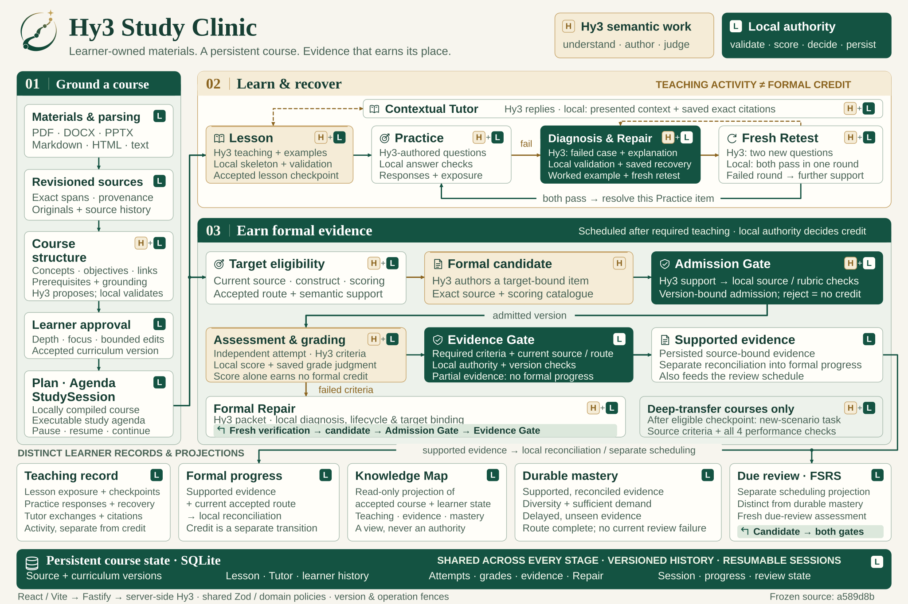

# Architecture

[Product overview](../README.md) · [Setup](SETUP.md) · [Verification](VERIFICATION.md)

Study Clinic is a local React/Vite application backed by Fastify and SQLite. Hy3 proposes semantic content. Local services validate proposals, persist accepted versions, and own changes to learning state.

[](media/architecture/study-clinic-architecture.svg)

H marks Hy3 semantic work; L marks local authority. Dual badges include both responsibilities, such as authored Practice content and local answer checks. The deterministic SVG uses the product's vector logo and links its 24 elements to implementation at frozen product/documentation snapshot [`a589d8b`](https://github.com/Small-fish-QAQ/hy3-study-clinic/commit/a589d8bdca7f8e04928d1a00deb0708094ab98fb). Open or download the SVG to inspect its source links and structured metadata.

Implementation anchors: [local course compilation](https://github.com/Small-fish-QAQ/hy3-study-clinic/blob/a589d8bdca7f8e04928d1a00deb0708094ab98fb/apps/server/src/services/acceptedCoursePlan.ts#L14) · [bounded Tutor replies](https://github.com/Small-fish-QAQ/hy3-study-clinic/blob/a589d8bdca7f8e04928d1a00deb0708094ab98fb/apps/server/src/services/studySessions.ts#L840) · [evidence and reconciliation](https://github.com/Small-fish-QAQ/hy3-study-clinic/blob/a589d8bdca7f8e04928d1a00deb0708094ab98fb/apps/server/src/services/formalAssessments.ts#L666) · [fresh Formal Repair verification](https://github.com/Small-fish-QAQ/hy3-study-clinic/blob/a589d8bdca7f8e04928d1a00deb0708094ab98fb/apps/server/src/services/courseActionLaunch.ts#L1226) · [mastery policy](https://github.com/Small-fish-QAQ/hy3-study-clinic/blob/a589d8bdca7f8e04928d1a00deb0708094ab98fb/packages/shared/src/domain/formalProgression.ts#L441).

The browser does not call Hy3 directly. Credentials, unrevealed answer keys and private grading contracts remain server-side. Runtime schemas shared by client and server describe accepted transport data.

## Repository map

| Directory                                     | Responsibility                                                                                       |
| --------------------------------------------- | ---------------------------------------------------------------------------------------------------- |
| [apps/web/src](../apps/web/src)               | Course library, preparation, home, Study, Tutor, materials, curriculum, progress and Knowledge Map.  |
| [apps/server/src](../apps/server/src)         | API routes, provider adapters, ingestion, grounding, learning services, repositories and migrations. |
| [packages/shared/src](../packages/shared/src) | Zod schemas, domain contracts and pure validation/state rules.                                       |
| [eval](../eval/README.md)                     | Small original fixtures, labels, structural checks and explicit real-provider adapter evaluation.    |
| [docs](README.md)                             | Reviewer guides, protocol, implementation boundaries and public evidence.                            |

## From materials to an accepted route

1. Ingestion retains immutable material revisions, original supported assets, extracted source blocks and precise provenance. Supported inputs include text-layer PDF, DOCX, PPTX, plain text/code, Markdown and static HTML/web snapshots.
2. Grounded concepts and a bounded Course Source Map provide source identities for Hy3's course proposal. Material budgets constrain selection; mapping is not proof of semantic coverage.
3. The learner chooses global depth and optional focus, then reviews one proposed Course Skeleton. Rename, prerequisite-safe movement and focus edits are bounded. Acceptance produces an immutable Curriculum version.
4. The ordinary preparation path compiles that accepted Curriculum into a StudyPlan locally. It preserves objectives and prerequisites; broad units are split into bounded teaching portions. It does not request a second ordinary plan approval.
5. A SessionAgenda identifies executable work. A durable StudySession owns pause/resume, explicit continuation, supported detours and the active teaching context.

Advanced and historical Contract/Plan proposal paths remain compatibility paths. They do not describe the normal setup flow. Source, capability and route checks apply before execution, and existing accepted versions are not silently rewritten.

Details: [Course preparation and teaching](FRONT_HALF.md).

## Teaching, Practice and Tutor

A deterministic Teaching Skeleton carries required objectives, allowed evidence and activity budgets. Hy3 authors the explanation, cases, guided decisions and Practice. Local code validates content against that inventory, current source identities and cognitive contracts. Real-provider content review can reject factual defects, unanswerable tasks and actual disclosure of answers; it remains fallible semantic review.

Where appropriate, a bounded executable teaching model supplies consistent worked steps and generated cases. Its arithmetic can be locally checked, while its assumptions, rules and explanations still need source-fidelity review. Other topics use authored cases.

Accepted Lesson content is an immutable checkpoint. Practice failure cannot overwrite it. Complete validated generation dependencies can be reused only for their exact identities and context; a cache hit is not a fresh provider call. Truncation and semantic rejection have bounded recovery rather than unlimited retries.

Normal guided interactions execute locally from prepared content. The UI withholds future steps and feedback until the relevant response. Lesson, guided responses, hints and Practice record teaching and exposure, not Formal Evidence.

The embedded Tutor receives a bounded window of presented content, the learner's selected passage, current task and previous replies. It excludes unrevealed answer keys and future retest questions. Source excerpts are resolved and saved with each reply; later material cannot rebind an old citation. Tutor does not advance formal progress.

Details: [Tutor inside Study](TUTOR.md).

## Two recovery paths

| Trigger                        | Response                                                                                                                                  | Learning-state effect                                                                      |
| ------------------------------ | ----------------------------------------------------------------------------------------------------------------------------------------- | ------------------------------------------------------------------------------------------ |
| Wrong informal Practice answer | Diagnosis tied to the actual failed case, explanation, example and two fresh retest questions; further support if repeated attempts fail. | Passing resolves that Practice item only. No Formal grade, Evidence or mastery is created. |
| Failed formal verification     | A formal Repair episode and fresh verification governed by the accepted objective, source and route.                                      | Subsequent admissible evidence can reconcile formal progress under local policy.           |

Retest hides explanations, hints and keys until commitment. Both new questions must pass within one round; exhausting retries is not success. Existing source/route fences, leases, request identities and version checks govern recovery writes.

Details: [Post-Practice recovery](PRACTICE_RECOVERY.md).

## Formal evidence and mastery

```text
eligible objective + current source / construct / scoring authority
                 ↓
candidate → local admission → immutable assessment
                 ↓
independent attempt → criterion judgment + local score
                 ↓
local Evidence Gate → supported evidence → progression reconciliation
                 ↓
durable-mastery policy / separate due-review scheduling
```

Formal eligibility depends on independently supported capabilities and scoring criteria. Hy3 judges short-answer criterion satisfaction, while local code computes scores and applies required-criterion, source, version and route rules. A grade and its progression reconciliation are separate records, so a failed projection can be retried without another model grade.

Partial evidence does not grant formal progress. Formal Repair prepares fresh verification for the same target and re-enters candidate admission; it must pass both Admission Gate and Evidence Gate again.

Evidence support also separates semantic observations from local decisions: Hy3 classifies candidate relations and support groups without seeing which candidates are currently bound. Given the same offered candidate universe, changing only that private binding leaves provider input unchanged. Local code derives coverage, binding match, mis-binding and contradiction, then rechecks accepted artifacts at consequential boundaries. These checks do not prove semantic entailment.

Teaching-only objectives stay teaching-only when Formal authority is unavailable. Selecting a deeper course cannot manufacture a scoring basis. The supported construct ceiling and general calculation/design/evaluation limits are described in [LIMITATIONS.md](LIMITATIONS.md).

Deep-transfer plans add a unit-transfer task after an eligible objective's checkpoint. Source criteria and four performance requirements are checked separately. Durable mastery additionally requires diversity, sufficient demand and delayed unseen evidence; a synthesis route label does not raise an objective's supported construct. FSRS review scheduling is separate from mastery.

Knowledge Map is a read-only projection of accepted course structure, the validated concept graph and learner records. It is not a source of curriculum or evidence authority.

Details: [Deep-transfer completion](DEEP_TRANSFER.md).

## Persistence and failure boundaries

SQLite repositories and numbered migrations own persistent records. Accepted versions and assessment history are retained; corrections use explicit successors. Local checks reject stale, foreign or mismatched inputs. Idempotency prevents replayed commands from applying learner-state effects twice. Cancellation and operation ownership are checked before persistence.

Material reprocessing produces a new revision and retains old provenance. Retirement preserves history; explicit course deletion is destructive. Historical curricula can remain readable while failing current admission rules. Use a new valid successor or course instead of rewriting old evidence.

This is a local application with bounded context, retrieval, histories and generation budgets. It does not supply a production multi-tenant deployment, universal semantic verification or an unbounded background workflow engine.

## Provider and evaluation boundary

[Hy3Provider](../apps/server/src/llm/hy3Provider.ts) uses a compatible HTTP API. [FakeProvider](../apps/server/src/llm/fakeProvider.ts) provides deterministic operations for local workflows and tests. Valid saved settings override environment-derived Provider settings; see [SETUP.md](SETUP.md).

The workflow can be repeated offline without an API key. This does not promise byte-identical output: generated identifiers, content selection and ordering may vary between runs.

An optional visual-description adapter is retained in code. Its outputs are advisory and cannot enter Formal Evidence, grading or mastery. The submitted language workflow and evaluation configuration keep `VISUAL_PROVIDER=disabled`; it is not a second submitted model path.

Runtime safeguards and the existing structural runners are implementation evidence. The separate [StudyEval protocol](EVALUATION.md) describes quality judgments and evaluator validation; the [final public results](EVALUATION_RESULTS.md) include completed machine evaluation, independent model review and human annotation. Neither successful tests nor a positive model review establishes measured learning effectiveness.
