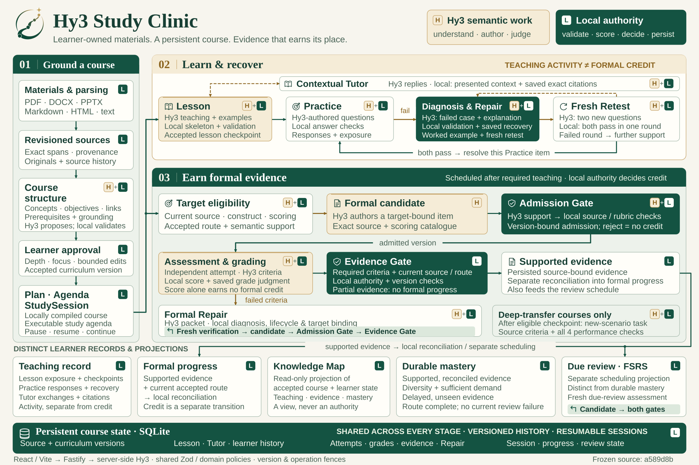

# 系统架构

[项目首页](../README.md) · [设计与评估报告](REPORT.md) · [运行指南](SETUP.md) · [验证与复现](VERIFICATION.md)

Study Clinic 使用 React 和 Vite 构建界面，Fastify 提供本地 API，SQLite 保存课程、学习会话与作答记录。Hy3 生成课程、讲解、题目并参与评分；服务端检查返回内容，保存通过检查的版本，再按规则更新学习状态。

本文面向维护者，按资料、课程、教学、评分和恢复的调用顺序介绍实现。“正式证据”指带有题目、作答、评分及版本信息的测评记录；“准入”指正式出题或记入通过状态前的资格检查。产品用途与实验结论见主报告，模型配置与备份见运行指南。

[](media/architecture/study-clinic-architecture.svg)

图中 H 表示 Hy3 的语义工作，L 表示本地职责。图内源码链接固定在历史快照 `a589d8b`；当前文档中的代码链接指向本次检出。图的来源与元素映射保留在 SVG 元数据中。

## 目录与职责

| 目录                                          | 职责                                                   |
| --------------------------------------------- | ------------------------------------------------------ |
| [apps/web/src](../apps/web/src)               | 课程工作室、资料与结构、学习、Tutor、进度和知识地图    |
| [apps/server/src](../apps/server/src)         | API、模型适配、资料导入、业务服务、仓储与数据库迁移    |
| [packages/shared/src](../packages/shared/src) | Zod 数据契约、客户端与服务端共享类型、纯校验与状态规则 |
| [eval](../eval/README.md)                     | 评估器、冻结样本、原始结果与复现脚本                   |
| [docs](README.md)                             | 面向读者的说明、历史索引与展示资源                     |

浏览器只调用服务端 API。模型凭证、未公开答案和私有评分契约保留在服务端。共享数据契约描述可以传输的内容，不自动赋予内容来源或评分资格。

## 资料与课程准备

资料导入保存原始附件、提取文本和来源位置，每次处理形成独立版本，旧记录保留原来的出处。系统把概念和课程内容对应到资料片段，限定 Hy3 可使用的范围；建立对应关系后，仍需检查这些片段是否确实支持相关内容。

普通建课按以下顺序进行：

1. 学习者指定全局深度与可选重点。深度对应基础理解、熟练运用、高水平表现、深入迁移；重点增加同一深度下的教学投入。
2. Hy3 提出课程结构与目标。本地检查范围、层级、先修关系和可支持的能力；较大课程按有界批次准备细节。
3. 学习者可以改名称、在先修约束内调整顺序和重点，再明确接受一个课程版本。
4. 本地编译器从已接受的课程结构生成普通学习计划，保留目标和顺序。每个教学部分最多承担两个目标，后续单元等待先修单元的最后一个部分完成。
5. 会话议程选择可执行任务，学习会话保存暂停、继续和允许的临时探究。

课程结构称为 `Curriculum`，学习计划称为 `StudyPlan`，当前任务与会话由 `SessionAgenda` 和 `StudySession` 表达。普通路径不再让模型重新提出一份需要二次批准的计划；高级和历史计划路径仍作为兼容实现存在。

入口：[课程服务](../apps/server/src/services/curriculum.ts)、[本地计划编译](../apps/server/src/services/acceptedCoursePlan.ts)、[课程来源映射](../apps/server/src/services/courseSourceMap.ts)。

## 教学准备与内容检查

本地教学骨架先确定必需目标、可用依据、活动与时长预算。Hy3 再生成解释、案例、引导判断和独立练习，服务端按实际需要的教学部分校验并组装内容。前面的教学会成为后续部分已经展示过的上下文。

部分有限规则适合可执行教学模型：Hy3 提出假设、无环规则图和输入范围，本地执行得到一致的预测和演算步骤。执行只能证明结果符合该模型，模型假设、规则和解释是否忠实于资料仍需复核。有限运算无法忠实表达的目标使用编写的案例。

内容评审主要检查事实、必要因果规则、题目可答性和实际答案泄露。需要独立求解时，评审者只能看到学习者可见的事实，不接收作者答案、预期信号或未来演算结果。难度意见保留为诊断信息，不能代替具体缺陷证据。

生成和修复有次数、请求体、输出与超时预算；实际数值由当前 Provider 代码定义。失败或被拒绝的内容不会作为成功教学保存。已接受的讲解是不可变检查点，后续练习准备失败不能覆盖它。

来源位置与补充教学分别标记。只有完整组件确为所选来源中的原文片段时，才保留原文引用；改写、假设例子和生成解释不能自行获得来源支持。结构、引用和正面评审都不能保证所有教学语义正确。

入口：[教学准备](../apps/server/src/services/teachingBriefPreparation.ts)、[内容评审](../apps/server/src/services/lessonPedagogyEvaluator.ts)、[教学执行](../apps/server/src/services/lessonExecution.ts)。

## 生成恢复与缓存

[生成阶段服务](../apps/server/src/services/generationStages.ts)复用完整且已经校验的私有生成结果。缓存身份包含不可变输入、阶段版本、工作区与会话、Provider 与模型、来源身份；课程还绑定学习约定与前后版本，教学绑定已接受路线和骨架。依赖改变会改变后续身份，复用前仍需重新检查内容和资格。

缓存命中在当前操作下留下逻辑记录，并关联原来的完成调用，不新增实际模型请求或 token 消耗。未完成或被拒绝的输出不进入可复用缓存。未接受教学部分被拒绝后失去复用资格，显式重试准备后继结果；其他有效部分可以保留。

取消、操作归属、租约和版本检查在请求与持久化边界执行。缓存不能授予引用、正式测评、学分或掌握资格，已接受内容与恢复中的草稿仍是不同状态。

## 学习与 Tutor

普通引导交互基于已经准备好的内容本地执行，按作答情况逐步展示后续步骤、提示和反馈。它们记录教学活动与可能见过的内容，不产生正式证据。

Tutor 在桌面讲解旁打开，在小屏幕上使用底部抽屉。服务端将选中片段与当前可见内容、精确讲解版本核对。输入包含已展示教学、当前问题、已提交错误、已揭示补救、近期对话、深度与重点以及来源片段；私有答案和未来复测题被排除。

序列化输入上限为 96,000 个 UTF-8 字节，优先缩减较远教学和旧对话。Hy3 返回正文与来源键，服务端解析并保存当时的确切来源片段，后来的资料不能重新绑定旧回复的引用。没有保存片段的历史回复也不会从当前讲解补领引用。

生成中如果讲解或会话改变，回复会被拒绝；重载先同步未完成轮次。服务端对话是持久记录，未发送草稿可暂存在浏览器的会话存储中。Tutor 不替学习者提交答案，也不推进正式进度。

完成回复保守地计为可能已见内容，供补救与题目新颖性检查使用。它能够识别部分重复提示，不能识别所有语义改写；断线前已保存的回复也可能实际上尚未被读到。

入口：[学习会话](../apps/server/src/services/studySessions.ts)、[Tutor 界面](../apps/web/src/components/StudyTutorSurface.tsx)。

## 练习错误与两条补救路径

| 错误来自哪里        | 后续过程                                 | 对正式进度的影响                                 |
| ------------------- | ---------------------------------------- | ------------------------------------------------ |
| 非正式练习 Practice | 针对本次错误解释、举例，再完成两个新问题 | 通过只完成当前练习项                             |
| 正式测评 Formal     | 建立正式补救，再准备同一目标的新验证     | 新证据重新通过准入、评分和证据检查后才能更新进度 |

非正式练习补救读取确切目标、所测能力、实际选项反馈、已展示教学和来源；学习者还可以补充思路。Hy3 提出诊断、因果解释、例子、对照和两道自包含的复测题。复核者在看不到作者答案时独立解题，服务端只保存通过检查的内容。

补救保存在失败练习的恢复字段中，复用现有命令身份、版本、租约和生成恢复机制。开始复测后，解释、提示、反馈和答案暂不展示；一轮内两题都正确才能通过。三轮失败会要求更深入的支持和学习者说明，耗尽重试不能算成功。

活跃状态仅保留最近三个补救包，旧包仍在教学事件中，其题面参与有界的新颖性检查。Tutor 只收到已揭示的补救内容。通过当前项后，其他必需练习仍需完成；后续正式检查点继续遵守独立的资格规则。

## 正式测评与进度

正式目标需要当前来源、可支持能力和评分依据。候选题目经过本地准入后保存为不可变测评，学习者独立提交，Hy3 判断简答的各评分要点，本地计算分数并检查必需要点。

```text
有资格的目标与评分依据
  → 候选题目
  → 准入检查与不可变测评
  → 独立作答与逐要点评分
  → 来源和版本等证据检查
  → 正式证据
  → 进度更新
```

评分与进度更新是分开的持久记录。如果进度投影失败，可以重试更新，不必再次调用模型评分。部分证据不能授予正式进度；正式补救后的新验证必须再次通过题目准入和证据检查。

证据支持判断也分开语义观察与本地决策。模型评价候选关系和支持组，不接收当前私有绑定；给定相同候选集合，仅更换私有绑定不会改变模型输入。本地代码计算覆盖、绑定匹配、错绑与矛盾，并在产生学习后果前重新检查。

缺少正式评分依据的目标可以继续教学。调整深度、重点或路线名称不会增加资料本身的依据；即使有引用，也要检查引用片段是否真的支持待评分的内容。

入口：[正式测评](../apps/server/src/services/formalAssessments.ts)、[正式进度](../apps/server/src/services/formalProgression.ts)、[共享状态规则](../packages/shared/src/domain/formalProgression.ts)。

## 深入迁移与长期掌握

深入迁移课程为具备正式资格的目标安排普通检查点及其后的单元迁移任务。学习者需要构造具体新场景、用资料支持的原则作判断，再改变关键条件并解释差异或适用边界。

来源评分标准与四项迁移表现分别检查，全部满足后才具备迁移证据资格；重复定义或仅更换已学例子的名称不能替代迁移。既有教学、练习、复测与迁移作答为新颖性判断提供上下文。失败继续走正式补救与新验证路径。

计划项、不可变题目和评分携带同一个迁移要求。当前完成策略要求各阻塞目标同时有普通正式证据和已通过的迁移；其他深度保留其阈值。证据表示仍受目标独立支持的能力范围约束，综合路线的名称不能自动提高掌握等级。

长期掌握还要求路线完成、多种表现、应用需求与延迟的未见复习证据。FSRS 复习调度与掌握状态分开。它们是可检查的规则，并未通过真实学习效果实验校准。

旧的已接受计划不会自动补入当前检查点或迁移任务。应明确创建有效后继版本或新课程，旧证据不被改写为新计划的证据。历史跨单元综合路径仍单独保留。

入口：[学习动作启动](../apps/server/src/services/courseActionLaunch.ts)、[掌握状态规则](../packages/shared/src/domain/formalProgression.ts#L453)。

## 持久化与失败边界

SQLite 仓储与编号迁移管理持久记录。已接受版本和测评历史保留，修正使用明确的后继版本。服务端拒绝过期、外来或身份不匹配的输入，幂等控制避免重复提交产生两次学习后果。

资料停用后保留历史，删除课程则会移除相关数据。历史课程仍可能可读，但不一定满足当前测评要求。知识地图根据课程结构、概念图和学习记录生成，只提供查看入口，不决定测评资格。

配置和备份路径见[运行指南](SETUP.md#配置优先级与数据位置)。测试应覆盖这些失败边界，而不只覆盖一次成功流程；对应入口见[验证与复现](VERIFICATION.md#按模块检查实现)。

## 模型与评估边界

[Hy3Provider](../apps/server/src/llm/hy3Provider.ts)通过兼容 HTTP 接口调用模型。[FakeProvider](../apps/server/src/llm/fakeProvider.ts)用于本地体验和回归检查。安装依赖后，使用本地资料的流程可以离线重复运行；标识、排序和后续输入可能变化，不能承诺逐字相同的输出。

可选视觉描述适配器保留在代码中，其输出仅作辅助说明，不能进入正式证据、评分或掌握。活动提交与评估均保持 `VISUAL_PROVIDER=disabled`。

源码测试检查实现，StudyEval 检查给定产物的质量，产品运行检查流程与实际输出。三者的结果与限制集中在[主报告](REPORT.md)，本页不维护另一份成绩表。
