# 演示与学习案例

[项目首页](../README.md) · [自己运行](SETUP.md) · [设计与评估报告](REPORT.md)

先用 1 分 50 秒的视频看一节课怎样进行：读讲解、追问、做练习，答错后再试。下面还收录了另一批课程中保存的题目、完整作答和评分，方便查看实际生成的内容。

[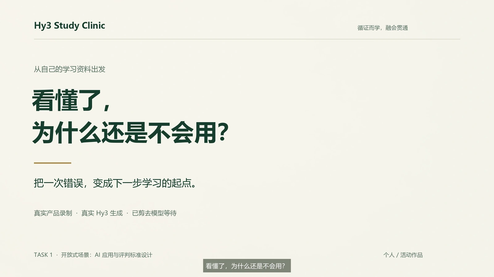](media/demo/Hy3-Study-Clinic-demo-2560x1440.mp4)

[▶ 打开完整视频](media/demo/Hy3-Study-Clinic-demo-2560x1440.mp4) · [下载 MP4](media/demo/Hy3-Study-Clinic-demo-2560x1440.mp4?raw=true) · [中文字幕](media/demo/Hy3-Study-Clinic-demo.zh-CN.srt)

视频含中文旁白与字幕。GitHub 若没有显示播放器，可点“下载 MP4”或文件页的 Raw / Download，在浏览器或本地播放器观看。

## 视频中的学习过程

演示课程是“用户访谈：问出真实需求”。它教学生开发者怎样提问，以及如何区分受访者的具体经历、赞同态度和还需验证的需求。可以重点看系统如何解释错误，以及换题后是否仍在检查同一个知识点。

| 时间  | 内容             | 值得观察的细节                                         |
| ----- | ---------------- | ------------------------------------------------------ |
| 00:00 | 学习工作室       | 从自己的资料组织一门课程。                             |
| 00:09 | 资料与课程结构   | 范围、深度、重点和单元相互关联。                       |
| 00:19 | 连续讲解与案例   | 用具体访谈问题解释“中立”与“预设”。                     |
| 00:30 | 选中内容问 Tutor | “你上次排队花了多久”仍预设排过队；回复可展开参考原文。 |
| 00:48 | 练习与错误定位   | 把少数人的经历和赞同推广成所有人的需求，触发诊断。     |
| 01:00 | 针对性补救       | 区分个人自述、态度、有限结论和需求假设。               |
| 01:13 | 换情境复测       | 换一个问题，独立运用刚才学到的判断方法。               |
| 01:27 | 回看学习进度     | 查看学过的内容和测评记录；此时尚未通过正式测评。       |

## 核对一次正式作答

视频停在练习完成后，尚未通过正式测评。下面换到 9 月 14 日的另一批运行，查看“四分位数与四分位距”课程的一次正式作答。**题目、作答与评分来自真实 Hy3 调用，作答者由 Hy3 模拟。**

题目约定：7 个数排序后，去掉正中数，再分别求两半的中位数。对 62、68、75、80、85、90、95，回答应先去掉 80，再得出 Q1 = 68、Q3 = 90。保存的回答写出了这两步，对应的两项评分标准均为“已达到”。

下图可以直接核对题目、回答、评分，以及“已通过”“已计入当前正式进度”的记录。这次通过针对一个目标，不表示整门课程完成。

[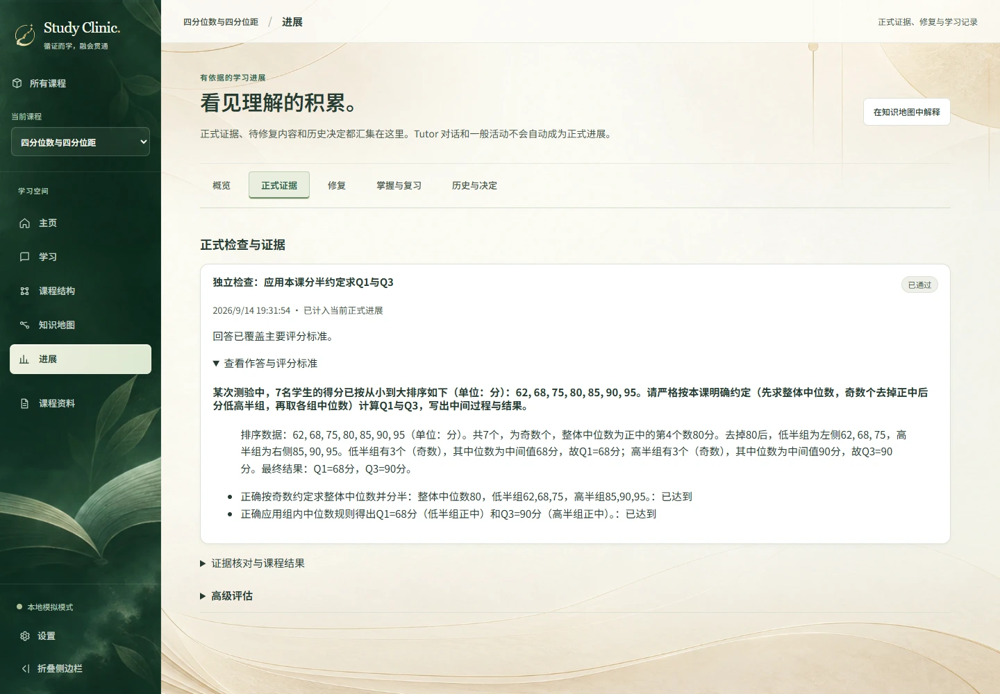](media/showcase/formal-desktop.webp)

界面来自 J04 的真实 Hy3 运行数据库副本，仅用 Fake 模式显示保存记录，没有重新生成或评分。[手机画面](media/showcase/formal-mobile.webp) · [截图来源](media/showcase/manifest.json)。

四分位数与四分位距的题目与实际作答

按指定约定去掉中位数 80，低半组中位数 68、高半组中位数 90。

**实际任务**

> 某次测验中，7名学生的得分已按从小到大排序如下（单位：分）：62, 68, 75, 80, 85, 90, 95。请严格按本课明确约定（先求整体中位数，奇数个去掉正中后分低高半组，再取各组中位数）计算Q1与Q3，写出中间过程与结果。

**实际作答**

> 排序数据：62, 68, 75, 80, 85, 90, 95（单位：分）。共7个，为奇数个，整体中位数为正中的第4个数80分。去掉80后，低半组为左侧62, 68, 75，高半组为右侧85, 90, 95。低半组有3个（奇数），其中位数为中间值68分，故Q1=68分；高半组有3个（奇数），其中位数为中间值90分，故Q3=90分。最终结果：Q1=68分，Q3=90分。

[来源](../eval/final-showcase/dataset/courses/J04.json) · [教学](../eval/final-showcase/runs/scored-01/cases/J04/lesson-1-prepared.json) · [题面](../eval/final-showcase/runs/scored-01/cases/J04/formal-1-before.json) · [答案与评分](../eval/final-showcase/runs/scored-01/cases/J04/formal-1-answer.json) · [持久化证据](../eval/final-showcase/runs/scored-01/cases/J04/final.snapshot.json)

原始评分中的 `demonstrated: true`、`evidenceStatus: "supported"` 与 `progressionPending: false` 对应该次已通过且进度更新完成的结果。全部运行还有生成失败和内容缺陷，接着看[20 课完整结果](REPORT.md#产品运行与实际失败)；需要核对保存文件时，使用[快速核验](VERIFICATION.md#快速核验)。

## 截图导览

按学习过程展开截图，可以点击图片查看细节。

<b>1 · 准备课程：工作室、资料与课程结构</b>

**学习工作室。** 每门课程保留自己的资料和学习过程。

**课程资料。** 本次使用原创中文用户访谈讲义。

[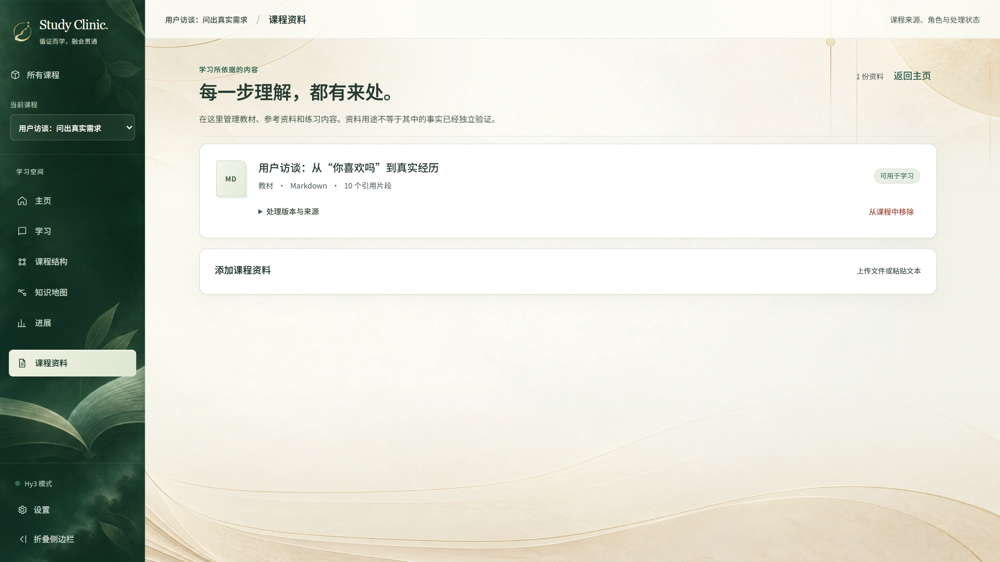](media/screenshots/02-course-materials.webp)

**课程结构。** 从资料组织单元与学习目标，供学习者审阅。

[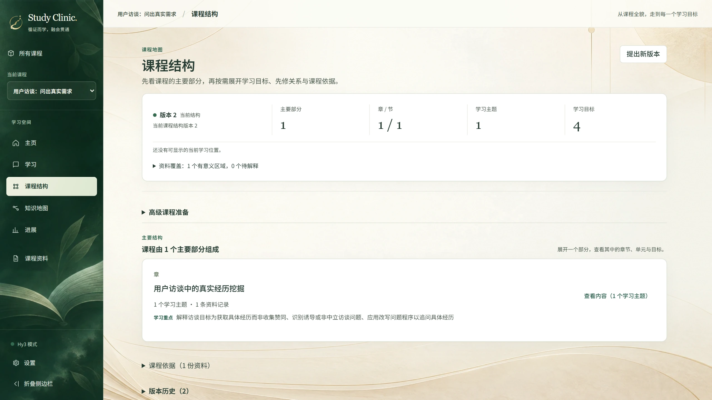](media/screenshots/03-course-structure.webp)

<b>2 · 学习与追问：讲解、Tutor 和参考原文</b>

**连续讲解。** 通过案例建立判断方法，补充教学有明确标识。

[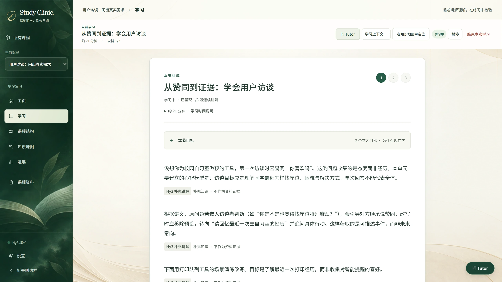](media/screenshots/04-structured-teaching.webp)

**上下文 Tutor。** 围绕选中的内容继续提问，不必离开当前学习。

[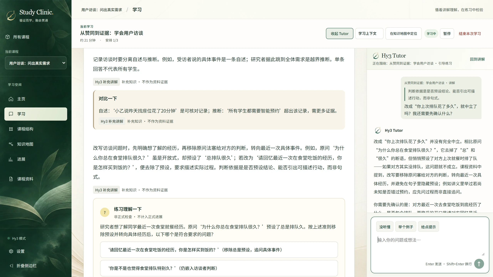](media/screenshots/07-contextual-tutor.webp)

**参考原文。** 展开回复引用，检查讲解与课程资料的关系。

[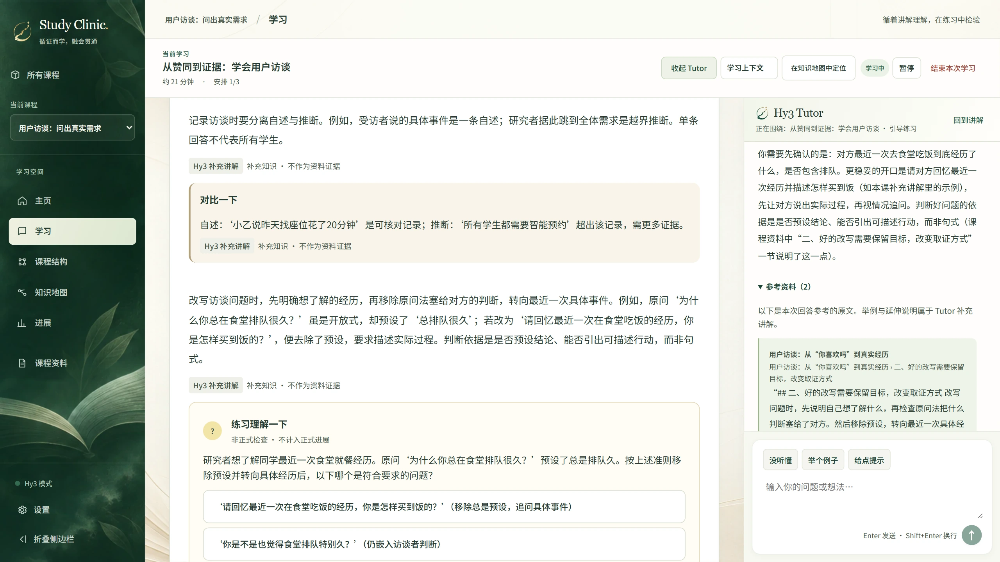](media/screenshots/08-tutor-sources.webp)

<b>3 · 从错误继续：独立练习、补救与新情境复测</b>

**独立判断。** 访谈记录能支持什么结论，需要学习者自己判断。

[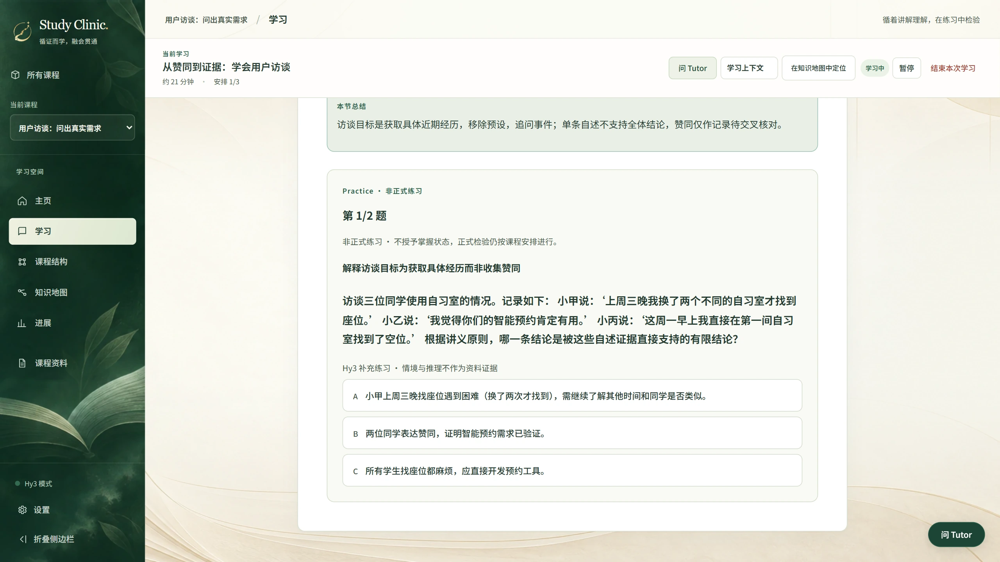](media/screenshots/09-practice-evidence-judgment.webp)

**补上理解。** 诊断引用本次选择，解释错误跨过了哪一步。

[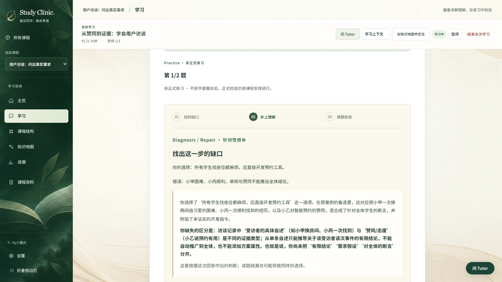](media/screenshots/11-repair-explanation.webp)

**换题检验。** 新情境要求再次使用判断方法。

[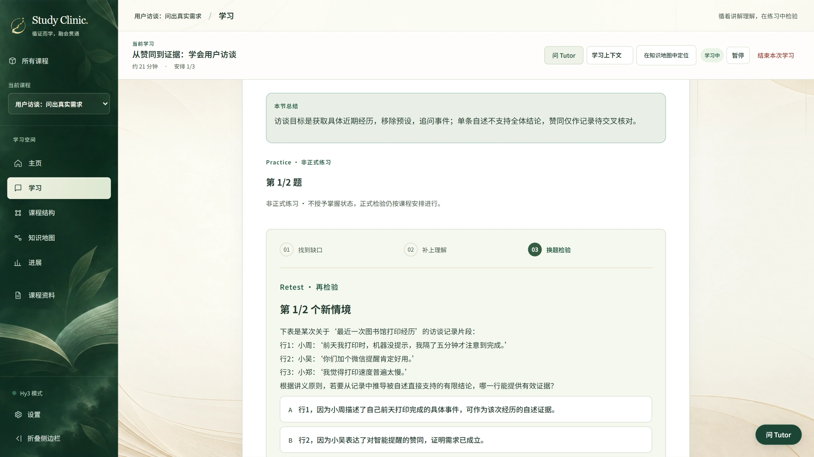](media/screenshots/13-retest-new-scenario.webp)

<b>4 · 回看进度：学过的内容与测评记录</b>

界面分别显示讲解、练习的完成情况和正式测评记录。这次演示停在练习完成后，正式通过记录仍为零。

[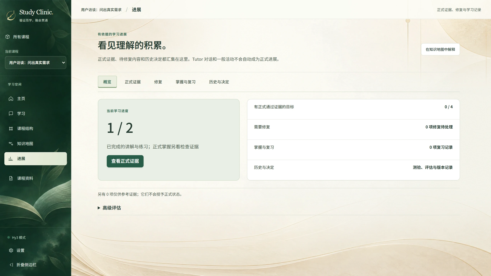](media/screenshots/15-progress-without-false-mastery.webp)

## 操作提示

在讲解中选中一段文字可以准备向 Tutor 提问，打开选中片段不会自动发送。Enter 发送，Shift+Enter 换行，中文输入法组词时不会提交。桌面上 Tutor 位于讲解旁，小屏幕上使用底部抽屉，关闭后回到阅读位置。

练习答错后，先看针对这次作答的解释，再进入新问题。复测期间不展示答案与提示，通过后完成当前练习项。正式测评单独安排；如果资料不足以支持出题和评分，相关目标仍可继续教学。

## 保存的学习案例

下方案例选自一次 20 课运行。15 课完成首个正式作答，其中 12 课经后续 AI 助手检查，未发现实质题目或作答缺陷，收录在这里。**作答者由 Hy3 模拟，内容复核没有经过独立人类认证。** 教学内容只做了抽查，运行也没有覆盖整门课程。

完整的 20 课结果和失败在[主报告](REPORT.md#产品运行与实际失败)与[原始结果表](../eval/final-showcase/analysis/scored-01/RESULTS.md)中呈现。选择条件与逐课判断见[内容审计](../eval/final-showcase/analysis/scored-01/content-audit.json)。

### 更多实际任务

上方四分位数案例之外，以下五例也保留实际题目、完整作答及原始记录。题目和答案未作润色。

功率、电能与使用时长的题目与实际作答

实际平均功率 0.5 kW × 3 h = 1.5 kWh；额定值不能替代实际功率。

**实际任务**

> 某设备铭牌标注额定功率为2000瓦。在本次测试中，题目明确授权所给为实际平均功率：设备以实际平均功率 0.5 千瓦运行了 3 小时。请回答：
> (1) 本次消耗电能为多少千瓦时？
> (2) 为什么不能仅凭铭牌额定功率 2000 瓦乘以时间来计算本次实际耗电？
> (3) 千瓦时是哪种物理量单位？它与焦耳的换算关系是什么？

**实际作答**

> (1) 本次消耗电能 = 实际平均功率 × 时间 = 0.5 千瓦 × 3 小时 = 1.5 千瓦时。题目明确授权所给为实际平均功率，可直接相乘。
> (2) 不能仅凭铭牌额定功率2000瓦（合2千瓦）乘时间，因为额定功率是规定条件下的标称参数，不一定等于整个使用过程持续的实际功率；本题实际平均功率仅为0.5千瓦，用额定值会高估耗电。
> (3) 千瓦时是电能（能量）单位，不是功率单位。换算：1千瓦=1000瓦，1小时=3600秒，1瓦=1焦耳/秒，故1千瓦时 = 1000 × 3600 = 3600000 焦耳。

[来源](../eval/final-showcase/dataset/courses/J08.json) · [教学](../eval/final-showcase/runs/scored-01/cases/J08/lesson-1-prepared.json) · [题面](../eval/final-showcase/runs/scored-01/cases/J08/formal-1-before.json) · [答案与评分](../eval/final-showcase/runs/scored-01/cases/J08/formal-1-answer.json) · [持久化证据](../eval/final-showcase/runs/scored-01/cases/J08/final.snapshot.json)

溶液质量分数与加水稀释的题目与实际作答

140 g、25% 的盐水含盐 35 g、水 105 g；质量分数的分母是 140 g。

**实际任务**

> 有一份盐溶液，总质量140克，质量分数25%（即小数0.25）。本课假设盐完全溶解、无蒸发洒失，质量以克计。请计算该溶液中盐的质量和水的质量；写出溶质质量分数的定义并指出其分母；同时说明若用算出的盐质量除以水质量得到的比例能否当作溶液的质量分数，为什么。

**实际作答**

> 盐的质量 = 140克 × 0.25 = 35克；水的质量 = 140克 - 35克 = 105克。
> 溶质质量分数的定义：溶质质量 ÷ 溶液总质量，常写成百分数。其分母是溶液总质量（溶质质量与溶剂质量之和）。
> 不能用盐质量除以水质量（35÷105≈33.3%）当作溶液的质量分数。因为该结果只是盐与水的质量比，而质量分数要求的分母必须是溶液总质量（盐+水），不是单独的水；以溶剂为分母会得到错误的浓度，违背本课定义与边界。

[来源](../eval/final-showcase/dataset/courses/J14.json) · [教学](../eval/final-showcase/runs/scored-01/cases/J14/lesson-1-prepared.json) · [题面](../eval/final-showcase/runs/scored-01/cases/J14/formal-1-before.json) · [答案与评分](../eval/final-showcase/runs/scored-01/cases/J14/formal-1-answer.json) · [持久化证据](../eval/final-showcase/runs/scored-01/cases/J14/final.snapshot.json)

赊销收入、应收账款与现金的题目与实际作答

收入 1,300 元、现金 700 元、期末应收 600 元；收回旧欠款不新增收入。

**实际任务**

> 某服务企业采用本课简化的权责发生制模型：模型中没有税费、坏账、退款、利息或预收款；所有收入都来自已经完成的服务。期初应收账款为0。根据模型，收入按服务完成确认，收款不新增收入。应收账款滚动关系：期末应收=期初应收+本期新增赊销收入-本期收回的应收款。三月1日，企业完成500元服务并当场收款。三月10日，完成800元服务，约定四月付款。三月20日，收到上述800元欠款中的200元。请计算三月服务收入、现金流入与月末应收账款，并说明三月20日收款为何不新增服务收入。

**实际作答**

> 三月服务收入 = 500（3月1日当场完成收现）+ 800（3月10日完成赊销）= 1300元。现金流入 = 500（3月1日收现）+ 200（3月20日收回旧欠款）= 700元。月末应收账款 = 期初0 + 本期新增赊销收入800 - 本期收回应收款200 = 600元（3月1日当场收现不产生应收，3月10日赊销使应收增至800，3月20日收款减至600）。三月20日收款不新增服务收入的原因：对应的800元服务已在3月10日服务完成且客户产生付款义务时确认了收入，当时已记入应收账款；3月20日收到200元只是将原有债权的一部分变现为现金，属于收回前期形成的应收款，并未提供新的服务。若再次计入收入会重复计算同一笔服务收入。记录收款应指向原有债权而非仅看现金流入。

[来源](../eval/final-showcase/dataset/courses/J15.json) · [教学](../eval/final-showcase/runs/scored-01/cases/J15/lesson-1-prepared.json) · [题面](../eval/final-showcase/runs/scored-01/cases/J15/formal-1-before.json) · [答案与评分](../eval/final-showcase/runs/scored-01/cases/J15/formal-1-answer.json) · [持久化证据](../eval/final-showcase/runs/scored-01/cases/J15/final.snapshot.json)

关系表连接的题目与实际作答

Lee 对应两本书产生两行，Mo 对应一本书；检查真实数据的一对多匹配。

**实际任务**

> 现有左表 Authors(author_id, name) 包含行 (1, 'Lee'), (2, 'Mo')；右表 Books(book_id, author_id, title) 包含行 (101,1,'A'), (102,1,'B'), (103,2,'C')。关系连接根据显式条件（如 author_id 相等）组合两表行，左表每一行独立检查右表所有行，键相等则产生配对行，且此机制不自动汇总。请解释关系连接基于显式条件组合行的机制，并基于上述数据说明为什么作者 'Lee' 在连接结果中会出现多次（即一个左表行可以匹配多个右表行）。

**实际作答**

> 关系连接机制：根据显式条件（如 Authors.author_id = Books.author_id），对左表每一行独立扫描右表所有行；只要右表某行的连接键与左表行相等，就产生一个由两行组合而成的结果行。该过程按配对逐一发射，不自动汇总或合并多个匹配。
>
> 基于给定数据：Authors 有 (1,'Lee') 和 (2,'Mo')；Books 有 (101,1,'A')、(102,1,'B')、(103,2,'C')。以 author_id 相等为条件，处理左行 Lee (author_id=1) 时，检查 Books 全部行：book_id=101 的 author_id=1，相等，生成组合行 (Lee,101,'A')；book_id=102 的 author_id=1，相等，生成组合行 (Lee,102,'B')；book_id=103 的 author_id=2，不相等，无配对。因此 Lee 这一个左表行因为右表中存在两行满足键相等，被配对两次，在连接结果中出现两次（例如内连接结果包含 (Lee,101,'A'), (Lee,102,'B'), (Mo,103,'C')）。这正说明一个左表行可以匹配多个右表行，且连接机制不会把这两行合并为单行。

[来源](../eval/final-showcase/dataset/courses/J17.json) · [教学](../eval/final-showcase/runs/scored-01/cases/J17/lesson-1-prepared.json) · [题面](../eval/final-showcase/runs/scored-01/cases/J17/formal-1-before.json) · [答案与评分](../eval/final-showcase/runs/scored-01/cases/J17/formal-1-answer.json) · [持久化证据](../eval/final-showcase/runs/scored-01/cases/J17/final.snapshot.json)

函数参数与返回值的题目与实际作答

参数 a 接收值 3，局部变为 8 并返回 16；调用者 c=16，b 保持 3。

**实际任务**

> 假设函数 f(a): 先执行 a = a + 5，然后返回 a * 2。调用者持有变量 b = 3，执行 c = f(b)。请回答：(1) 在函数定义中 a 是什么？调用时提供的 b 的值扮演什么角色？(2) 解释按值传递如何将 b 的值绑定到 a，并说明函数内对 a 的赋值是否会影响调用者变量 b，为什么？(3) 调用结束后 c 和 b 的值分别是多少？展示你的推理过程。

**实际作答**

> (1) 在定义 f(a) 中，a 是参数（局部参数名）。调用时提供的 b 的值（3）是实参，扮演传入函数的数值角色，用于绑定到局部参数 a。
> (2) 按值传递：调用 f(b) 时，b 的当前值 3 作为实参被提供给函数，函数调用创建局部参数 a 并绑定该值（a 初始为 3）。函数内 a = a+5 只改变本次调用的局部 a（变为8），因为数字是按值传递，局部 a 与调用者 b 是不同名字，且无引用关联，所以对 a 的赋值不会影响调用者变量 b。
> (3) 推理：局部 a 起始 3，赋值后 a=8，返回 a*2=16。调用者语句 c = f(b) 将返回结果 16 赋给 c，未对 b 赋值。故调用结束后 c = 16，b = 3。

[来源](../eval/final-showcase/dataset/courses/J20.json) · [教学](../eval/final-showcase/runs/scored-01/cases/J20/lesson-1-prepared.json) · [题面](../eval/final-showcase/runs/scored-01/cases/J20/formal-1-before.json) · [答案与评分](../eval/final-showcase/runs/scored-01/cases/J20/formal-1-answer.json) · [持久化证据](../eval/final-showcase/runs/scored-01/cases/J20/final.snapshot.json)

### 全部案例的原始记录

下面列出全部 12 个展示案例的资料、讲解、题目、作答和最终记录。要查看失败课程，请读上方链接中的完整 20 课结果。

展开全部案例与原始文件链接

| 旅程                             | 检查点内容                                                             | 完整证据链                                                                                                                                                                                                                                                                                                                                                                                    |
| -------------------------------- | ---------------------------------------------------------------------- | --------------------------------------------------------------------------------------------------------------------------------------------------------------------------------------------------------------------------------------------------------------------------------------------------------------------------------------------------------------------------------------------- |
| J01 · 最大公因数与整块铺砖       | 15 不能整除 25，因数集合给出最大公因数 5；展示概念与近应用检查点。     | [资料](../eval/final-showcase/dataset/courses/J01.json) · [教学](../eval/final-showcase/runs/scored-01/cases/J01/lesson-1-prepared.json) · [题面](../eval/final-showcase/runs/scored-01/cases/J01/formal-1-before.json) · [作答/评分](../eval/final-showcase/runs/scored-01/cases/J01/formal-1-answer.json) · [最终证据](../eval/final-showcase/runs/scored-01/cases/J01/final.snapshot.json) |
| J04 · 四分位数与四分位距         | 按指定约定去掉中位数 80，低半组中位数 68、高半组中位数 90。            | [资料](../eval/final-showcase/dataset/courses/J04.json) · [教学](../eval/final-showcase/runs/scored-01/cases/J04/lesson-1-prepared.json) · [题面](../eval/final-showcase/runs/scored-01/cases/J04/formal-1-before.json) · [作答/评分](../eval/final-showcase/runs/scored-01/cases/J04/formal-1-answer.json) · [最终证据](../eval/final-showcase/runs/scored-01/cases/J04/final.snapshot.json) |
| J06 · 动能为什么随速率的平方变化 | 解释 E=½mv² 的量与单位，代入得 6 J，并保留模型适用范围。               | [资料](../eval/final-showcase/dataset/courses/J06.json) · [教学](../eval/final-showcase/runs/scored-01/cases/J06/lesson-1-prepared.json) · [题面](../eval/final-showcase/runs/scored-01/cases/J06/formal-1-before.json) · [作答/评分](../eval/final-showcase/runs/scored-01/cases/J06/formal-1-answer.json) · [最终证据](../eval/final-showcase/runs/scored-01/cases/J06/final.snapshot.json) |
| J08 · 功率、电能与使用时长       | 实际平均功率 0.5 kW × 3 h = 1.5 kWh；额定值不能替代实际功率。          | [资料](../eval/final-showcase/dataset/courses/J08.json) · [教学](../eval/final-showcase/runs/scored-01/cases/J08/lesson-1-prepared.json) · [题面](../eval/final-showcase/runs/scored-01/cases/J08/formal-1-before.json) · [作答/评分](../eval/final-showcase/runs/scored-01/cases/J08/formal-1-answer.json) · [最终证据](../eval/final-showcase/runs/scored-01/cases/J08/final.snapshot.json) |
| J11 · 英语主动句与被动句的对应   | 主动与被动表达中，动作执行者和承受者的语义角色不因语法主语变化而互换。 | [资料](../eval/final-showcase/dataset/courses/J11.json) · [教学](../eval/final-showcase/runs/scored-01/cases/J11/lesson-1-prepared.json) · [题面](../eval/final-showcase/runs/scored-01/cases/J11/formal-1-before.json) · [作答/评分](../eval/final-showcase/runs/scored-01/cases/J11/formal-1-answer.json) · [最终证据](../eval/final-showcase/runs/scored-01/cases/J11/final.snapshot.json) |
| J13 · 溶解度、饱和与冷却析出     | 溶解度以 100 g 溶剂为分母，区分溶剂与溶液总质量。                      | [资料](../eval/final-showcase/dataset/courses/J13.json) · [教学](../eval/final-showcase/runs/scored-01/cases/J13/lesson-1-prepared.json) · [题面](../eval/final-showcase/runs/scored-01/cases/J13/formal-1-before.json) · [作答/评分](../eval/final-showcase/runs/scored-01/cases/J13/formal-1-answer.json) · [最终证据](../eval/final-showcase/runs/scored-01/cases/J13/final.snapshot.json) |
| J14 · 溶液质量分数与加水稀释     | 140 g、25% 的盐水含盐 35 g、水 105 g；质量分数的分母是 140 g。         | [资料](../eval/final-showcase/dataset/courses/J14.json) · [教学](../eval/final-showcase/runs/scored-01/cases/J14/lesson-1-prepared.json) · [题面](../eval/final-showcase/runs/scored-01/cases/J14/formal-1-before.json) · [作答/评分](../eval/final-showcase/runs/scored-01/cases/J14/formal-1-answer.json) · [最终证据](../eval/final-showcase/runs/scored-01/cases/J14/final.snapshot.json) |
| J15 · 赊销收入、应收账款与现金   | 收入 1,300 元、现金 700 元、期末应收 600 元；收回旧欠款不新增收入。    | [资料](../eval/final-showcase/dataset/courses/J15.json) · [教学](../eval/final-showcase/runs/scored-01/cases/J15/lesson-1-prepared.json) · [题面](../eval/final-showcase/runs/scored-01/cases/J15/formal-1-before.json) · [作答/评分](../eval/final-showcase/runs/scored-01/cases/J15/formal-1-answer.json) · [最终证据](../eval/final-showcase/runs/scored-01/cases/J15/final.snapshot.json) |
| J16 · 会计等式怎样追踪日常交易   | 500 元业主投入与 300 元借款分别增加权益与负债，现金合计 800 元。       | [资料](../eval/final-showcase/dataset/courses/J16.json) · [教学](../eval/final-showcase/runs/scored-01/cases/J16/lesson-1-prepared.json) · [题面](../eval/final-showcase/runs/scored-01/cases/J16/formal-1-before.json) · [作答/评分](../eval/final-showcase/runs/scored-01/cases/J16/formal-1-answer.json) · [最终证据](../eval/final-showcase/runs/scored-01/cases/J16/final.snapshot.json) |
| J17 · 关系表连接                 | Lee 对应两本书产生两行，Mo 对应一本书；检查真实数据的一对多匹配。      | [资料](../eval/final-showcase/dataset/courses/J17.json) · [教学](../eval/final-showcase/runs/scored-01/cases/J17/lesson-1-prepared.json) · [题面](../eval/final-showcase/runs/scored-01/cases/J17/formal-1-before.json) · [作答/评分](../eval/final-showcase/runs/scored-01/cases/J17/formal-1-answer.json) · [最终证据](../eval/final-showcase/runs/scored-01/cases/J17/final.snapshot.json) |
| J19 · 先进先出队列               | 队列 [U,V] 出队 U，入队 W 后为 [V,W]；peek 返回 V 而不改变队列。       | [资料](../eval/final-showcase/dataset/courses/J19.json) · [教学](../eval/final-showcase/runs/scored-01/cases/J19/lesson-1-prepared.json) · [题面](../eval/final-showcase/runs/scored-01/cases/J19/formal-1-before.json) · [作答/评分](../eval/final-showcase/runs/scored-01/cases/J19/formal-1-answer.json) · [最终证据](../eval/final-showcase/runs/scored-01/cases/J19/final.snapshot.json) |
| J20 · 函数参数与返回值           | 参数 a 接收值 3，局部变为 8 并返回 16；调用者 c=16，b 保持 3。         | [资料](../eval/final-showcase/dataset/courses/J20.json) · [教学](../eval/final-showcase/runs/scored-01/cases/J20/lesson-1-prepared.json) · [题面](../eval/final-showcase/runs/scored-01/cases/J20/formal-1-before.json) · [作答/评分](../eval/final-showcase/runs/scored-01/cases/J20/formal-1-answer.json) · [最终证据](../eval/final-showcase/runs/scored-01/cases/J20/final.snapshot.json) |

## 媒体来源

视频为 **2560 × 1440、30 fps、109.9 秒、12.0 MiB**。十张截图同为 2560 × 1440。仓库内相对链接指向当前检出版本的文件。

视频录于 2026-09-11，产品代码为 `325dfa1051c6efa8e5f5617955b34683d516c144`。演示使用独立新建的课程与原创用户访谈讲义，教学、Tutor 和补救来自真实 Hy3 调用，没有用替换界面或手工授予进度制作课程内的题目、选项与成绩。

这段视频早于 9 月 14 日的 20 课运行，不是该实验的评分录像。它剪去了生成等待和部分教学内容，包含旁白与开场收尾；录屏没有展示正式测评通过、深入迁移或到期复习的完整过程。

十张演示截图仅转为 WebP，没有裁切、拼接或改写内容。视频原样复制；SRT 仅规范换行，保留内容与时间；封面取自视频 1.5 秒处。视频与这十张截图合计约 14.2 MiB，源文件和 SHA-256 见[媒体清单](media/manifest.json)。

## 资源与许可

截图与录屏是实际产品画面。品牌与背景图案中包含 AI 生成的栅格素材，装饰图案不承担学习状态含义；打印、强制配色和增强对比模式保留纯色回退。

| 资源                                                                               | 说明                                                                                                                                                          |
| ---------------------------------------------------------------------------------- | ------------------------------------------------------------------------------------------------------------------------------------------------------------- |
| [字体与许可](../apps/web/public/fonts/README.md)                                   | 随应用分发的 Noto Sans SC 与 Noto Serif SC                                                                                                                    |
| [Tabler 图标与许可](../apps/web/public/icons/tabler/README.md)                     | 图标来源与授权                                                                                                                                                |
| [背景素材](../apps/web/public/backgrounds)与[界面样式](../apps/web/src/studio.css) | 阅读背景、表面颜色与响应式布局                                                                                                                                |
| [正式作答截图清单](media/showcase/manifest.json)                                   | 保存记录的桌面与手机画面来源                                                                                                                                  |
| [早期竞赛概览](media/competition/competition-overview.svg)                         | 保留的展示资源，附 [PNG](media/competition/competition-overview.png)、[清单](media/competition/manifest.json)与[生成器](media/competition/render-overview.py) |

竞赛概览的生成器读取封存结果，不重新评分。原运行环境为 Python 3.12 与 Matplotlib 3.11.2，命令为 `python docs/media/competition/render-overview.py`；当前数据解释以主报告为准。
