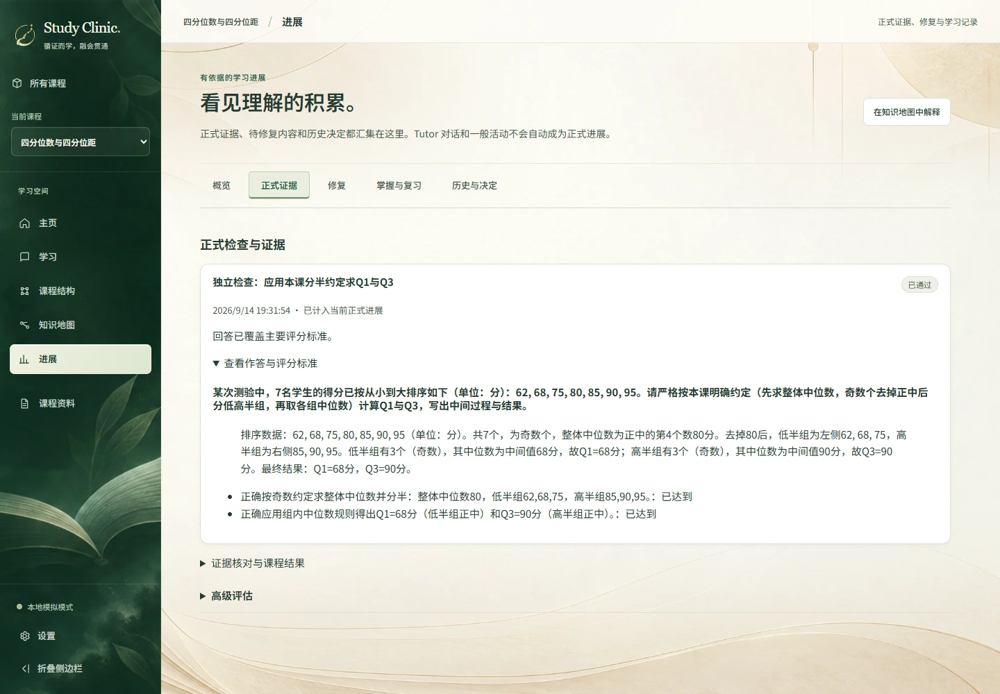

# Product Showcase

**12 content-audited end-to-end learning journeys**

[返回首页](../README.md) · [正式 Task 1 评估：StudyEval](../eval/studyeval-validation/README.md) · [完整 20 课可靠性审计](../eval/final-showcase/README.md)

这些保存的旅程展示 Study Clinic 如何把资料、教学、Practice、正式作答与持久化证据连起来。先看下方六个例子，再按完整清单查看全部 12 条。

_界面来自 J04 已完成的真实 Hy3 运行数据库副本；仅用 Fake 模式展示保存记录，未重新生成或评分。[手机画面](media/showcase/formal-mobile.webp) · [截图来源](media/showcase/manifest.json)。_

**选集口径：** 12 条旅程来自同一次冻结的 20 课 Candidate 23 运行，依据后续内容审计中 `completeJourney`、`credited`、`taskSound`、`answerSound` 均为 true 选出。审计由任务助手完成，覆盖正式题目、私有答案、必需评分点与实际作答；未发现实质题目或作答缺陷。教学仅抽查，不能称为逐句认证；首个 Formal 检查点不等于完成整门课程。它们是事后选出的产品例子，不是无偏基准，也不代表真实学生学习增益。[原内容审计](../eval/final-showcase/analysis/scored-01/content-audit.json)与[全部 20 课结果及失败](../eval/final-showcase/analysis/scored-01/RESULTS.md)保持原样。

## 六个值得先看的过程

### J04 · 四分位数与四分位距

按指定约定去掉中位数 80，低半组中位数 68、高半组中位数 90。

**实际任务**

> 某次测验中，7名学生的得分已按从小到大排序如下（单位：分）：62, 68, 75, 80, 85, 90, 95。请严格按本课明确约定（先求整体中位数，奇数个去掉正中后分低高半组，再取各组中位数）计算Q1与Q3，写出中间过程与结果。

查看完整实际作答

> 排序数据：62, 68, 75, 80, 85, 90, 95（单位：分）。共7个，为奇数个，整体中位数为正中的第4个数80分。去掉80后，低半组为左侧62, 68, 75，高半组为右侧85, 90, 95。低半组有3个（奇数），其中位数为中间值68分，故Q1=68分；高半组有3个（奇数），其中位数为中间值90分，故Q3=90分。最终结果：Q1=68分，Q3=90分。

[来源](../eval/final-showcase/dataset/courses/J04.json) · [教学](../eval/final-showcase/runs/scored-01/cases/J04/lesson-1-prepared.json) · [题面](../eval/final-showcase/runs/scored-01/cases/J04/formal-1-before.json) · [答案与评分](../eval/final-showcase/runs/scored-01/cases/J04/formal-1-answer.json) · [持久化证据](../eval/final-showcase/runs/scored-01/cases/J04/final.snapshot.json)

### J08 · 功率、电能与使用时长

实际平均功率 0.5 kW × 3 h = 1.5 kWh；额定值不能替代实际功率。

**实际任务**

> 某设备铭牌标注额定功率为2000瓦。在本次测试中，题目明确授权所给为实际平均功率：设备以实际平均功率 0.5 千瓦运行了 3 小时。请回答：
> (1) 本次消耗电能为多少千瓦时？
> (2) 为什么不能仅凭铭牌额定功率 2000 瓦乘以时间来计算本次实际耗电？
> (3) 千瓦时是哪种物理量单位？它与焦耳的换算关系是什么？

查看完整实际作答

> (1) 本次消耗电能 = 实际平均功率 × 时间 = 0.5 千瓦 × 3 小时 = 1.5 千瓦时。题目明确授权所给为实际平均功率，可直接相乘。
> (2) 不能仅凭铭牌额定功率2000瓦（合2千瓦）乘时间，因为额定功率是规定条件下的标称参数，不一定等于整个使用过程持续的实际功率；本题实际平均功率仅为0.5千瓦，用额定值会高估耗电。
> (3) 千瓦时是电能（能量）单位，不是功率单位。换算：1千瓦=1000瓦，1小时=3600秒，1瓦=1焦耳/秒，故1千瓦时 = 1000 × 3600 = 3600000 焦耳。

[来源](../eval/final-showcase/dataset/courses/J08.json) · [教学](../eval/final-showcase/runs/scored-01/cases/J08/lesson-1-prepared.json) · [题面](../eval/final-showcase/runs/scored-01/cases/J08/formal-1-before.json) · [答案与评分](../eval/final-showcase/runs/scored-01/cases/J08/formal-1-answer.json) · [持久化证据](../eval/final-showcase/runs/scored-01/cases/J08/final.snapshot.json)

### J14 · 溶液质量分数与加水稀释

140 g、25% 的盐水含盐 35 g、水 105 g；质量分数的分母是 140 g。

**实际任务**

> 有一份盐溶液，总质量140克，质量分数25%（即小数0.25）。本课假设盐完全溶解、无蒸发洒失，质量以克计。请计算该溶液中盐的质量和水的质量；写出溶质质量分数的定义并指出其分母；同时说明若用算出的盐质量除以水质量得到的比例能否当作溶液的质量分数，为什么。

查看完整实际作答

> 盐的质量 = 140克 × 0.25 = 35克；水的质量 = 140克 - 35克 = 105克。
> 溶质质量分数的定义：溶质质量 ÷ 溶液总质量，常写成百分数。其分母是溶液总质量（溶质质量与溶剂质量之和）。
> 不能用盐质量除以水质量（35÷105≈33.3%）当作溶液的质量分数。因为该结果只是盐与水的质量比，而质量分数要求的分母必须是溶液总质量（盐+水），不是单独的水；以溶剂为分母会得到错误的浓度，违背本课定义与边界。

[来源](../eval/final-showcase/dataset/courses/J14.json) · [教学](../eval/final-showcase/runs/scored-01/cases/J14/lesson-1-prepared.json) · [题面](../eval/final-showcase/runs/scored-01/cases/J14/formal-1-before.json) · [答案与评分](../eval/final-showcase/runs/scored-01/cases/J14/formal-1-answer.json) · [持久化证据](../eval/final-showcase/runs/scored-01/cases/J14/final.snapshot.json)

### J15 · 赊销收入、应收账款与现金

收入 1,300 元、现金 700 元、期末应收 600 元；收回旧欠款不新增收入。

**实际任务**

> 某服务企业采用本课简化的权责发生制模型：模型中没有税费、坏账、退款、利息或预收款；所有收入都来自已经完成的服务。期初应收账款为0。根据模型，收入按服务完成确认，收款不新增收入。应收账款滚动关系：期末应收=期初应收+本期新增赊销收入-本期收回的应收款。三月1日，企业完成500元服务并当场收款。三月10日，完成800元服务，约定四月付款。三月20日，收到上述800元欠款中的200元。请计算三月服务收入、现金流入与月末应收账款，并说明三月20日收款为何不新增服务收入。

查看完整实际作答

> 三月服务收入 = 500（3月1日当场完成收现）+ 800（3月10日完成赊销）= 1300元。现金流入 = 500（3月1日收现）+ 200（3月20日收回旧欠款）= 700元。月末应收账款 = 期初0 + 本期新增赊销收入800 - 本期收回应收款200 = 600元（3月1日当场收现不产生应收，3月10日赊销使应收增至800，3月20日收款减至600）。三月20日收款不新增服务收入的原因：对应的800元服务已在3月10日服务完成且客户产生付款义务时确认了收入，当时已记入应收账款；3月20日收到200元只是将原有债权的一部分变现为现金，属于收回前期形成的应收款，并未提供新的服务。若再次计入收入会重复计算同一笔服务收入。记录收款应指向原有债权而非仅看现金流入。

[来源](../eval/final-showcase/dataset/courses/J15.json) · [教学](../eval/final-showcase/runs/scored-01/cases/J15/lesson-1-prepared.json) · [题面](../eval/final-showcase/runs/scored-01/cases/J15/formal-1-before.json) · [答案与评分](../eval/final-showcase/runs/scored-01/cases/J15/formal-1-answer.json) · [持久化证据](../eval/final-showcase/runs/scored-01/cases/J15/final.snapshot.json)

### J17 · Joining related tables without losing unmatched rows

Lee 对应两本书产生两行，Mo 对应一本书；检查真实数据的一对多匹配。

**实际任务**

> 现有左表 Authors(author_id, name) 包含行 (1, 'Lee'), (2, 'Mo')；右表 Books(book_id, author_id, title) 包含行 (101,1,'A'), (102,1,'B'), (103,2,'C')。关系连接根据显式条件（如 author_id 相等）组合两表行，左表每一行独立检查右表所有行，键相等则产生配对行，且此机制不自动汇总。请解释关系连接基于显式条件组合行的机制，并基于上述数据说明为什么作者 'Lee' 在连接结果中会出现多次（即一个左表行可以匹配多个右表行）。

查看完整实际作答

> 关系连接机制：根据显式条件（如 Authors.author_id = Books.author_id），对左表每一行独立扫描右表所有行；只要右表某行的连接键与左表行相等，就产生一个由两行组合而成的结果行。该过程按配对逐一发射，不自动汇总或合并多个匹配。
>
> 基于给定数据：Authors 有 (1,'Lee') 和 (2,'Mo')；Books 有 (101,1,'A')、(102,1,'B')、(103,2,'C')。以 author_id 相等为条件，处理左行 Lee (author_id=1) 时，检查 Books 全部行：book_id=101 的 author_id=1，相等，生成组合行 (Lee,101,'A')；book_id=102 的 author_id=1，相等，生成组合行 (Lee,102,'B')；book_id=103 的 author_id=2，不相等，无配对。因此 Lee 这一个左表行因为右表中存在两行满足键相等，被配对两次，在连接结果中出现两次（例如内连接结果包含 (Lee,101,'A'), (Lee,102,'B'), (Mo,103,'C')）。这正说明一个左表行可以匹配多个右表行，且连接机制不会把这两行合并为单行。

[来源](../eval/final-showcase/dataset/courses/J17.json) · [教学](../eval/final-showcase/runs/scored-01/cases/J17/lesson-1-prepared.json) · [题面](../eval/final-showcase/runs/scored-01/cases/J17/formal-1-before.json) · [答案与评分](../eval/final-showcase/runs/scored-01/cases/J17/formal-1-answer.json) · [持久化证据](../eval/final-showcase/runs/scored-01/cases/J17/final.snapshot.json)

### J20 · Function arguments, local names, and returned values

参数 a 接收值 3，局部变为 8 并返回 16；调用者 c=16，b 保持 3。

**实际任务**

> 假设函数 f(a): 先执行 a = a + 5，然后返回 a * 2。调用者持有变量 b = 3，执行 c = f(b)。请回答：(1) 在函数定义中 a 是什么？调用时提供的 b 的值扮演什么角色？(2) 解释按值传递如何将 b 的值绑定到 a，并说明函数内对 a 的赋值是否会影响调用者变量 b，为什么？(3) 调用结束后 c 和 b 的值分别是多少？展示你的推理过程。

查看完整实际作答

> (1) 在定义 f(a) 中，a 是参数（局部参数名）。调用时提供的 b 的值（3）是实参，扮演传入函数的数值角色，用于绑定到局部参数 a。
> (2) 按值传递：调用 f(b) 时，b 的当前值 3 作为实参被提供给函数，函数调用创建局部参数 a 并绑定该值（a 初始为 3）。函数内 a = a+5 只改变本次调用的局部 a（变为8），因为数字是按值传递，局部 a 与调用者 b 是不同名字，且无引用关联，所以对 a 的赋值不会影响调用者变量 b。
> (3) 推理：局部 a 起始 3，赋值后 a=8，返回 a*2=16。调用者语句 c = f(b) 将返回结果 16 赋给 c，未对 b 赋值。故调用结束后 c = 16，b = 3。

[来源](../eval/final-showcase/dataset/courses/J20.json) · [教学](../eval/final-showcase/runs/scored-01/cases/J20/lesson-1-prepared.json) · [题面](../eval/final-showcase/runs/scored-01/cases/J20/formal-1-before.json) · [答案与评分](../eval/final-showcase/runs/scored-01/cases/J20/formal-1-answer.json) · [持久化证据](../eval/final-showcase/runs/scored-01/cases/J20/final.snapshot.json)

## 全部 12 条旅程

每行均可展开原资料、教学产物、实际题面、完整作答和最终证据。表格不新增评分，也不把选集数量作为成功率。

| 旅程                                                       | 检查点内容                                                             | 完整证据链                                                                                                                                                                                                                                                                                                                                                                                    |
| ---------------------------------------------------------- | ---------------------------------------------------------------------- | --------------------------------------------------------------------------------------------------------------------------------------------------------------------------------------------------------------------------------------------------------------------------------------------------------------------------------------------------------------------------------------------- |
| J01 · 最大公因数与整块铺砖                                 | 15 不能整除 25，因数集合给出最大公因数 5；展示概念与近应用检查点。     | [资料](../eval/final-showcase/dataset/courses/J01.json) · [教学](../eval/final-showcase/runs/scored-01/cases/J01/lesson-1-prepared.json) · [题面](../eval/final-showcase/runs/scored-01/cases/J01/formal-1-before.json) · [作答/评分](../eval/final-showcase/runs/scored-01/cases/J01/formal-1-answer.json) · [最终证据](../eval/final-showcase/runs/scored-01/cases/J01/final.snapshot.json) |
| J04 · 四分位数与四分位距                                   | 按指定约定去掉中位数 80，低半组中位数 68、高半组中位数 90。            | [资料](../eval/final-showcase/dataset/courses/J04.json) · [教学](../eval/final-showcase/runs/scored-01/cases/J04/lesson-1-prepared.json) · [题面](../eval/final-showcase/runs/scored-01/cases/J04/formal-1-before.json) · [作答/评分](../eval/final-showcase/runs/scored-01/cases/J04/formal-1-answer.json) · [最终证据](../eval/final-showcase/runs/scored-01/cases/J04/final.snapshot.json) |
| J06 · 动能为什么随速率的平方变化                           | 解释 E=½mv² 的量与单位，代入得 6 J，并保留模型适用范围。               | [资料](../eval/final-showcase/dataset/courses/J06.json) · [教学](../eval/final-showcase/runs/scored-01/cases/J06/lesson-1-prepared.json) · [题面](../eval/final-showcase/runs/scored-01/cases/J06/formal-1-before.json) · [作答/评分](../eval/final-showcase/runs/scored-01/cases/J06/formal-1-answer.json) · [最终证据](../eval/final-showcase/runs/scored-01/cases/J06/final.snapshot.json) |
| J08 · 功率、电能与使用时长                                 | 实际平均功率 0.5 kW × 3 h = 1.5 kWh；额定值不能替代实际功率。          | [资料](../eval/final-showcase/dataset/courses/J08.json) · [教学](../eval/final-showcase/runs/scored-01/cases/J08/lesson-1-prepared.json) · [题面](../eval/final-showcase/runs/scored-01/cases/J08/formal-1-before.json) · [作答/评分](../eval/final-showcase/runs/scored-01/cases/J08/formal-1-answer.json) · [最终证据](../eval/final-showcase/runs/scored-01/cases/J08/final.snapshot.json) |
| J11 · 英语主动句与被动句的对应                             | 主动与被动表达中，动作执行者和承受者的语义角色不因语法主语变化而互换。 | [资料](../eval/final-showcase/dataset/courses/J11.json) · [教学](../eval/final-showcase/runs/scored-01/cases/J11/lesson-1-prepared.json) · [题面](../eval/final-showcase/runs/scored-01/cases/J11/formal-1-before.json) · [作答/评分](../eval/final-showcase/runs/scored-01/cases/J11/formal-1-answer.json) · [最终证据](../eval/final-showcase/runs/scored-01/cases/J11/final.snapshot.json) |
| J13 · 溶解度、饱和与冷却析出                               | 溶解度以 100 g 溶剂为分母，区分溶剂与溶液总质量。                      | [资料](../eval/final-showcase/dataset/courses/J13.json) · [教学](../eval/final-showcase/runs/scored-01/cases/J13/lesson-1-prepared.json) · [题面](../eval/final-showcase/runs/scored-01/cases/J13/formal-1-before.json) · [作答/评分](../eval/final-showcase/runs/scored-01/cases/J13/formal-1-answer.json) · [最终证据](../eval/final-showcase/runs/scored-01/cases/J13/final.snapshot.json) |
| J14 · 溶液质量分数与加水稀释                               | 140 g、25% 的盐水含盐 35 g、水 105 g；质量分数的分母是 140 g。         | [资料](../eval/final-showcase/dataset/courses/J14.json) · [教学](../eval/final-showcase/runs/scored-01/cases/J14/lesson-1-prepared.json) · [题面](../eval/final-showcase/runs/scored-01/cases/J14/formal-1-before.json) · [作答/评分](../eval/final-showcase/runs/scored-01/cases/J14/formal-1-answer.json) · [最终证据](../eval/final-showcase/runs/scored-01/cases/J14/final.snapshot.json) |
| J15 · 赊销收入、应收账款与现金                             | 收入 1,300 元、现金 700 元、期末应收 600 元；收回旧欠款不新增收入。    | [资料](../eval/final-showcase/dataset/courses/J15.json) · [教学](../eval/final-showcase/runs/scored-01/cases/J15/lesson-1-prepared.json) · [题面](../eval/final-showcase/runs/scored-01/cases/J15/formal-1-before.json) · [作答/评分](../eval/final-showcase/runs/scored-01/cases/J15/formal-1-answer.json) · [最终证据](../eval/final-showcase/runs/scored-01/cases/J15/final.snapshot.json) |
| J16 · 会计等式怎样追踪日常交易                             | 500 元业主投入与 300 元借款分别增加权益与负债，现金合计 800 元。       | [资料](../eval/final-showcase/dataset/courses/J16.json) · [教学](../eval/final-showcase/runs/scored-01/cases/J16/lesson-1-prepared.json) · [题面](../eval/final-showcase/runs/scored-01/cases/J16/formal-1-before.json) · [作答/评分](../eval/final-showcase/runs/scored-01/cases/J16/formal-1-answer.json) · [最终证据](../eval/final-showcase/runs/scored-01/cases/J16/final.snapshot.json) |
| J17 · Joining related tables without losing unmatched rows | Lee 对应两本书产生两行，Mo 对应一本书；检查真实数据的一对多匹配。      | [资料](../eval/final-showcase/dataset/courses/J17.json) · [教学](../eval/final-showcase/runs/scored-01/cases/J17/lesson-1-prepared.json) · [题面](../eval/final-showcase/runs/scored-01/cases/J17/formal-1-before.json) · [作答/评分](../eval/final-showcase/runs/scored-01/cases/J17/formal-1-answer.json) · [最终证据](../eval/final-showcase/runs/scored-01/cases/J17/final.snapshot.json) |
| J19 · FIFO queues and service order                        | 队列 [U,V] 出队 U，入队 W 后为 [V,W]；peek 返回 V 而不改变队列。       | [资料](../eval/final-showcase/dataset/courses/J19.json) · [教学](../eval/final-showcase/runs/scored-01/cases/J19/lesson-1-prepared.json) · [题面](../eval/final-showcase/runs/scored-01/cases/J19/formal-1-before.json) · [作答/评分](../eval/final-showcase/runs/scored-01/cases/J19/formal-1-answer.json) · [最终证据](../eval/final-showcase/runs/scored-01/cases/J19/final.snapshot.json) |
| J20 · Function arguments, local names, and returned values | 参数 a 接收值 3，局部变为 8 并返回 16；调用者 c=16，b 保持 3。         | [资料](../eval/final-showcase/dataset/courses/J20.json) · [教学](../eval/final-showcase/runs/scored-01/cases/J20/lesson-1-prepared.json) · [题面](../eval/final-showcase/runs/scored-01/cases/J20/formal-1-before.json) · [作答/评分](../eval/final-showcase/runs/scored-01/cases/J20/formal-1-answer.json) · [最终证据](../eval/final-showcase/runs/scored-01/cases/J20/final.snapshot.json) |

## 与正式评估的关系

**StudyEval v2.0 是正式 Task 1 评估**，提供六维操作标准、完整样本、判别力、人类对齐、边界、对抗与一致性验证。[评估方法和结果](../eval/studyeval-validation/README.md)。

本页提供产品展示证据。完整 20 课运行另列为 **Supplementary end-to-end reliability audit**：17/20 教学、15/20 首个 Formal 检查点、12/20 复核未发现实质题目或作答缺陷。全部失败、三个获证课程的内容问题与 0/30 实际控制获证结果可在[可靠性审计](../eval/final-showcase/README.md)核查。所用材料是有意选择的完整正常材料，学习者和评分使用 Hy3，同模型可能共享偏差。
